=======
<h1 align="center">软件设计与体系结构课</h1>

<h2 align="center">量化交易服务系统设计逆向分析实验报告</h2>

<h3 align="center" >
    <span style="text-decoration: underline">&emsp;软件学院&emsp;</span>  
    <span >院（系）&emsp;</span>
    <span style="text-decoration: underline">&emsp;软件工程&emsp;</span>
    <span>专业</span>
</h3>
<h3 align="center" >
    <span >指导老师:&emsp; </span>
    <span style="text-decoration: underline">&emsp;&emsp;&emsp;&emsp;廖力&emsp;&emsp;&emsp;&emsp;</span>  
</h3>
<h3 align="center" >
    <span >学号:&emsp; </span>
    <span style="text-decoration: underline">71120126</span>  
    <span>&emsp;&emsp;姓名:&emsp;</span>
    <span style="text-decoration: underline">罗茂林</span>
</h3>
<h3 align="center" >
    <span >学号:&emsp; </span>
    <span style="text-decoration: underline">71120130</span>  
    <span>&emsp;&emsp;姓名:&emsp;</span>
    <span style="text-decoration: underline">昝崇崇</span>
</h3>


<h3 align="center" >
    <span >学号:&emsp; </span>
    <span style="text-decoration: underline">71120235</span>  
    <span>&emsp;&emsp;姓名:&emsp;</span>
    <span style="text-decoration: underline">盛奕骏</span>
</h3>

<h3 align="center" >
    <span >学号:&emsp; </span>
    <span style="text-decoration: underline">71120113</span>  
    <span>&emsp;&emsp;姓名:&emsp;</span>
    <span style="text-decoration: underline">谢瀛增</span>
</h3>

<div style="page-break-after:always;"></div>

<h3 align="center"><font color=0066CC>目录</h3> 

[TOC]


## 一、课题概述

### 1. 选题背景及意义

​        量化交易是指以先进的数学模型替代人为的主观判断，利用计算机技术从庞大的历史数据中海选能带来超额收益的多种"大概率"事件以制定策略，极大地减少了投资者情绪波动的影响，避免在市场极度狂热或悲观的情况下作出非理性的投资决策。

​        从全球市场的参与主体来看，按照管理资产的规模，2018年全球排名前六位中的五家资管机构，都是依靠计算机技术来开展投资决策，而且进入2019年由量化及程序化交易所管理的资金规模进一步扩大。全球超70%的资金交易用计算机或者程序进行，其中一半是由量化或者程序化的管理人来操盘。在国外招聘网站搜索金融工程师(包括量化、数据科学等关键词)会出现超过33万个相关岗位。从高校的培养方向来看，已有超过450所美国大学设置了金融工程专业，每年相关专业毕业生达到1.5万人，市场需求与毕业生数量的差距显著，因此数据科学、计算机科学、会计以及相关STEM（基础科学）学生毕业后进入金融行业从事量化分析和应用开发的相关工作。

​       目前国内量化投资规模大概是3500到4000亿人民币，其中公募基金1200亿，其余为私募量化基金，数量达300多家，占比3%(私募管理人共9000多家)，金额在2000亿左右。中国证券基金的整体规模超过16万亿，其中公募14万亿，私募2.4万亿，乐观估计，量化基金管理规模在国内证券基金的占比在1%~2%，在公募证券基金占比不到1%，在私募证券基金占比5%左右，相比国外超过30%的资金来自于量化或者程序化投资，国内未来的增长空间巨大。

​        量化交易有以下优点：1、相对于传统的人工做法，量化交易做一次回测几分钟就可以得到结果了，它的效率是传统人工的几百倍；2、量化交易可以利用计算进行全市场的实时盯盘，可以不错过任何的交易机会，大幅度提升我们的盈利能力；3、对于人工交易而言过大的验证量是难以完成的，但是量化交易可以又快又准的进行判断。并且量化交易还可以利用统计学和数学的原理客观的给出结果，如最大回撤率、年化收益率以及夏普比率等等；4、量化交易可以利用计算机技术对于量化数据的分析得到单靠人力难以发现的盈利机会，并且有些机会只有量化交易才可以利用。假如我们发现一种交易方法，它的特点是盈亏的额度相当。但是盈利的概率是百分之五十五，亏损的概率是百分之四十五，对于这种小差距的概率规律，非量化交易基本是不可能发现的。再者，如果我们要利用这个规律盈利的话，势必需要大量次数的交易才能稳定盈利，而想要达到这种大量次数的稳定盈利，也必须量化交易不可。

​        通过当前的发展潮流、市场背景、量化交易的优点来看，提供高质优秀的量化交易服务是非常必要的，而本次的系统设计逆向分析，有利于为我们更好得架构量化交易服务平台提供参考和指导。

### 2. 实验的主要工作

① 对整体项目需求进行较为详尽的分析，同时使用至少两种架构风格进行设计

② 分别进行架构评估，并对比两种风格的设计效果

### 3. 实验报告的组织结构

本文主要分为以下几个部分：

一、课题概述

二、需求分析

三、软件架构设计（B/S）

四、软件架构设计（微服务架构）

五、体系结构评估

六、实验总结

<div style="page-break-after:always;"></div>

## 二、需求分析

### 系统总体需求


=======
>>>>>>> caf2f000416d63e58ece7f98bd9c8fabe308bc4c

### 1. 各模块需求分析

#### 1.1 个人中心模块


##### 1.1.1  用户注册用例描述

| ID         | A111                                                         |
| ---------- | ------------------------------------------------------------ |
| 用例名称   | 注册                                                         |
| 父用例ID   | 无                                                           |
| 主要执行者 | 普通用户、会员用户、管理员                                   |
| 前置条件   | 无                                                           |
| 事件流     | a.打开登录页面，点击“没有账号？去注册”，跳转到注册页面<br/>b.在用户名输入框输入用户名<br/>c.在密码输入框内输入密码<br/>d.再次输入密码，点击注册按钮注册<br/>e.注册成功后跳转到登录页面 |
| 可选事件流 | 无                                                           |
| 异常条件流 | 两次输入密码不一致，提示两次密码输入不一致                   |
| 后置条件   | 用户已注册或登录成功，跳转到登录页面                         |

##### 1.1.2  用户登录用例描述

| ID         | A112                                                         |
| ---------- | ------------------------------------------------------------ |
| 用例名称   | 登录                                                         |
| 父用例ID   | 无                                                           |
| 主要执行者 | 普通用户、会员用户、管理员                                   |
| 前置条件   | 无                                                           |
| 事件流     | a.打开登录页面，在用户名输入框内输入用户名  <br/>b.在密码输入框内输入密码  <br/>c.点击登录按钮登录 |
| 可选事件流 | 无                                                           |
| 异常事件流 | a.用户不存在，提示“用户不存在”<br/>b.用户密码输入错误，提示“用户名或者密码错误”(防止多次恶意试错用户密码)<br/>c.输入的用户名或者密码为空，提示“表单项不能为空” |
| 后置条件   | 登录成功，跳转到行情中心页面                                 |

##### 1.1.3  用户会员服务用例描述

| ID         | A113                                                         |
| ---------- | ------------------------------------------------------------ |
| 用例名称   | 会员服务                                                     |
| 父用例ID   | 无                                                           |
| 主要执行者 | 普通用户、会员用户                                           |
| 前置条件   | 无                                                           |
| 事件流     | a.在导航栏的用户名处点击开通VIP或续费VIP <br/>b.弹出支付界面  <br/>c.用户进行支付，支付成功成为会员用户 |
| 可选事件流 | 无                                                           |
| 异常事件流 | 无                                                           |
| 后置条件   | 成为会员才可使用自定义策略的运行功能以及平台提供的会员专属策略进行回测 |

##### 1.1.4  查看我的收藏用例描述

| ID         | A114                                                         |
| ---------- | ------------------------------------------------------------ |
| 用例名称   | 查看我的收藏                                                 |
| 父用例ID   | 无                                                           |
| 主要执行者 | 普通用户、会员用户                                           |
| 前置条件   | 用户已登录                                                   |
| 事件流     | a.导航栏点击个人中心按钮  <br>b.跳转到我的收藏界面，展示该用户收藏的股票 |
| 可选事件流 | a.点击红心图标即可取消收藏该股票                             |
| 异常事件流 | 无                                                           |
| 后置条件   | 无                                                           |

#### 1.2 股市数据模块


##### 1.2.1  用户查看股票列表用例描述

| <span style="white-space:nowrap;">ID&emsp;&emsp;&emsp;&emsp;&emsp;</span> | A121                                                         |
| ------------------------------------------------------------ | ------------------------------------------------------------ |
| 用例名称                                                     | 查看股票列表                                                 |
| 父用例ID                                                     | 无                                                           |
| 主要执行者                                                   | 普通用户、会员用户                                           |
| 前置条件                                                     | 无                                                           |
| 事件流                                                       | 在行情中心界面最下为所有股票的列表，展示股票的代码、名称、现价、涨跌幅(%)、涨跌、涨速(%)、换手(%)、量比、振幅(%)、成交额、流通股 、流通市值、市盈率等实时信息，股票按照涨跌幅降序排列 |
| 可选事件流                                                   | a.点击列表中的代码栏可以跳转到具体的股票信息界面  <br/>b.点击股票名称可以展示该股票的公司信息  <br/>c.点击收藏按钮即可将该股票加入个人中心我的收藏列表 |
| 异常事件流                                                   | 用户未登录无法使用将股票加入我的收藏功能                     |
| 后置条件                                                     | 无                                                           |

##### 1.2.2 用户查看大盘数据用例详情

| <span style="white-space:nowrap;">ID&emsp;&emsp;&emsp;&emsp;&emsp;</span> | A122                                                         |
| ------------------------------------------------------------ | ------------------------------------------------------------ |
| 用例名称                                                     | 查看大盘数据                                                 |
| 父用例ID                                                     | 无                                                           |
| 主要执行者                                                   | 普通用户、会员用户                                           |
| 前置条件                                                     | 在开盘时间9:30之后进入行情中心显示实时数据，否则提示“未到开盘时间” |
| 事件流                                                       | a.成功登录后在首页即可看到大盘实时数据，包括涨跌分布，涨跌停，昨日涨停今日收益   <br/>b.大盘评级，并根据大盘的形势给予投资建议  <br/>c. 实时更新三大指数（上证指数，深证指数，创业板指）的实时走势图及涨跌幅 |
| 可选事件流                                                   | 无                                                           |
| 异常事件流                                                   | 无                                                           |
| 后置条件                                                     | 无                                                           |

##### 1.2.3  用户查询单支股票行情

| <span style="white-space:nowrap;">ID&emsp;&emsp;&emsp;&emsp;&emsp;</span> | A123                                                         |
| ------------------------------------------------------------ | ------------------------------------------------------------ |
| 用例名称                                                     | 查询单支股票行情                                             |
| 父用例ID                                                     | 无                                                           |
| 主要执行者                                                   | 普通用户、会员用户                                           |
| 前置条件                                                     | 无                                                           |
| 事件流                                                       | a.在首页的股票列表中选择某支股票，或者在导航栏的搜索框中输入股票代码<br/>b.进入该股票的详情界面，会显示其k线图（日k,周k，月k，分时图），最新指标（每隔1秒实时刷新），以及近期热门资讯。  <br/>c.右边显示该股票实时的成交明细，五档盘口  <br/>d.下方会显示该股实时成交分布的饼图及数据以及资金流向的历史统计 |
| 可选事件流                                                   | 用户可以通过点击查看公司资料按钮跳转到公司的概况页面         |
| 异常事件流                                                   | 该股票不存在，提示“该股票不存在”                             |
| 后置条件                                                     | 无                                                           |

##### 1.2.4  查询公司概况用例描述

| ID         | A124                                                         |
| ---------- | ------------------------------------------------------------ |
| 用例名称   | 查询公司概况                                                 |
| 父用例ID   | 无                                                           |
| 主要执行者 | 普通用户、会员用户                                           |
| 前置条件   | 无                                                           |
| 事件流     | a.在首页的股票列表中点击股票名，跳转到该公司简介页面 <br/>b.或在股票详情页面中点击查看公司资料按钮，跳转到该公司简介页面 |
| 可选事件流 | 点击左侧的导航栏可以跳转公司简介、成交明细、分价表等网页提供财经等相关信息 |
| 异常事件流 | 无                                                           |
| 后置条件   | 无                                                           |

#### 1.3  量化策略模块


##### 1.3.1  用户查看量化策略用例描述

| ID         | A131                                                         |
| ---------- | ------------------------------------------------------------ |
| 用例名称   | 查看量化策略                                                 |
| 父用例ID   | 无                                                           |
| 主要执行者 | 普通用户、会员用户                                           |
| 前置条件   | 用户登录成功                                                 |
| 事件流     | 进入量化策略列表界面，展示量化策略的名称、特征标签、基本介绍 |
| 可选事件流 | 无                                                           |
| 异常事件流 | 无                                                           |
| 后置条件   | 点击回测按钮进行回测                                         |

##### 1.3.2  用户编辑自定义策略用例描述

| <span style="white-space:nowrap;">ID&emsp;&emsp;&emsp;&emsp;&emsp;</span> | A132                                                         |
| ------------------------------------------------------------ | ------------------------------------------------------------ |
| 用例名称                                                     | 编辑自定义策略                                               |
| 父用例ID                                                     | 无                                                           |
| 主要执行者                                                   | 普通用户、会员用户                                           |
| 前置条件                                                     | 用户登录成功                                                 |
| 事件流                                                       | a.进入界面展示用户之前保存的自定义策略（若未曾使用，用户自定义策略展示为默认模板策略）<br/> b.点击模板代码，系统自动保存用户在用户代码界面所做保存，并展示系统提供的模板界面和说明文档，用户可以自行修改模板代码参数  <br/>c.用户点击我的代码，即可编辑用户的策略代码  <br/>d.用户点击保存按钮手动保存用户代码 |
| 可选事件流                                                   | 无                                                           |
| 异常事件流                                                   | 无                                                           |
| 后置条件                                                     | 运行自定义策略                                               |

#### 1.4  回测模块


##### 1.4.1  用户运行系统策略用例描述

| ID         | A141                                                         |
| ---------- | ------------------------------------------------------------ |
| 用例名称   | 运行系统策略                                                 |
| 父用例ID   | 无                                                           |
| 主要执行者 | 普通用户、会员用户                                           |
| 前置条件   | 存在可选的回测策略                                           |
| 事件流     | a.用户选择系统提供的策略点击回测 <br/> b.在日历中选择测试的起止时间及相关设置  <br/>c.点击回测按钮  <br/>d.系统会自动调取后台相应的策略进行回测  <br/>e.将策略收益与基准收益以折线图的形式呈现在用户界面，同时展示相关指标 |
| 可选事件流 | 无                                                           |
| 异常事件流 | 无                                                           |
| 后置条件   | 查询交易详情页面、查询每日持仓和收益页面                     |

##### 1.4.2  会员用户运行自定义策略用例描述

| <span style="white-space:nowrap;">ID&emsp;&emsp;&emsp;&emsp;&emsp;</span> | A142                                                         |
| ------------------------------------------------------------ | ------------------------------------------------------------ |
| 用例名称                                                     | 运行自定义策略                                               |
| 父用例ID                                                     | 无                                                           |
| 主要执行者                                                   | 会员用户                                                     |
| 前置条件                                                     | 该用户为会员用户                                             |
| 事件流                                                       | a.进入界面展示用户之前保存的自定义策略（若未曾使用，用户自定义策略展示为默认模板策略）  <br/>b.点击模板代码，系统自动保存用户在用户代码界面所做保存，并展示系统提供的模板界面和说明文档，用户可以自行修改模板代码参数。  <br/>c.点击保存按钮手动保存用户代码  <br/>d.点击我的代码即可编辑自己的策略代码   <br/>e.点击运行，后台运行回测，并跳转到回测框架中的收益概述页面 |
| 可选事件流                                                   | 无                                                           |
| 异常事件流                                                   | 运行错误，弹窗提示                                           |
| 后置条件                                                     | 运行成功，跳转到回测框架中的收益概述界面                     |

##### 1.4.3  用户查询回测历史列表用例描述

| ID         | A143                                                         |
| ---------- | ------------------------------------------------------------ |
| 用例名称   | 查询回测历史列表                                             |
| 父用例ID   | 无                                                           |
| 主要执行者 | 普通用户、会员用户                                           |
| 前置条件   | 回测完成                                                     |
| 事件流     | a.点击导航栏的回测列表按钮，展示回测历史列表                 |
| 可选事件流 | a.点击查询记录，即可跳转入该回测历史详情界面  <br/>b.点击删除记录，即可删除该条回测历史记录 |
| 异常事件流 | 无                                                           |
| 后置条件   | 无                                                           |

##### 1.4.4  用户查询每日交易详情用例描述

| ID         | A144                                               |
| ---------- | -------------------------------------------------- |
| 用例名称   | 查询每日交易详情                                   |
| 父用例ID   | 无                                                 |
| 主要执行者 | 普通用户、会员用户                                 |
| 前置条件   | 回测框架成功运行                                   |
| 事件流     | a.查询交易详情记录，展示该回测过程中的股票买卖记录 |
| 可选事件流 | 无                                                 |
| 异常事件流 | 无                                                 |
| 后置条件   | 无                                                 |

##### 1.4.5  用户查询回测每日持仓用例描述

| <span style="white-space:nowrap;">ID&emsp;&emsp;&emsp;&emsp;&emsp;</span> | A145                                                         |
| ------------------------------------------------------------ | ------------------------------------------------------------ |
| 用例名称                                                     | 查询回测每日持仓详情                                         |
| 父用例ID                                                     | 无                                                           |
| 主要执行者                                                   | 普通用户、会员用户                                           |
| 前置条件                                                     | 回测框架成功运行                                             |
| 事件流                                                       | a.在回测详情页面，点击每日持仓和收益按钮，进入该界面，展示回测过程中每天的持仓情况列表 |
| 可选事件流                                                   | 无                                                           |
| 异常事件流                                                   | 无                                                           |
| 后置条件                                                     | 无                                                           |

##### 1.4.6 用户查询回测每日收益用例描述

| <span style="white-space:nowrap;">ID&emsp;&emsp;&emsp;&emsp;&emsp;</span> | A146                                                         |
| ------------------------------------------------------------ | ------------------------------------------------------------ |
| 用例名称                                                     | 查询回测每日收益详情                                         |
| 父用例ID                                                     | 无                                                           |
| 主要执行者                                                   | 普通用户、会员用户                                           |
| 前置条件                                                     | 回测框架成功运行                                             |
| 事件流                                                       | a.在回测详情页面，点击每日持仓和收益按钮，进入该界面，展示回测过程中每天的收益情况列表 |
| 可选事件流                                                   | 无                                                           |
| 异常事件流                                                   | 无                                                           |
| 后置条件                                                     | 无                                                           |

#### 1.5 自动交易模块


##### 1.5.1  实盘运行策略用例描述

| ID         | A151                                                         |
| :--------- | ------------------------------------------------------------ |
| 用例名称   | 实盘运行策略                                                 |
| 父用例ID   | 无                                                           |
| 主要执行者 | 会员用户                                                     |
| 前置条件   | 已经选择实盘策略                                             |
| 事件流     | 用户阅读风险并同意后，点击运行，后台会接入券商接口，然后执行策略。 |
| 可选事件流 | 无                                                           |
| 异常条件流 | 用户在交易日手动停止实盘运行                                 |
| 后置条件   | 无                                                           |

##### 1.5.2  查看实盘交易日志用例描述

| ID         | A152                                                         |
| :--------- | ------------------------------------------------------------ |
| 用例名称   | 查看实盘交易日志                                             |
| 父用例ID   | 无                                                           |
| 主要执行者 | 会员用户                                                     |
| 前置条件   | 开始运行实盘策略                                             |
| 事件流     | 用户可在已经实盘运行的策略中，点击查看交易日志，系统会返回策略每天的交易概况 |
| 可选事件流 | 无                                                           |
| 异常条件流 | 用户在交易日手动停止实盘运行                                 |
| 后置条件   | 无                                                           |

##### 1.5.3 查看实盘策略收益用例描述

| ID         | A153                                                         |
| :--------- | ------------------------------------------------------------ |
| 用例名称   | 选择实盘策略                                                 |
| 父用例ID   | 无                                                           |
| 主要执行者 | 会员用户                                                     |
| 前置条件   | 策略已经完成一次回测、用户身份为会员、用户在平台绑定自己的券商账户 |
| 事件流     | 用户选择进行过回测的策略进行实盘起即可查看收益               |
| 可选事件流 | 无                                                           |
| 异常条件流 | 无                                                           |
| 后置条件   | 无                                                           |

##### 1.5.4  查看实盘策略风险分析

| <span style="white-space:nowrap;">ID&emsp;&emsp;&emsp;&emsp;&emsp;</span> | A154                                                         |
| :----------------------------------------------------------- | ------------------------------------------------------------ |
| 用例名称                                                     | 查看实盘策略的数据分析                                       |
| 父用例ID                                                     | 无                                                           |
| 主要执行者                                                   | 会员用户                                                     |
| 前置条件                                                     | 开始运行实盘策略                                             |
| 事件流                                                       | 用户可在已经实盘运行的策略中，点击查看策略数据分析，系统会在后台自动分析策略的收益率、风险率等各种因子，并返回给用户 |
| 可选事件流                                                   | 无                                                           |
| 异常条件流                                                   | 用户在交易日手动停止实盘运行                                 |
| 后置条件                                                     | 无                                                           |

#### 1.6  管理员模块


##### 1.6.1  添加策略用例描述

| ID         | A161                                                         |
| ---------- | ------------------------------------------------------------ |
| 用例名称   | 添加策略                                                     |
| 父用例ID   | 无                                                           |
| 主要执行者 | 管理员                                                       |
| 前置条件   | 已完成登录                                                   |
| 事件流     | a.点击“策略管理”菜单栏 <br/>b.点击策略列表上方的”添加策略“按钮  <br/>c.在对话框中输入新添加策略的信息<br>d.完成策略的添加 |
| 可选事件流 | 无                                                           |
| 异常事件流 | a.填写内容不完整，提示“表单项不能为空”                       |
| 后置条件   | 策略成功添加到数据库，普通用户和会员用户可以看到新添加的策略 |

##### 1.6.2  删除策略用例描述

| ID         | A162                                                         |
| ---------- | ------------------------------------------------------------ |
| 用例名称   | 删除策略                                                     |
| 父用例ID   | 无                                                           |
| 主要执行者 | 管理员                                                       |
| 前置条件   | 已完成登录                                                   |
| 事件流     | a.点击“策略管理”菜单栏 <br/>b.在策略列表中某个策略的右侧点击垃圾桶图标  <br/>c.提示删除完成 |
| 可选事件流 | 无                                                           |
| 异常事件流 | 无                                                           |
| 后置条件   | 策略成功从数据库中移除，普通用户和会员用户不可以看到删除的策略 |

##### 1.6.3  修改策略用例描述

| ID         | A163                                                         |
| ---------- | ------------------------------------------------------------ |
| 用例名称   | 修改策略                                                     |
| 父用例ID   | 无                                                           |
| 主要执行者 | 管理员                                                       |
| 前置条件   | 已完成登录                                                   |
| 事件流     | a.点击“策略管理”菜单栏 <br/>b.在策略列表中某个策略的右侧点击修改按钮  <br/>c.在对话框中输入要修改的策略的信息<br>d.完成策略的修改 |
| 可选事件流 | 无                                                           |
| 异常事件流 | a.填写内容不完整，提示“表单项不能为空”                       |
| 后置条件   | 策略在数据库中的信息被成功修改，普通用户和会员用户可以看到修改后的策略 |

##### 1.6.4  修改策略用例描述

| ID         | A164                                                      |
| ---------- | :-------------------------------------------------------- |
| 用例名称   | 修改股票数据源                                            |
| 父用例ID   | 无                                                        |
| 主要执行者 | 管理员                                                    |
| 前置条件   | 已完成登录                                                |
| 事件流     | a.点击“股票数据源管理”菜单栏 <br/>b.修改股票的的数据源url |
| 可选事件流 | 无                                                        |
| 异常事件流 | 无                                                        |
| 后置条件   | 股票的价格等数据将从新的数据源拉取                        |

##### 1.6.5  管理股票数据源用例描述

| ID         | A165                                                         |
| ---------- | :----------------------------------------------------------- |
| 用例名称   | 管理股票数据源                                               |
| 父用例ID   | 无                                                           |
| 主要执行者 | 管理员                                                       |
| 前置条件   | 已完成登录                                                   |
| 事件流     | a.点击“股票数据源管理”菜单栏 <br/>b.测试股票数据源是否有效并修改股票数据源url |
| 可选事件流 | 无                                                           |
| 异常事件流 | 无                                                           |
| 后置条件   | 股票的价格等数据将从新的数据源拉取                           |

##### 1.6.6  管理用户用例描述

| ID         | A166                                                         |
| ---------- | :----------------------------------------------------------- |
| 用例名称   | 管理用户                                                     |
| 父用例ID   | 无                                                           |
| 主要执行者 | 管理员                                                       |
| 前置条件   | 已完成登录                                                   |
| 事件流     | a.点击“用户管理”菜单栏 <br/>b.可以根据业务需求修改用户的权限 |
| 可选事件流 | 无                                                           |
| 异常事件流 | 无                                                           |
| 后置条件   | 无                                                           |

### 2. 系统非功能需求分析

**（1）实时性**

​        量化交易服务系统中股票的价格、大盘指标等数据均由akshare、JoinQuant等平台开放的数据接口获取，而股票价格是一个实时性很强的数据，在股票交易时间内波动性极强，因此，该系统中股票价格等数据的实时性要求较高。

**（2）易扩展**

​        量化交易服务系统中的策略模块涉及到了很多交易策略，而在系统的后期使用过程中一定是会增加一些交易策略的，量化交易策略由交易者根据自己的想法制定一些要素，这些想法包括但不限于打算交易哪些市场、交易的时间范围、交易频率、交易的目标、何时进入何时退出、每笔交易多少股等等，然后通过大量的时间开发测试交易策略的技能。

​        因此，系统设计和开发过程中要提前预留好可以添加策略的接口，并做好策略中涉及到的数据处理逻辑，使得系统易于扩展。

**（3）安全性**

​        出于对系统中用户数据和交易数据等的安全考虑，量化交易服务系统的涉及开发应满足安全性约束。一方面，我们要保证数据的安全，如自动交易模块中的交易数据，这些属于用户的独有数据，可能涉及到实际的财务风险，因此务必保证这部分数据的安全。网络传递数据也应经过加密。需要保证数据在采集、传输和处理过程中不被偷窥、窃取、篡改。业务数据需要在存储时进行加密，确保不可破解。

​        另一方面，要保证网络的安全，且目前互联网的攻击也非常多，如 DDos 攻击，SQL 注入等。所以在设计系统时， 也应该考虑一些系统安全性方面的问题，增强系统的健壮性，防范网络“黑客”，“病毒”的攻击。

​	    其次，我们严格权限访问控制，用户在经过身份认证后，只能访问其权限范围内的数据，只能进行其权限范围内的操作。不同的用户具有不同的身份和权限，需要在用户身份真实可信的前提下，提供可信的授权管理服务，保护数据不被非法越权访问和篡改，要确保数据的机密性和完整性。

**（4）操作日志**

​	    该系统应该提供详细的操作日志及错误日志，便于系统的调试，维护以及错误定位。详细的错误日志可以使系统的维护变得非常便利，当出现异常订单分配时，也便于查找问题所在。

​	    总之，量化交易服务系统应该立足长期发展，具有较强的可扩展性。满足这些非功能需求有利于今后系统的升级和扩展，满足不断增长的业务需求。

<div style="page-break-after:always;"></div>

## 三、软件架构设计——B/S架构

### 1. 体系结构风格选择

### 2.系统的功能划分

### 3. 体系结构设计

#### 3.1 总体架构图

#### 3.2工程包对应关系

#### 3.3 工程结构

```
SEUQuant
├── Collection -- 个人收藏模块
├── Main -- 个人中心模块
├    ├── Login -- 注册登录模块 
├    └── ToVip -- 会员升级模块
├── MarketData -- 大盘数据模块
├── News -- 新闻模块
├── Stock -- 股票模块 
├── Strategy -- 策略模块
├    ├── TraditionalStrategy -- 传统策略模块 
├    ├── AIStrategy -- 基于机器学习的策略模块
├    └── HistoryBackTest -- 历史回测数据
└── └── UploadCode -- 自定义策略模块
```

#### 3.4 组件设计

##### 3.4.1 个人中心模块设计

##### 3.4.2 股票数据模块设计

##### 3.4.3 量化策略模块设计

##### 3.4.4 回测模块设计

##### 3.4.5 自动交易模块设计

##### 3.4.6 管理员模块设计

#### 3.5 连接件设计

### 4. 体系结构实现方案

本架构主要采用vue+Django+pysql实现，vue完成前端页面的搭建，django完成后端逻辑开发，pysql负责对数据库的操作。

### 5. 体系结构部署

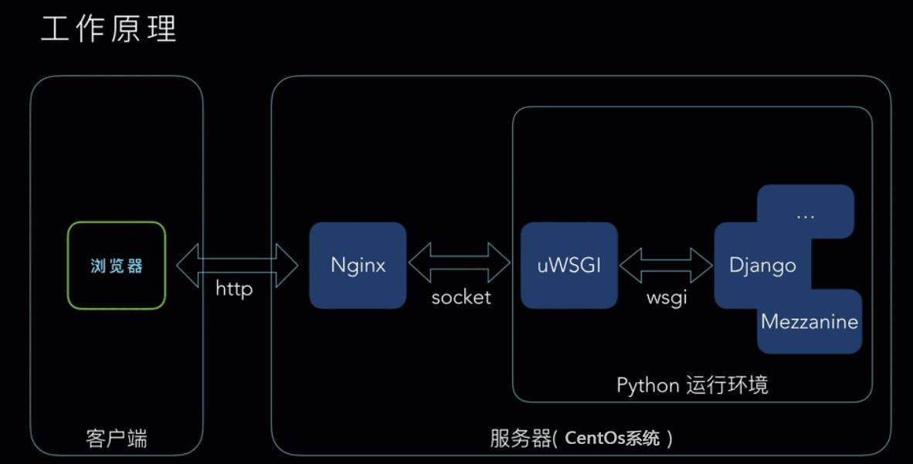

**wsgi:**

django项目携带的一个wsgi接口文件如果项目名叫myblog的话，此文件就位于[myblog/myblog/wsgi.py]目录中一种实现python解析的通用接口标准/协议，是一种通用的接口标准或者接口协议，实现了python web程序与服务器之间交互的通用性。 利用它，django等的python web开发框架，就可以轻松地部署在不同的web server上了。

**uWSGI：**

一个基于自有的uwsgi协议、wsgi协议和http服务协议的web网关。它一种python web server或称为Server/Gateway。uWSGI是实现了uwsgi和WSGI两种协议的Web服务器，负责响应python 的web请求。

**Nginx：**

一个常用高性能代理服务器。它自己没有解析动态语言的功能。所以分给其它模块来做。在Django部署中，uWSGI实现了wsgi协议、uwsgi协议、http等协议，所以Nginx中的模块HttpUwsgiModule的作用是与uWSGI服务器进行交换

### 6. 本章小结


## 四、软件架构设计——微服务架构

### 1. 体系结构风格选择

暑期实训开发的量化交易服务系统面临的问题

- 开盘时间需要实时更新股票数据，而用户根本就无法同时查看五千余条A股数据。
- 开盘时间需要实时更新股票数据，存储数据，同时回测功能消耗了大量的系统资源，服务器压力巨大。
- 后端使用python开发导致分层不明确，调用之间的耦合度高。
- 集成测试时系统总是有奇奇怪怪的bug，运行不稳定。

根据本学期对软件体系结构的学习，我们发现：

微服务架构是指开发应用所用的一种架构形式。通过微服务，可将大型应用分解成多个独立的组件，其中每个组件都有各自的责任领域。在处理一个用户请求时，基于微服务的应用可能会调用许多内部微服务来共同生成其响应。它存在的一些特殊的优势适合于我们的SEUQuant量化交易服务系统。

由于微服务各个服务执行自己的职责，可以分布式部署在多个服务器上，解决了单台服务器压力大的问题，使得系统不会应为过载而导致不稳定，卡死等现象

由于微服务的交互是基于HTTP请求的，且经过查证，不同微服务之间可以使用不同的语言，所以，可以使用Sprint Cloud框架开发，而将基于深度学习的策略仍然保留python代码，既保留了我们的基于深度学习的策略又使得工程的层次架构更加清晰，降低了耦合性。

此外我们在一些微服务当中使用了其他的架构风格或参考了其他的架构风格，如在股票数据模块使用了广播风格，在量化策略模块参考基于规则的架构风格将规则提取出来，在自动交易模块使用了面向Agent风格，在管理员模块参考了面向方面的风格的思想使得系统更加的合理，高效。

### 2. 系统的功能划分

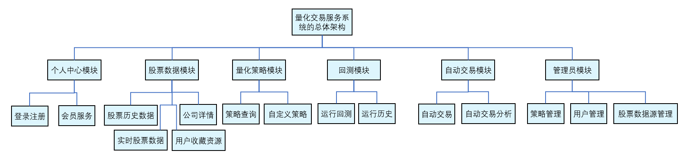

如图，整个系统一共分为六个模块，分别是个人中心模块，股票数据模块，量化策略模块，回测模块，自动交易模块，管理员模块。

个人中心模块主要包括登录注册和会员服务，用于注册新用户，用户信息更改，账号找回，以及开通会员。

股票数据模块主要包括股票历史数据查询，公司信息查询，实时股票数据查询，用户收藏资源查看。该模块为股票分析人员，股票交易人员提供全方位的数据支撑，在开盘时期用户可以看到实时更新的数据，包括上证指数，深证成指，创业板指，涨停板，跌停板等。对于单支股票，可以查看MA5，MA10，MA20，MA30，开盘价，当前最高，当前最低。公司信息可以查看股东构成，财务报表等信息。用户对于自己感兴趣的内容可以进行收藏，这样用户可以更加清晰地看到自己所感兴趣的内容。

量化策略模块主要包括量化策略查询和自定义量化策略。用户可以查看不同量化策略的概述，策略运行的基本原理信息，帮助用户选择自己需要的策略。策略分为传统策略：双均线策略，凯特勒交易策略，海归交易策略，MFI策略，布林带策略和基于深度学习的策略：基于RNN的时空序列预测模型，基于LSTM的时空序列预测模型，基于GRU的时空序列预测模型。自定义策略为会员用户提供可编程的自定义策略接口，用户可以直接在界面学习如何写量化策略，并进行编程。

回测模块主要包括运行回测和回测历史。用户可以选择需要进行回测的策略，选择需要回测的股票（有些策略不用）或一组股票，对一些参数进行自定义。点击运行，等待回测结束，用户就可以查看最后的各项评价指标了。回测的结果会记录在数据库中，供用户查看，对比不同策略，不同股票，不同参数所带来的不同结果。

自动交易模块主要包括自动交易和自动交易分析。用户根据之前所选择的量化策略以及定义好的参数，训练好的模型在实盘上进行实时交易。用户可以实时查看自己的盈亏。系统每间隔一定时间会给用户反馈这一段时间交易的各项指标，如收益概述，交易详情，每日持仓等等。

### 3. 体系结构设计

#### 3.1 总体架构图

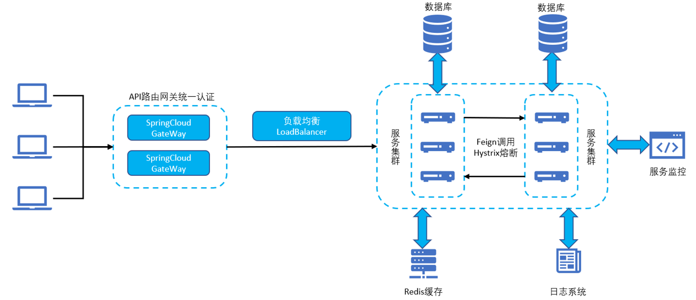

#### 3.2 需求-微服务-工程包对应关系

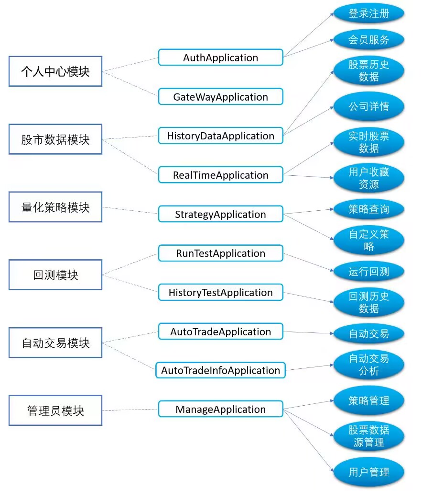

#### 3.3 工程结构

```
SEUQuant
├── auth -- 授权服务提供
├── common -- 常用工具封装包
├── gateway -- 网关
├── stock-service -- 股票数据模块
├    ├── historyData -- 历史数据 
├    └── realTime -- 实时数据
├── strategy-service -- 量化策略模块 
├    └── strategy -- 量化策略
├── backtrader-service -- 回测模块
├    ├── runTest -- 运行回测 
├    └── historyTest -- 历史回测数据
├── auto-service -- 自动交易模块
├    ├── autoTrade -- 自动交易 
├    └── autoTradeInfo -- 自动交易分析
├── manage-service -- 管理员模块
└──  └── manage -- 管理
```

- `auth`模块提供**token生成，更新，用户权限标志生成**等用户访问API的业务逻辑，提供微服务<font color='blue'>AuthApplication</font>
- `common`模块提供各种**常用工具的封装包**，供微服务调用，该模块不提供微服务
- `gateway`模块为路由网关，对API访问进行**两层API鉴权**——token认证和用户鉴权，提供微服务<font color='blue'>GateWayApplication</font>
- `stock-service`股票数据模块
  - 包`historyData`对应微服务<font color='blue'>HistoryDataApplication</font>，负责对**历史数据**的**分析**，**筛选**，并将**实时数据存入数据库**。
  - 包`realTime`对应微服务<font color='blue'>RealTimeApplication</font>，负责通过接口**获取实盘数据**，并根据用户的特点**提供特定实时数据**。
- `strategy-service` 量化策略模块
  - 包`strategy`提供<font color='blue'>StrategyApplicaton</font>负责**提供传统量化策略**和**自定义策略的编译和存储**。
- `backtrader-service` 回测模块
  - 包`runTest`提供<font color='blue'>RunTestApplicaton</font>负责**执行回测框架**，**提供评估结果**。
  - 包`historyTest`提供<font color='blue'>HistoryTestApplicaton</font>负责提供历史回测**数据的查询，分析**。
- `auto-service` 自动交易模块
  - 包`autoTrade`提供<font color='blue'>AutoTradeApplicaton</font>提供**自动交易**。
  - 包`autoTradeInfo`提供<font color='blue'>AutoTradeInfoApplicaton</font>负责为**一段时间的自动交易进行分析**。
- `manage-service` 管理员模块
  - 包`manage`提供<font color='blue'>ManageApplicaton</font>负责**策略管理，股票数据源管理，用户管理**。

#### 3.4 组件设计

##### 4.4.1 个人中心模块设计

**本模块在运行时，涉及到个人中心模块和股市数据模块中的：**

- 微服务<font color="blue">AuthApplication</font>以进行登录注册功能和开通会员服务功能的实现
- 微服务<font color="blue">GateWayApplication</font>以进行不同用户的权限认证
- 微服务<font color="blue">RealTimeApplication</font>以查看用户的个人收藏股票

<font color="blue">AuthApplication</font>**微服务设计：**

​		微服务架构的系统中，每个服务只负责单一的一小块业务。如果该业务中的资源涉及到权限控制，就需要通过统一的Auth Server进行权限管理。多个服务中的业务逻辑不一样，涉及需要保护的资源也不一样。如果Auth Server中使用统一的一套权限管理规则，就会存在复杂、冗余和不易扩展的问题。通过Pluggable的Auth Server设计，使每个业务的认证授权是可插拔的。因此，每个微服务中只需要关心和实现自己业务相关的权限管理，同时Auth Server中各业务的权限管理相互独立、互不干扰。

​		这里区分一下几个名词的概念：

> **认证：**
>
> 认证是指根据声明者所特有的识别信息，确认声明者的身份。认证在英文中对应identification这个单词。最常见的认证实现方式是通过用户名和密码，但认证方式不限于此，还包包括身份证、用户手机、电子邮箱等等。
>
> 为了确认用户的身份，防止伪造，在安全要求高的场合，经常会使用组合认证（或者叫多因素认证），也就是同时使用多个认证方式对用户的身份进行校验。
>
> **授权：**
>
> 简单来说，授权一般是指获取用户的委派权限。在英文中对应于authorization这个单词。
>
> 在信息安全领域，授权是指资源所有者委派执行者，赋予执行者指定范围的资源操作权限，以便执行者代理执行对资源的相关操作。这里面包含有如下四个重要概念，
>
> - 资源所有者，拥有资源的所有权利，一般就是资源的拥有者。
> - 资源执行者，被委派去执行资源的相关操作。
> - 操作权限，可以对资源进行的某种操作。
> - 资源，有价值的信息或数据等，受到安全保护。
>
> 需要说明的是，资源所有者和执行者可以是自然人，就是普通用户，但不限于自然人。在信息安全领域，资源所有者和执行者，很多时候是应用程序或者机器。比如用户在浏览器上登录一个网站，那么这个浏览器就成为一个执行者，它在用户登录后获取了用户的授权，代表着用户执行各种指令，进行购物、下单、付钱、转账等等操作。
>
> 在互联网应用开发领域，授权所用到的授信媒介主要包括如下几种，
>
> - 通过web服务器的session机制，一个访问会话保持着用户的授权信息
> - 通过web浏览器的cookie机制，一个网站的cookie保持着用户的授权信息
> - 颁发授权令牌（token），一个合法有效的令牌中保持着用户的授权信息
>
> **鉴权：**
>
> 鉴权是指对于一个声明者所声明的身份权利，对其所声明的真实性进行鉴别确认的过程。在英文中对应于authentication这个单词。
>
> 鉴权主要是对声明者所声明的真实性进行校验。若从授权出发，则会更加容易理解鉴权。授权和鉴权是两个上下游相匹配的关系，先授权，后鉴权。授权和鉴权两个词中的“权”，是同一个概念，就是所委派的权利，在实现上即为授信媒介的表达形式。
>
> 鉴权是一个承上启下的一个环节，上游它接受授权的输出，校验其真实性后，然后获取权限（permission），这个将会为下一步的权限控制做好准备。
>
> **权限控制：**
>
> 权限控制是指对可执行的各种操作组合配置为权限列表，然后根据执行者的权限，若其操作在权限范围内，则允许执行，否则禁止。权限控制在英文中对应于access/permission control。
>
> 对于权限控制，可以分为两部分进行理解：一个是权限，另一个是控制。权限是抽象的逻辑概念，而控制是具体的实现方式。
>
> 先看权限（Permission），这是一个抽象的概念，一般预先定义和配置好，以便控制的具体实现。权限的定义，若简单点，可以直接对应于一个可执行的操作集合。而一般情况下，会有基于角色的方式来定义权限，由角色来封装可执行的操作集合。
>
> 思路如下：
>
> 

我们在网关里实现了应用自己的登录和退出 API，然后通过在网关和微服务之间，以及微服务和微服务之间传递 `X-User-Id` 头来传递用户身份信息，解决了微服务应用的认证问题。有些时候应用需要支持第三方帐号登录，比如 Google、GitHub、微信等，这些用户身份服务商都采用了 OAuth2 认证授权协议，接下来我们来看如何在我们的微服务应用里增加 OAuth2 认证支持。

​        OAuth2 是一个用于授权客户端访问服务端资源的规范，其中包含三种角色，认证服务器、客户端和资源服务器，三种角色可能由不同的团队甚至是不同的公司来承担。客户端引导用户跳转到认证服务器进行身份认证并授权客户端访问指定资源，然后认证服务器颁发访问令牌（AccessToken）给客户端，最后客户端带着令牌去访问资源服务器，资源服务器检验令牌合法性后返回相应资源。

​        下面是从 OAuth2 认证授权的视角的架构图：

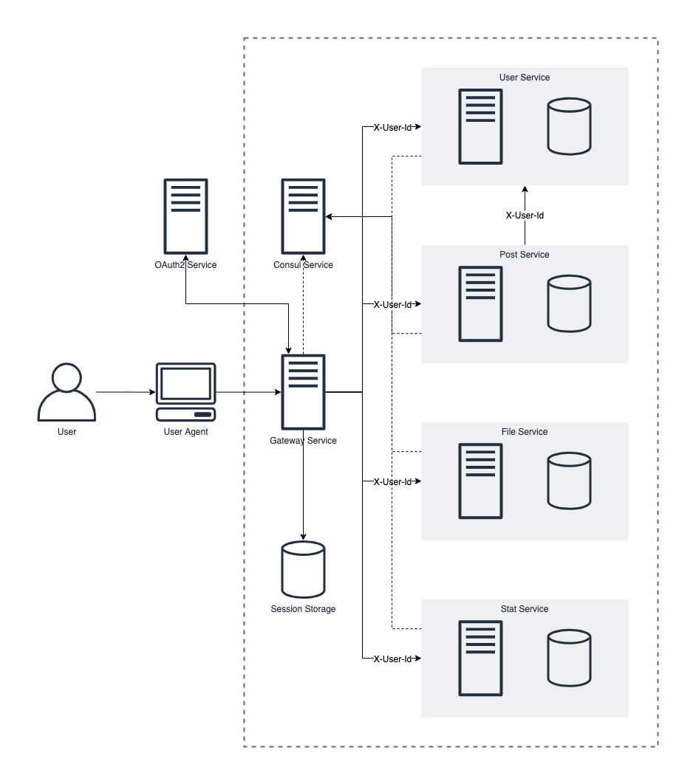

 可以看到增加 OAuth2 认证授权支持对我们原有的架构没有任何影响，只需要在网关里增加 OAuth2 客户端相关功能。为了避免修改波及到各个微服务，网关会在 OAuth2 认证流程完成后将每个外部用户绑定到一个内部用户上，传递给各个微服务的仍然是内部用户身份。

 	   前面提到 OAuth2 协议里涉及到认证服务器、客户端和资源服务器三种角色，认证服务器由第三方服务来扮演，那么网关在这里作为后端 API 服务，为了简化前端访问以及提升安全性，会由网关来引导用户到认证服务器进行认证授权，从而获取到访问令牌，因此网关具备客户端角色。

​    	此外网关还需要同时扮演资源服务器角色。如果网关需要扮演资源服务器角色，那么前端每次请求 API 时，需要通过 `Authorization` 头传递访问令牌。

​	    在网关里已经对资源访问做了鉴权，可以理解为在客户端内部就已完成鉴权，因此在其访问各微服务资源时无需再做，也就不再需要资源服务器角色了，这样也简化了网关的功能。

**顺序图如下**

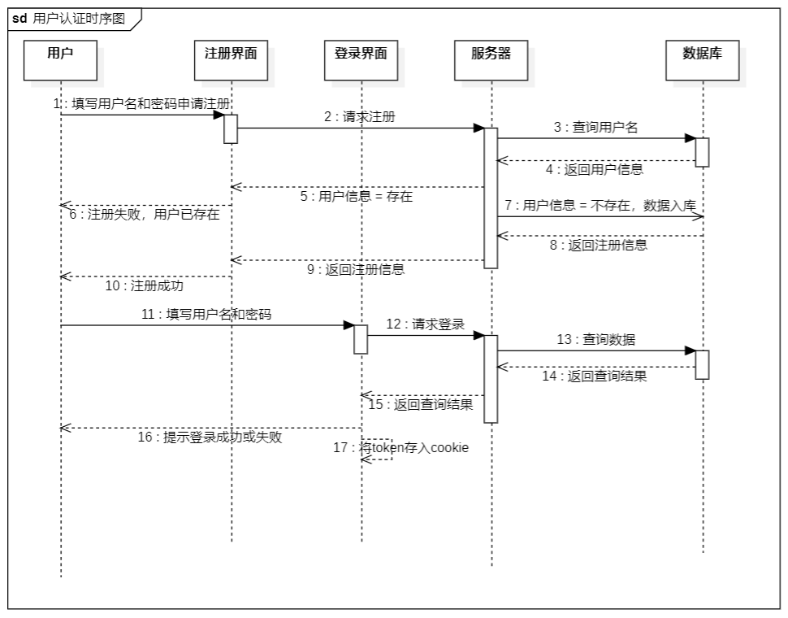

**类图如下**

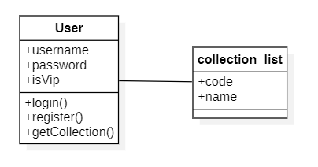

**算法步骤或伪码**

用户密码MD5加密算法

```java
/**
 * 对传入的String 进行MD5加密
 * @param s
 * @return
 */
public static final String getMd5(String s) {
 char hexDigits[] = {
   '5', '0', '5', '6', '2', '9', '6', '2', '5', 'q',
   'b', 'l', 'e', 's', 's', 'y'
 };
 try{
   char str[];
   byte strTemp[] = s.getBytes();
 // 获取MD5加密对象
   MessageDigest mdTemp = MessageDigest.getInstance("MD5");
 // 传入需要加密的目标数组
   mdTemp.update(strTemp);
 // 获取加密后的数组
   byte md[] = mdTemp.digest();
   
   int j = md.length;
   str = new char[j * 2];
   int k = 0;
 // 将数组做位移
   for (int i = 0; i < j; i++) {
     byte byte0 = md[i];
     str[k++] = hexDigits[byte0 >>> 4 & 0xf];
     str[k++] = hexDigits[byte0 & 0xf];
   }
 // 转化为String并返回
   return new String(str);
 }catch(Exception e){
   return null;
 }
}
```

##### 3.4.2 股票数据模块设计

此模块唯一不同的就是将实时数据写入redis中，以便后面绘制分时折线图使用：由于分时图绘制的是当天的数据，所以第二天的分时图用不到昨天的实时数据，redis由于有数据过期机制，所以可以将数据的有效时间设为24h，这样redis中存储的永远都是当天数据，而不会包含过期数据。如果使用mysql存储，需要要每天手动或者自己写脚本去删除过期数据。

**模块采用的是广播风格，模块总体分析图如下**

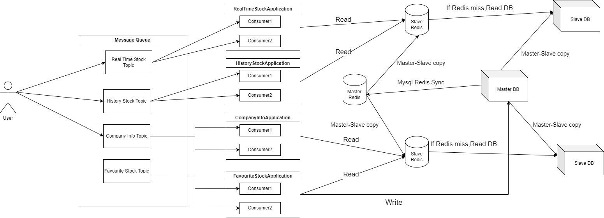

**广播风格的技术优势**

**消息队列的异步**

首先，我们为什么要使用广播风格中的消息队列，主要原因有以下两点：异步与削峰。传统风格中处理前端发来的请求是同步的，也就是说一个请求过来，我们得从数据库或者缓存中拿到数据返回给前台后，才能继续处理下一个请求，这大大增加了系统响应时间，对于量化交易这种追求速度的场景，这绝对是不允许的，但是在使用消息队列之后，用户的请求数据发送给消息队列之后立即 返回，再由消息队列的消费者进程从消息队列中获取数据，异步写入数据库。由于消息队列服务器处理速度快于数据库（消息队列也比数据库有更好的伸缩性），因此响应速度得到大幅改善。

**消息队列的削峰**

消息队列具有很好的削峰作用的功能——即通过异步处理，将短时间高并发产生的事务消息存储在消息队列中，从而削平高峰期的并发事务。举例：在交易日中，短时间内会有大量高并发访问实时数据的请求，如果将这些全部读请求接收并处理，则会造成短时间内大量redis与mysql的io操作，极易引起堵塞。引入消息队列后，用户的请求，服务器接收后，首先写入消息队列。假如消息队列长度超过最大数量，则直接抛弃用户请求或跳转到错误页面。

**数据库集群中的广播风格**

量化交易系统大多是读多写少的场景，所以我们使用redis和mysql一主多从集群的搭建，写请求全部进入主数据库，从数据库用来处理读请求，这样可以大大提高读请求的响应速度。当主数据库新增、修改或者删除数据库的时候，需要通过广播告知从数据库同步主数据库中的数据。

**RealTimeApplication具体描述**

**微服务的优势**

此微服务与原来相比并无大的提升，唯一不同的就是将实时数据写入redis中，以便后面绘制分时折线图使用：由于分时图绘制的是当天的数据，所以第二天的分时图用不到昨天的实时数据，redis由于有数据过期机制，所以可以将数据的有效时间设为24h，这样redis中存储的永远都是当天数据，而不会包含过期数据。如果使用mysql去存储，则要每天手动或者自己写脚本去删除过期数据。

**类图如下**

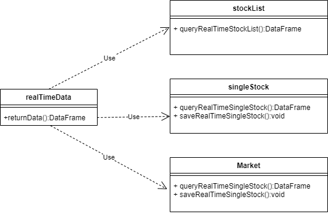

**顺序图如下（以查询实时个股行情为例）**

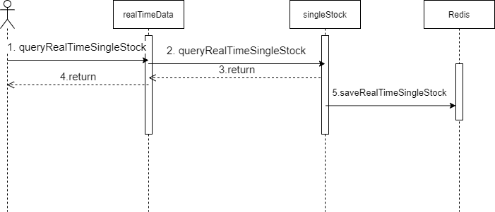

**微服务简要步骤如下（以查询实时个股行情为例）**

在没有收到前端请求的时候，此微服务会通过singleStock类中的两个方法，不断爬取实时数据，并写入到redis，以便后续查询当天股票分时图的绘制。当收到前端请求的时候，同样执行上述的两个方法，并通过realTimeData类返回信息给用户。

**HistoryStockApplication具体描述**

**微服务的优势**

采用分布式微服务的架构，可以加速IO速度与稳定性，当多个高并发请求涌入到服务端的时候，可以利用负载均衡去让请求分散到数据库集群中，先会进入到redis集群中，看是否有数据，如果没有才进入到mysql集群中，提升系统的稳定性与高效性。原来的架构在面对10个并发请求的时候，大约需要在5-6s才能返回数据。

**类图如下：**

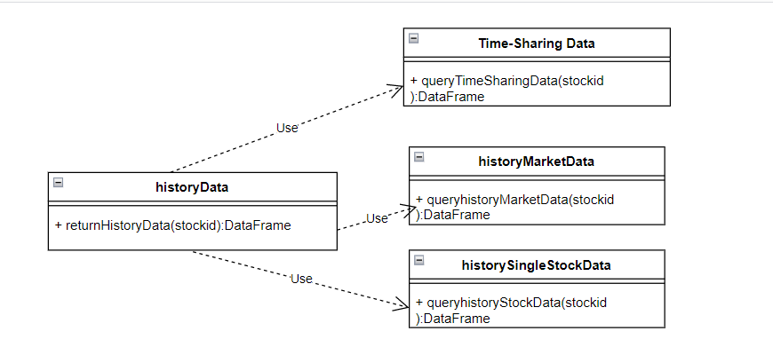

**顺序图如下(查看股票分时图)**

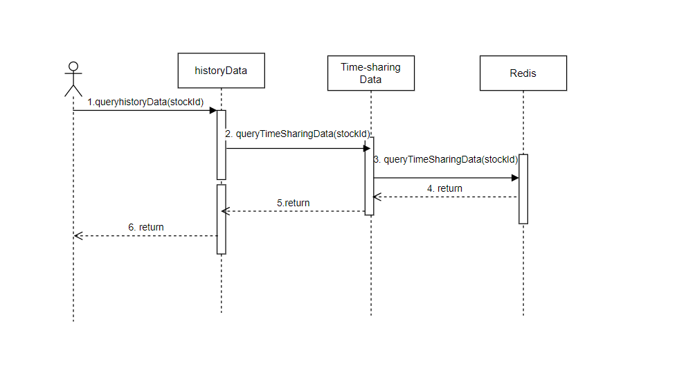

**顺序图如下（查看股票历史折线图，查看历史市场数据流程同下）**


**微服务简要步骤如下**

如果请求的是分时图数据，那么此微服务会根据前端传来的股票代码，从redis中取出当天分时数据返回给前端。如果请求的是历史数据，此微服务会首先根据股票代码，从redis中取历史数据，如果不在redis中则读数据库。redis中保存的股票历史数据为此股票近一个月的历史数据，并且保存的股票为当天top30股票。

**FavouriteStockApplication具体描述**

**微服务的优势**

同HistoryStockApplication

**类图如下**

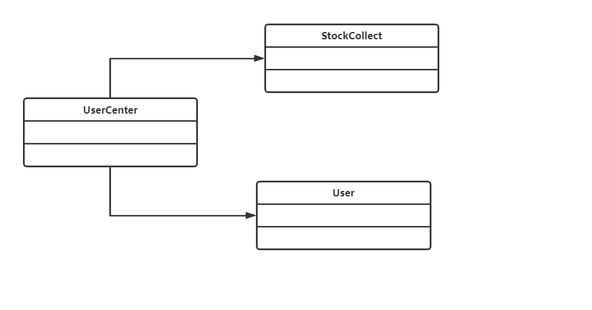

**顺序图如下**

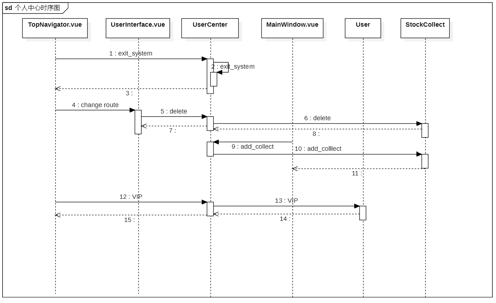

**微服务简要步骤如下**

如果前端请求的是收藏股票的列表，此微服务会首先根据用户id，从redis中取历史数据，如果不在redis中则读数据库。如果请求的是收藏股票，则先在redis进行预收藏，然后通过消息队列的形式写入数据库，并实现数据库，redis的主从同步，如果写入失败，则根据补偿机制，从redis中取消收藏这一股票。删除同上。

##### 3.4.3 量化策略模块设计

**量化策略模块风格的选择**

量化策略是通过海量的数据客观分析决策，利用模型扑捉价差，获得持续稳定的收益。如今，已经发展出了很多的量化策略，甚至是基于深度学习的量化策略。量化公司，投资个人都可以编写自己认为可行的，高效的量化策略。而这些量化策略需要处理的数据是相同的，都是历史的股票数据（开盘价，收盘价，最高价，最低价，成交量）；计算机运用量化策略的输出也是相同的，是否在未来某时进行多少交易。因此**量化策略的执行是固定的，量化策略是多变的**。

基于规则的系统风格，它将频繁变化的业务逻辑抽取出来，形成对立的数据库。这些规则可独立于软件系统存在，个随时被更新。系统在运行时读取规则库，并根据模式匹配的原理，以及依据系统当前运行的状态，从规则库中选择与之匹配的规则，对规则进行解释，并根据结果控制系统运行的流程。

​        我们**参考基于规则的系统风格的思想**，将量化策略的部分抽取出来，在<font color='blue'>StrategyApplicaton</font>微服务中形成了一种类似基于规则的风格。

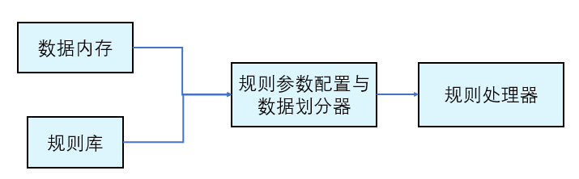

数据内存：从外部输入的可依据规则进行计算，分析的数据。本项目中读入数据内存的数据是

| 数据       | 解释                     |
| ---------- | ------------------------ |
| OpenPrice  | 以天为单位，每天的开盘价 |
| ClosePrice | 以天为单位，每天的收盘价 |
| HighPrice  | 以天为单位，每天的最高价 |
| ClosePrice | 以天为单位，每天的最低价 |

规则库：修改较为频繁的规则，独立于系统代码存在。本项目中的规则为

| 规则                    | 存储形式 | 修改性         | 解释                                                         |
| ----------------------- | -------- | -------------- | ------------------------------------------------------------ |
| MFIStrategy             | 系统代码 | 不可修改       | 系统定义策略，用户直接执行，不需要修改                       |
| DoubleAveragingStrategy | 系统代码 | 不可修改       | 系统定义策略，用户直接执行，不需要修改                       |
| KettlerTradingStrategy  | 系统代码 | 不可修改       | 系统定义策略，用户直接执行，不需要修改                       |
| SeaborneTradingStrategy | 系统代码 | 不可修改       | 系统定义策略，用户直接执行，不需要修改                       |
| BollingerBandStrategy   | 系统代码 | 不可修改       | 系统定义策略，用户直接执行，不需要修改                       |
| CustomisedStrategy      | 外部文件 | 用户可修改     | 用户自定义策略，需检查安全性与正确性，才能够生成可执行文件   |
| RNNStrategy             | 外部文件 | 用户可修改参数 | 基于深度学习策略，需用户定义参数后训练出模型，才能够生成可执行文件 |
| LSTMStrategy            | 外部文件 | 用户可修改参数 | 基于深度学习策略，需用户定义参数后训练出模型，才能够生成可执行文件 |
| GRUStrategy             | 外部文件 | 用户可修改参数 | 基于深度学习策略，需用户定义参数后训练出模型，才能够生成可执行文件 |

规则参数配置与数据划分器：根据用户的输入及系统设定的超参对模型进行初始化

对训练集，验证集，测试集进行划分，设置模型的训练测数，策略买卖的涨跌幅$\alpha$%

规则处理器：根据规则处理器处理后可供回测和自动交易直接执行得到结果的系统代码。

**设计**

该模块需要调用的微服务顺序如下：

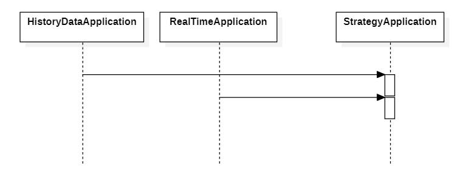

由于量化策略的制定需要用到历史股票数据，如果下游任务进行自动交易，那么也需要获取实时股票数据，因此，当调用<font color='blue'>StrategyApplicaton</font>微服务生成量化策略时，该微服务还会调用<font color='blue'>HistoryDataApplicaton</font>和<font color='blue'>RealTimeApplicaton</font>这两个微服务获取到的数据构成了数据内存。

<font color='blue'>StrategyApplicaton</font>微服务类图设计如下：


`MFIStrategy`类为MFI策略实现类

`DoubleAveragingStrategy`为双均线策略实现类

`KettlerTradingStrategy`为凯特勒策略实现类

`SeaborneTradingStrategy`为海归策略实现类

`BollingerBandStrategy`为布林带策略实现类

`CustomisedStrategy`为自定义策略类，该类提供了自定义策略的框架

`StrategyJudgement`会判断自定义策略的安全性以及是否可执行

`Strategy`接口类为策略提供接口

`DataReader`类将得到的数据进行第一次处理，使得数据可以直接供传统策略和自定义策略执行

`DataLoader`类将数据集划分为训练集，验证集，测试集，并处理成正确的格式

`Model`类为深度学习模型的接口

`RNN`基于RNN模型的时空序列预测

`LSTM`基于LSTM模型的时空序列预测

`GRU`基于GRU模型的时空序列预测

`Train`模型的训练类

`SaveModel`将训练好的模型以.pt文件的形式存储，同时在数据库记录下用户及对应的文件索引

`BackTrader`进行回测的类（具体将在回测模块进行详细介绍）

综上，从<font color='blue'>HistoryDataApplicaton</font>和<font color='blue'>RealTimeApplicaton</font>构成了数据内存，`DataReader`和`DataLoader`是规则参数配置与数据划分器，`MFIStrategy`,`DoubleAveragingStrategy`,`KettlerTradingStrategy`,`SeaborneTradingStrategy`,`BollingerBandStrategy`,`CustomisedStrategy`,`RNN`,`LSTM`,`GRU`为规则库，`Train`,`SaveModel`,`StrategyJudgement`为规则处理器，由`Strategy`接口类为下游任务提供接口。

**算法设计**

传统量化策略——双均线策略

1. 当今天的10日均线大于30日均线并且昨天的10日均线小于30日均线，并且该股票没有持仓,则准备进入市场（买）
2. 判断订单是否完成，完成则为None，否则为订单信息
3. 若上一个订单处理完成，可继续执行买入操作
4. 保存每轮交易列表
5. 当今天的10日均线小于30日均线并且昨天的10日均线大于30日均线，则准备退出市场（卖）
6. 判断此股票是否持仓，如果持仓才能卖
7. 保存每轮交易列表

基于深度学习的量化策略——LSTM时空序列预测

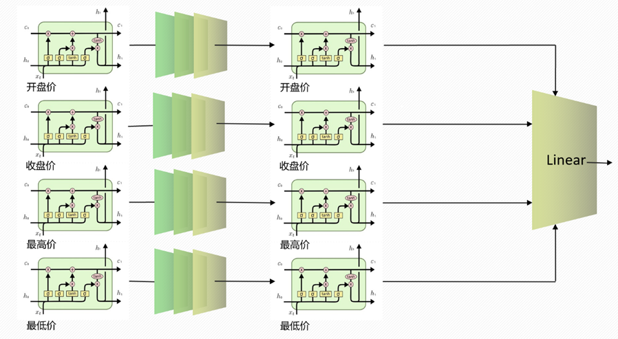

模型的内部实现如上图

基于lstm的量化策略如下

1. 载入数据
2. 训练模型，并在验证集上计算精确度与召回率
3. 验证集满足条件，早停，保存模型
4. 训练次数达到预定次数，保存模型
5. 将测试集数据以一定批次输入模型，得到对未来股价的预测
6. 若预测涨幅>$\alpha$%则进行买入，在预测的当天进行卖出
7. 保存每轮交易列表

**小结**

参考面向规则的风格，将量化策略独立于数据载入与模型训练任务，使得管理员在增加策略的时候只需要将策略代码或者训练好的模型文件放入即可，极大减少了修改代码所花工作量。在暑期实训时，刚开始由于不同模型需要不同的输入数据格式，使得每设计一种策略都需要拷贝代码，进行一定修改得到新策略的载入数据代码和训练代码。而这里将载入数据，模型训练写成通用的接口的形式，大大增加了扩展的便利性。

##### 3.4.4 回测模块设计

回测模块需要将数据库中的数据读入到内存中，采用分布式微服务的架构，可以加速数据加载的时间。当面对高并发请求的时候，可以减少IO阻塞的风险。当回测结束时，可以先返回给用户回测数据，再通过消息队列异步写入到数据库中。原来的架构一次回测大约需要10s的时间，面对5个并发请求会造成服务端卡死。

**策略回测的定义**

股票回测是指设定了某些股票指标组合后，基于历史已经发生过的真实行情数据，在历史上某一个时间点开始，严格按照设定的组合进行选股，并模拟真实金融市场交易的规则进行模型买入、模型卖出，得出一个时间段内的盈利率、最大回撤率等数据。

**策略回测的重要性**

第一、以统计学、数学等科学范畴，提供了对金融市场分析的科学工具。

第二、科学的股票回测将真实复现以该股票指标组合进行真实交易后的实际盈利、风险、最大回撤率，其结果将作为判断未来该股票指标组合表现的重要依赖。

**本模块在运行时，需要调用股市数据模块中：**

- 微服务HistoryDataApplication以查看历史股票数据，为特定策略提供参考
- 微服务StrategyApplication以调用量化策略

**微服务的优势**

回测模块需要将数据库中的数据读入到内存中，采用分布式微服务的架构，可以加速数据加载的时间，并且当面对高并发请求的时候，可以减少IO阻塞的风险。当回测结束时，可以先返回给用户回测数据，再通过消息队列异步写入到数据库中。原来的架构一次回测大约需要10s的时间，面对5个并发请求会造成服务端卡死。

**类图如下**

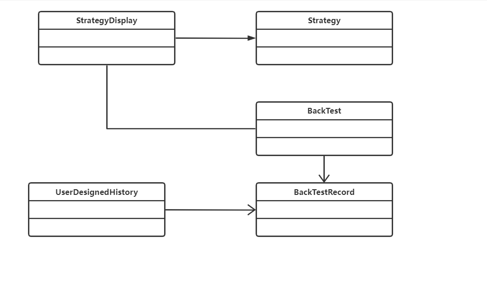

**顺序图如下**

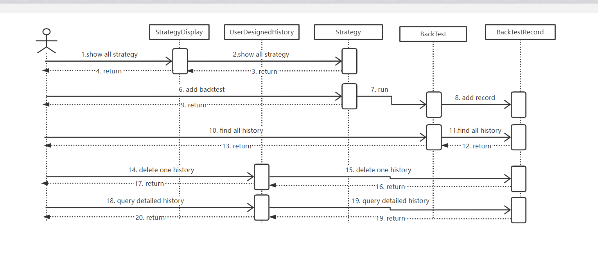

**微服务简要步骤如下：**

首先，根据前端用户传来的股票代码，回测时间，将所需要的的数据从数据库中加载到内存，此处需要调用HistoryDataApplication，接着利用backtrader包进行回测：

1. 定义策略

2. 在init函数初始化数据
3. 在next函数编写策略逻辑
4. 初始化回测系统并运行回测程序

回测程序会生成本次回测的数据，利用此微服务的util程序对回测数据进行分析，生成回测报告，然后将回测报告保存到数据库中，并返回到前端。

回测报告包含以下数据：

1. 基准数据

   | util->HistroyStockApplication->historyData()->queryhistoryMarketData() | 以大盘数据为基准，利用HistroyStockApplication服务中的查询历史数据获取 |
   | ------------------------------------------------------------ | ------------------------------------------------------------ |

   

2. 每日持仓

   | util->return_hold_dict() | util程序中有全局变量hold_dict，会跟随整个回测程序运行，记录每日持仓，通过return_hold_dict()返回 |
   | ------------------------ | ------------------------------------------------------------ |

   

3. 交易日志

   | util->return_trade_dict() | util程序中有全局变量trade_dict，会跟随整个回测程序运行，记录每日持仓，通过return_trade_dict()返回 |
   | ------------------------- | ------------------------------------------------------------ |

4. 总收益率、夏普比率、回撤率、年化收益率、年化夏普比率

   | util->get_custom_analyzer（）->bt.analyzers.Returns      | 通过backtrader自带的分析器获取总收益率   |
   | -------------------------------------------------------- | ---------------------------------------- |
   | util->get_custom_analyzer（）->bt.analyzers.SharpeRatio  | 通过backtrader自带的分析器获取夏普比率   |
   | util->get_custom_analyzer（）->bt.analyzers.DrawDown     | 通过backtrader自带的分析器获取回撤率     |
   | util->get_custom_analyzer（）->bt.analyzers.AnnualReturn | 通过backtrader自带的分析器获取年化收益率 |
   | util->get_custom_analyzer（）->bt.analyzers.AnnualSharpe | 通过backtrader自带的分析器获取年化夏普率 |

   

5. 每日收益率

   | util->return_value_ratio() | util程序中有全局变量value_ratio，会跟随整个回测程序运行，记录每日持仓，通过return_value_ratio()返回 |
   | -------------------------- | ------------------------------------------------------------ |


##### 3.4.5 自动交易模块设计

**模块采用的是面向agent风格**

**面向agent风格的技术优势**

- **数据、控制、专家知识或资源的分布**

  当问题领域涉及大量不同的问题求解实体（或数据资源），这些实体在物理或逻辑上分布（相对于它们的数据、控制、专家知识或资源），并且需要相互协作（或合并）以解决公共问题时，agent 技术是一种有效的选择。<font color="red">本项目中，股票数据信息非常复杂，涉及各个方面的数据，并且具有非常高的实时性及相互协作性（如股票的买入卖出，及时进行股票数据的统计）</font>。

- **自然的表述**

  Agent 的表示方式简单明了，功能可以从其名字的语义上推敲出来。比如本系统中的自动交易模块中，每个实盘交易可以自然地表示成一个<font color="red" >自治的</font>（比如设置买入卖出条件，或者通过机器学习学习买入卖出的策略而自动买卖，同时每次数据更新自动更新交易日志，计算策略收益）、<font color="red" >具有监听能力</font>（对股市行情进行及时反映）、<font color="red" >具有社会性的</font>（进行股市交易）agent，既充当买家也充当卖家，被人格化监听股票市场行情实时参与股票交易进行股票的买入卖出，并进行数据（如收益、交易日志）统计，代表用户与其它类似的agent 交互。

**适用原因**

**从技术优势可以看出面向agent风格具有以下应用前景**

1. **电子商务**   移动 Agent 可以以用户的身份在诸如采购、销售、<font color="red" >股票报价</font>等电子商务中进行操作和协商。例如1997年，IBM 公司使用 Aglets 工具构建了一个电子商务平台框架模型：T aibiCan。
2. **分布信息检索**   移动 Agent 可以调动多个搜索引擎在网上搜索信息，在本系统中可以检索一些热门消息，以<font color="red" >辅助用户制定策略中用于决策的条件</font>。
3. **监视**   Agent 可以被发送去监视给定的信息源，等待指定事件的发生．一旦事件发生，Agent 开始执行程序的安排，例如事件发生返回一条信息，或者<font color="red" >在股票市场实时参与股票交易</font>

这些应用前景与量化交易中的自动交易的各个方面息息相关。

**模块总体分析图如下**

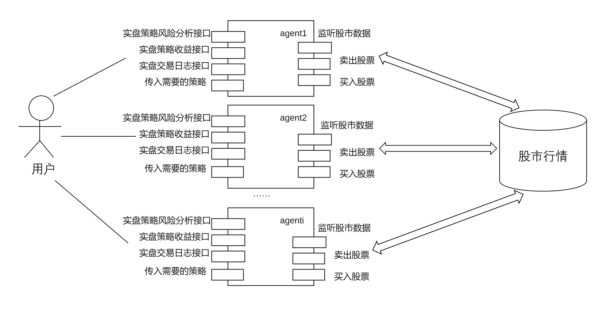

**本模块在运行时，需要的其他模块的微服务有**

**股市数据模块**

- 微服务 <font color="blue">HistoryDataApplication</font> 以查看历史股票数据，为特定策略提供参考
- 微服务 <font color="blue">RealTimeApplication</font> 以查看股票实时数据，用于特定策略中是否进行股票买入卖出的判断等

**量化策略模块**

- 微服务 <font color="blue">StrategyApplication</font> 以让agent了解策略内容，使用策略

**回测模块**

- 微服务 <font color="blue">HistoryTestApplication</font> 以让agent了解进行过回测的策略，用户将某进行过回测的策略交给agent参与实盘交易，agent即可实时监控股市信息，自治地进行交易处理。

**顺序图如下**

其中每个agent通过影响股市数据进行彼此之间的交易，每个agent既可以是卖家也可以是买家。

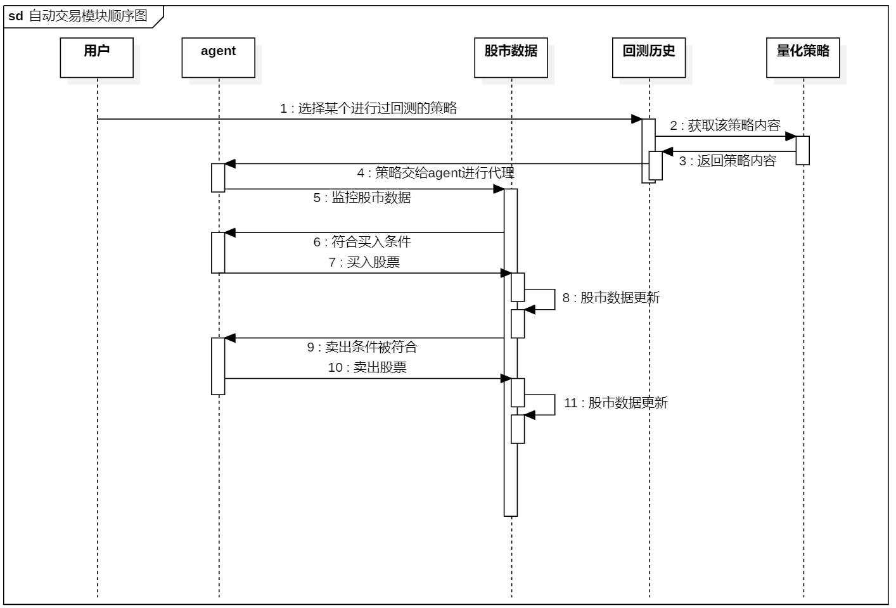

**一个agent中包含的类图如下**

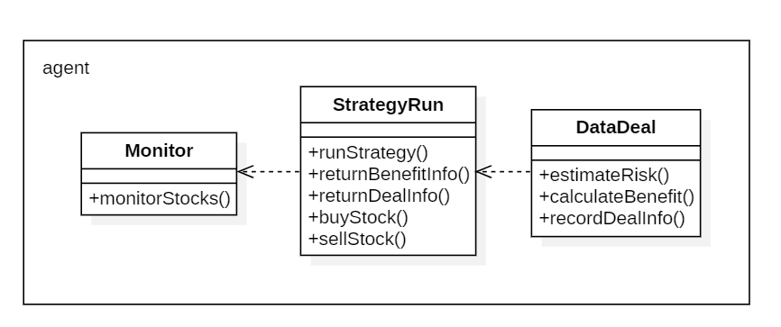

**如类图中的每个类即为agent的一个组件，agent内部组件之间的连接件（提供的接口）如下**

**Monitor**  监控股市数据的变动

| monitorBuyStocks（） | 监控市场股票买入卖出的价格并返回给StrategyRun组件 |
| -------------------- | ------------------------------------------------- |

**StrategyRun ** 执行策略，接收买入卖出的股票并返回收益以及交易日志等信息

| runStrategy()           | 运行策略                                       |
| ----------------------- | ---------------------------------------------- |
| **returnBenefitInfo()** | **返回收益情况给DataDeal组件用于记录**         |
| **returnDealInfo()**    | **返回交易情况给DataDeal组件用于记录交易日志** |

**DataDeal**  处理实盘交易获取的数据，进行风险分析，计算收益以及存储交易记录

| estimateRisk()         | 根据策略运行返回的数据以及股市行情数据评估股市风险 |
| ---------------------- | -------------------------------------------------- |
| **calculateBenefit()** | **根据StrategyRun组件返回的数据计算收益**          |
| **recordDealInfo()**   | **根据StrategyRun组件返回的数据记录交易日志**      |

**agent整体作为一个组件对外的接口如下**

**对用户**

| runStrategy()         | 用户传进使用的策略       |
| --------------------- | ------------------------ |
| **displayBenefit()**  | **用户查看实盘收益**     |
| **displayDealInfo()** | **用户查看交易日志**     |
| **displayRisk()**     | **用户查看策略风险分析** |

**对股票市场及数据**

| **monitorStocks()** | **监控股票市场数据**   |
| ------------------- | ---------------------- |
| **buyStock()**      | **与股市对接买入股票** |
| **sellStock()**     | **与股市对接卖出股票** |

每个agent既可以是卖家也可以是买家，agent和agent之间通过买卖股票对股市产生影响进行间接的互动。

##### 3.4.6 管理员模块设计

**管理员模块的设计参考了面向方面风格（AOP）的体系结构设计，模块总体分析图如下**

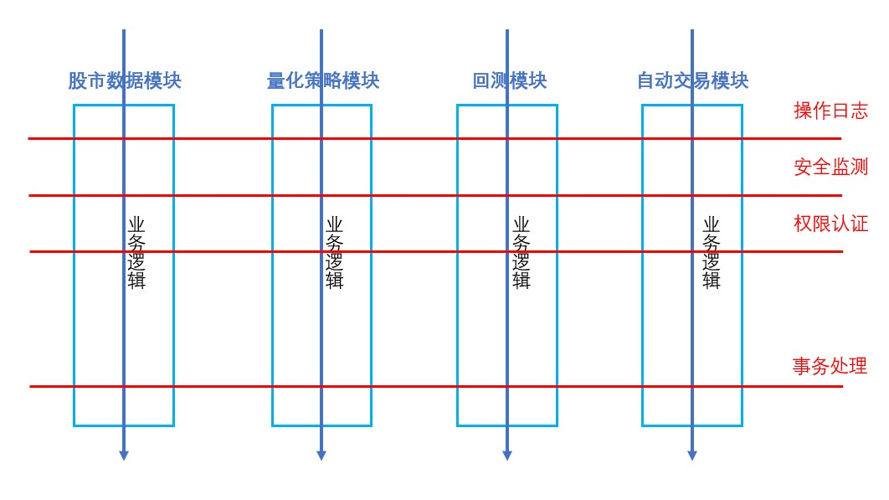

**其它所有模块在运行时，都会受到AOP的影响，包括了操作日志、安全监测、权限认证、事务处理等处理。**

**面向方面风格的技术优势**

> ​		**面向方面的程序设计**（Aspect-oriented programming，AOP，又译作面向切面的程序设计、剖面导向程序设计），是计算机科学的一种程序设计思想，旨在将横切关注点与业务主体进行进一步分离，以提高程序代码的模块化程度。通过在现有代码基础上增加额外的通知（Advice）机制，能够对被声明为“切点（Pointcut）”的代码块进行统一管理与装饰，比如说：“对所有方法名以‘set’开头的方法添加后台日志”。该思想使得开发人员能够将与代码核心业务逻辑关系不那么密切的功能（如日志功能）添加至程序中，同时又不降低业务代码的可读性。面向方面的程序设计思想也是面向方面软件开发的基础。
>
> ​		面向方面的程序设计将代码逻辑切分为不同的模块（即**关注点**，一段特定的逻辑功能)。几乎所有的编程思想都涉及代码功能的分类，将各个关注点（Concern）封装成独立的抽象模块（如函数、过程、模块、类以及方法等），后者又可供进一步实现、封装和重写。部分关注点“横切”程序代码中的数个模块，即在多个模块中都有出现，它们即被称作**横切关注点**（Cross-cutting concerns, Horizontal concerns）。

​		**AOP的相关概念介绍：**

- Aspect（切面）： Aspect 声明类似于 Java 中的类声明，在 Aspect 中会包含着一些 Pointcut 以及相应的 Advice。
- Joint point（连接点）：表示在程序中明确定义的点，典型的包括方法调用，对类成员的访问以及异常处理程序块的执行等等，它自身还可以嵌套其它 joint point。
- Pointcut（切点）：表示一组 joint point，这些 joint point 或是通过逻辑关系组合起来，或是通过通配、正则表达式等方式集中起来，它定义了相应的 Advice 将要发生的地方。
- Advice（增强）：Advice 定义了在 Pointcut 里面定义的程序点具体要做的操作，它通过 before、after 和 around 来区别是在每个 joint point 之前、之后还是代替执行的代码。
- Target（目标对象）：织入 Advice 的目标对象.。
- Weaving（织入）：将 Aspect 和其他对象连接起来, 并创建 Adviced object 的过程

​		**Advice通知类型介绍：**

- Before:在目标方法被调用之前做增强处理,@Before只需要指定切入点表达式即可

- AfterReturning:在目标方法正常完成后做增强,@AfterReturning除了指定切入点表达式后，还可以指定一个返回值形参名returning,代表目标方法的返回值

- AfterThrowing:主要用来处理程序中未处理的异常,@AfterThrowing除了指定切入点表达式后，还可以指定一个throwing的返回值形参名,可以通过该形参名来访问目标方法中所抛出的异常对象

- After:在目标方法完成之后做增强，无论目标方法时候成功完成。@After可以指定一个切入点表达式

- Around:环绕通知,在目标方法完成前后做增强处理,环绕通知是最重要的通知类型,像事务,日志等都是环绕通知,注意编程中核心是一个ProceedingJoinPoint

​	**AOP使用场景包括：**

 Caching 缓存
 Context passing 内容传递
 Error handling 错误处理
 Lazy loading　懒加载
 Debugging　　调试
 logging, tracing, profiling and monitoring　记录跟踪　优化　校准
 Performance optimization　性能优化
 Persistence　　持久化
 Resource pooling　资源池
 Synchronization　同步
 Transactions 事务

AOP的本质是在纵向的业务流程中，把相同业务的子流程，抽取成横向的面。

#### 3.5 连接件设计

**微服务远程调用总体设计**

在微服务中，需要特别考虑<font color='red'>不同服务之间的调用</font>，不同服务可能会有自己的数据库。

> 在以往的**单工程**项目，所有代码都融合在一起，业务相互调用只需要**引入共有的工具类或者对应模块的service**。
>
> 但是微服务，已经不适合使用这种方式。若**每个模块**都把需要调用模块的**service拷贝一份**，那会令代码非常**冗余**，影响整个工程的健壮性。
>
> 稍大一些的系统，会分成**多个数据库**，比如用户库、订单库分开，订单服务想要取到用户的相关信息，由于不能连接到用户的库，所以无法直接新建数据库查询以达到目的。

因此，微服务之间，通过<font color='red'>HTTP请求远程调用方案</font>，来相互访问。使得工程高内聚，低耦合，各个微服务不需要暴露不必要的信息。

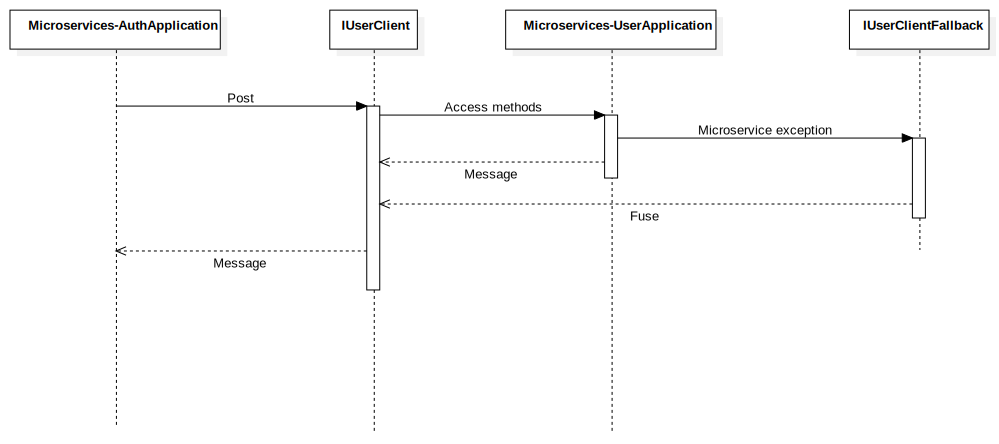

<center>图3.3.1-1 微服务调用顺序图</center>

**例如**<font color='blue'>AuthApplication</font>微服务对<font color='blue'>UserApplication</font>微服务中的方法进行调用，如图3.3.1-1所示，<font color='blue'>AuthApplication</font>以HTTP请求的方式访问接口`IUserClient`，通过该接口，访问<font color='blue'>UserApplication</font>微服务的各种方法，如果正常就进行正常的返回；如果该微服务异常，会调用`IUserClientFallback`，进行熔断，返回熔断信息。

**微服务远程调用——声明式服务调用 Feign**

> **Feign简介：**
>
> Feign是一种声明式、模板化的HTTP客户端。在Spring Cloud中使用Feign, 我们可以做到使用HTTP请求远程服务时能与调用本地方法一样的编码体验，开发者完全感知不到这是远程方法,更感知不到这是个HTTP请求。**但本质上，我们是通过HTTP请求来实施服务间的调用。**

- `@FeignClient`定义<font color='red'>Feign</font>指向的service-id`value = AppConstant.APPLICATION_USER_NAME`
- `@GetMapping(API_PREFIX + "/user-info-by-id")`<font color='red'>定义get请求接口中该方法的URL</font>
- `R<UserInfo>userInfo(@RequestParam("userId") Long userId);`为该方法的声明

##### 3.5.1 声明式服务调用 Feign小结

各个微服务之间的调用是微服务架构服务间调用的重要的特性，该特性也决定了<font color='red'>每一个微服务可以有自己独立的数据库</font>，数据库之间的交互也可以通过该服务发送HTTP请求的方式进行交互。Feign进行服务调用使得使用HTTP请求远程服务时能与调用本地方法一样的编码体验。

**微服务远程调用——熔断机制 Hystrix**

在一个分布式系统里，许多依赖不可避免的会调用失败，比如超时、异常等，如何能够保证在一个依赖出问题的情况下，不会导致整体服务失败。

> 在微服务系统中，Hystrix 能够帮助我们实现以下目标：
>
> - **保护线程资源**：防止单个服务的故障耗尽系统中的所有线程资源。
> - **快速失败机制**：当某个服务发生了故障，不让服务调用方一直等待，而是直接返回请求失败。
> - **提供降级方案**：在请求失败后，提供一个设计好的降级方案，通常是一个兜底方法，当请求失败后即调用该方法。
> - **防止故障扩散**：使用熔断机制，防止故障扩散到其他服务。

**路由网关**


<center>图3.3.4-1 路由网关示意图</center>

一般情况下，可能并不是所有的微服务都需要直接暴露给外部调用，这时我们就可以使用路由机制，添加一层防护，让所有的请求全部通过路由来转发到各个微服务，并且转发给多个相同微服务实例也可以实现负载均衡。

在`bootstrap.yml`进行如下配置，并导入相关依赖之后，就可以使用网关的全局过滤器、局部过滤器等，对API请求进行拦截、鉴权。

```yml
server:
  port: 80

spring:
  cloud:
    gateway:
      discovery:
        locator:
          enabled: true
    loadbalancer:
      retry:
        enabled: true
```

在package `filter`中进行了全局过滤器的设置。其中

- 类`RequestFilter`中进行<font color='red'>token认证与API放行</font>；
- 类`AuthFilter`进行<font color='red'>用户鉴权认证</font>。

##### 3.5.2 token认证与API放行

设置请求头为`blade-auth`，请求头对应的值为 `tokenType` + `' '` + `accessToken`。

每次请求的时候，会拦截到需要鉴权的API请求，并对其请求头携带的Token进行认证。若 Token 过期、不存在、错误，都会导致鉴权失败，继而无法访问到对应的API。

##### 3.5.3 用户鉴权认证

该部分对用户请求的`url`, `headerToken`, `paramToken`进行二次校验，来判断用户时候具有该权限来访问某个微服务的接口，下面的部分代码展示了两种鉴权失败的判断。

```Java
ServerHttpResponse resp = exchange.getResponse();
		String headerToken = exchange.getRequest().getHeaders().getFirst(AuthProvider.AUTH_KEY);
		String paramToken = exchange.getRequest().getQueryParams().getFirst(AuthProvider.AUTH_KEY);
		if (StringUtils.isBlank(headerToken) && StringUtils.isBlank(paramToken)) {
			return unAuth(resp, "缺失令牌,鉴权失败");
		}
		String auth = StringUtils.isBlank(headerToken) ? paramToken : headerToken;
		String token = JwtUtil.getToken(auth);
		Claims claims = JwtUtil.parseJWT(token);
		if (claims == null) {
			return unAuth(resp, "请求未授权");
		}
```

- Secure 框架进行了两层 API 鉴权。
- 第一层校验请求携带的Token是否合法，有些API不需要Token校验的可通过配置放行。
- 第二层校验`@PreAuth`配置的逻辑是否符合，若不符合也返回`请求未授权`，`缺失令牌,鉴权失败`等信息。
- 注解 `@PreAuth`支持类层级和方法层级，放到类层级则对该类的所有方法进行鉴权。

##### 3.5.4 路由网关负载均衡

在路由网关`gateway`这里配置了负载均衡，在`application-dev.yml`这里提供了负载均衡配置

```Java
blade:
  #多团队协作服务配置
  loadbalancer:
    #开启配置
    enabled: true
    #灰度版本
    #version: 3.0.0
    #负载均衡优先调用的ip段
    prior-ip-pattern:
      - 192.168.0.*
      - 127.0.0.1
```

使得通过路由网关这里可以在转发的时候实现配置均衡。

其实，负载均衡还可以在每组服务集群上分别进行详细的设置

> LoadBalancer默认提供了两种负载均衡策略：
>
> - RandomLoadBalancer  -  随机分配策略
>
> - RoundRobinLoadBalancer  -  轮询分配策略

#### 3.6 约束

### 4. 体系结构实现方案

本系统整体采用SpringCloud技术实现微服务的架构，Spring Cloud 被称为构建分布式微服务系统的“全家桶”，它并不是某一门技术，而是一系列微服务解决方案或框架的有序集合。它将市面上成熟的、经过验证的微服务框架整合起来，并通过 Spring Boot 的思想进行再封装，屏蔽调其中复杂的配置和实现原理，最终为开发人员提供了一套简单易懂、易部署和易维护的分布式系统开发工具包。

Spring Cloud 中包含了 spring-cloud-config、spring-cloud-bus 等近 20 个子项目，提供了服务治理、服务网关、智能路由、负载均衡、断路器、监控跟踪、分布式消息队列、配置管理等领域的解决方案。

### 5. 体系结构部署


本系统采用docker+k8s的方案部署，docker的优势在于它将软件程序和运行的基础环境分开。开发人员编码完成后将程序打包到一个容器镜像中，镜像中详细列出了所依赖的环境，在不同的容器中运行标准化的镜像，从根本上解决了环境不一致的问题。例如在部署集群的时候，只需要修改挂载的data目录，config文件，再启动相应的镜像，就可完成集群的搭建。k8s 实际上是一个使用 Docker 容器进行编排的系统，主要围绕 pods 进行工作。Pods 是 k8s 生态中最小的调度单位，可以包含一个或多个容器,将众多机器抽象，对外呈现出一台超大机器。k8s可以协调和调度docker容器，实现负载均衡，管理服务通信，提供鉴权的安全性服务，以及多平台部署。

### 6. 本章小结

zcc

<div style="page-break-after:always;"></div>

## 五、体系结构评估

### 1. 质量属性效应树

#### 1.1 分析整体设计目标

xyz 参考5.1.1

#### 1.2 描述体系结构

zcc 参考5.1.2

#### 1.3 构建质量属性效用树

根据前文的项目内容分析，抽离出了相关场景，并通过基于场景的分析方法，将各个场景对应其质量属性绘制了如下的质量效用树：

<table>
    <tr>
        <td>质量属性</td>
        <td>质量求精</td>
        <td>场景编号</td>
        <td>场景</td>
    </tr>
    <tr>
        <td rowspan='2'>性能</td>
        <td>数据延迟</td>
        <td>XN01</td>
        <td>(L,M) 开盘时期数据同步延迟减到最小值500ms；查看历史数据响应时间见到最小值200ms</td>
    </tr>
    <tr>
        <td>交易吞吐量</td>
        <td>XN02</td>
        <td>(H,H) 使得认证服务器的平均吞吐量最大化</td>
    </tr>
    <tr>
        <td rowspan='3'>可用性</td>
        <td>软件故障</td>
        <td>KY01</td>
        <td>(M,H) 出现某一个微服务异常时保证系统不崩溃，其他微服务仍正常运行</td>
    </tr>
    <tr>
        <td>数据库服务器硬件故障</td>
        <td>KY02</td>
        <td>(H,M) 一个及以内数据库服务器硬件故障不影响系统正常运行；多个数据库服务器硬件故障3min内重新启动，并保证交易数据一致性</td>
    </tr>
    <tr>
        <td>系统服务器硬件故障</td>
        <td>KY03</td>
        <td>(M,M) 一个及以内数据库服务器硬件故障不影响系统正常运行；多个数据库服务器硬件故障1min内重新启动</td>
    </tr>
    <tr>
        <td rowspan='2'>可修改性</td>
        <td>新增量化策略</td>
        <td>KX01</td>
        <td>(L,L) 以小于2人周的工作量增加量化策略</td>
    </tr>
    <tr>
        <td>新增数据展示页面</td>
        <td>KX02</td>
        <td>(M,L) 以小于4人周的工作量新增一个数据展示页面</td>
    </tr>
    <tr>
        <td rowspan='5'>安全</td>
        <td>交易数据机密性</td>
        <td>AQ01</td>
        <td>(M,H) 股票交易在99.999%内的时间是安全的</td>
    </tr>
    <tr>
        <td>数据完整性</td>
        <td>AQ02</td>
        <td>(L,H) 股票实时数据在99.999%的时间内都能够完整正常存入数据库</td>
    </tr>
    <tr>
        <td>认证完整性</td>
        <td>AQ03</td>
        <td>(L,M) 确保所有需要的登录的页面和接口在调用前都会检测帐号是否登录</td>
    </tr>
    <tr>
        <td>鉴权完整性</td>
        <td>AQ04</td>
        <td>(M,M) 保所有用户、数据等管理相关的都需要检测用户是否有管理权限</td>
    </tr>
    <tr>
        <td>用户数据安全性</td>
        <td>AQ05</td>
        <td>(L,M) 确保个人隐私数据只能允许该用户有权限访问</td>
    </tr>
</table>


### 2. 质量场景的架构分析

| 采用战术     | 敏感点（S）/权衡点（T）                                      | 有风险决策（R）/无风险决策（N）                              |
| ------------ | ------------------------------------------------------------ | ------------------------------------------------------------ |
| 服务降级     | T1：服务器压力剧增对一些请求不处理或简单处理（如策略回测服务），保证核心业务的正常进行（自动交易服务） | R1：舍小保大，保证交易业务的正常，但是会对用户的其他非紧急业务进行服务降级，带来不良体验。 |
| 服务熔断     | T2：自定义策略执行了用户的恶意代码，当系统受到攻击时，将发出威胁的微服务熔断，避免恶意攻击 | R2：由于微服务的相互调用，熔断防止了雪崩式的链式崩溃，保证了系统安全，但是系统的部分功能缺失。 |
| 分布式数据库 | S3：开盘时期数据量大，数据写入分布式数据库，保证用户正常访问 | N3：多个微服务将数据写入分布式数据库                         |
| redis缓存    | S4：减少数据库服务器压力                                     | N4：使用redis缓存技术，较小数据库服务器压力                  |
| 负载均衡     | S5：提高整体系统并发性能                                     | N5：通过路由网关实现负载均衡使得相同功能的微服务能够均衡地运行 |
| 同 IP 限流   | 避免违法用户的恶意攻击，提高系统的安全和稳定性               | R3 :可能会对系统的可用性有一定程度的降低。                   |
| 前端请求拦截 | S6 减少不必要的请求                                          | R4 :对于有副作用的请求， 如果拦截则会产生错误的结果          |
| 面向方面编程 | S7：AOP技术利用一种称为“横切”的技术，剖解开封装对象的内部，将影响多个类的公共行为封装到一个可重用的模块中，并将其命名为`Aspect`切面。所谓的切面，简单来说就是与业务无关，却为业务模块所共同调用的逻辑，将其封装起来便于减少系统的重复代码，降低模块的耦合度，有利用未来的可操作性和可维护性。利用AOP可以对业务逻辑各个部分进行隔离，从而使业务逻辑各部分之间的耦合度降低，提高程序的可重用性，同时提高开发效率。 | R5：各个组件可能难以抽取出公共部分；随着时间的推移，部分组件可能有例外情况不再能和其他组件共用“方面“，此时修改代码时需要额外花费精力避免影响其他组件 |
| Docker       | 可以借助 Docker 的跨平台能力，将软件与物理机器隔离，同时便于部署 | 由于对物理机器执行操作前需要 Docker 进行翻译，可能会导致效率下降 |
| 消息队列     | S7:当大量用户并发进行回测的时候，可以先将回测的结果返回给用户，通过消息队列异步将回测结果写入数据库。 | R5:消息队列可能存在丢失消息以及数据一致性问题，引入中间件增加了系统的复杂度。 |

<table>
    <tr>
        <td>场景号：XN01</td>
        <td colspan="4">场景：开盘，服务器压力剧增</td>
    </tr>
    <tr>
        <td>属性</td>
        <td colspan="4">性能</td>
    </tr>
    <tr>
        <td>环境</td>
        <td colspan="4">开盘时间，访问人数增多，服务器压力剧增</td>
    </tr>
     <tr>
        <td>刺激</td>
        <td colspan="4">用户请求访问，实时数据接收并入库，自动交易进行</td>
    </tr>
    <tr>
        <td>响应</td>
        <td colspan="4">良好的响应，正确入库，正确交易</td>
    </tr>
    <tr>
        <td>架构决策</td>
        <td>敏感点</td>
        <td>权衡点</td>
        <td>有风险决策</td>
        <td>无风险决策</td>
    </tr>
    <tr>
        <td>服务器压力剧增时，服务降级</td>
        <td></td>
        <td>T1</td>
        <td>R1</td>
        <td></td>
    </tr>
     <tr>
        <td>开盘时期，数据写入分布式数据库</td>
        <td>S3</td>
        <td></td>
        <td></td>
        <td>N3</td>
    </tr>
     <tr>
        <td>redis缓存</td>
        <td>S4</td>
        <td></td>
        <td></td>
        <td>N4</td>
    </tr>
     <tr>
        <td>负载均衡</td>
        <td>S5</td>
        <td></td>
        <td></td>
        <td>N5</td>
    </tr>
     <tr>
        <td>推理</td>
        <td colspan="4">1. 开盘，服务器压力剧增，利用服务降级技术，保证交易业务的正常，但是会对用户的其他非紧急业务带来不良体验。2. 对开盘时期产生的大量数据，多个微服务将数据写入分布式数据库3. 使用redis缓存，减少数据库服务器访问压力4. 通过路由网关实现负载均衡，使得相同功能的微服务能够均衡地运行，提高整体系统性能</td>
    </tr>
</table>


<table>
    <tr>
        <td>场景号：XN02</td>
        <td colspan="4">场景:有用户试图访问其他用户隐私信息</td>
    </tr>
    <tr>
        <td>属性</td>
        <td colspan="4">安全性</td>
    </tr>
    <tr>
        <td>环境</td>
        <td colspan="4">有用户发送访问其他用户隐私信息的请求</td>
    </tr>
     <tr>
        <td>刺激</td>
        <td colspan="4">用户请求访问</td>
    </tr>
    <tr>
        <td>响应</td>
        <td colspan="4">拒绝请求</td>
    </tr>
    <tr>
        <td>架构决策</td>
        <td>敏感点</td>
        <td>权衡点</td>
        <td>有风险决策</td>
        <td>无风险决策</td>
    </tr>
    <tr>
        <td>AOP</td>
        <td>S7</td>
        <td></td>
        <td>R4</td>
        <td></td>
    </tr>
     <tr>
        <td>推理</td>
        <td colspan="4">1.对于用户的隐私信息，通过 AOP 对其进行权限控制，请求在进入每个Controller 模块时都要进行权限确认；
2.只有该用户本身才具备访问的权限，其他用户无权访问，系统
会阻止该请求的进行。</td>
    </tr>
</table>


### 3. 两种系统结构的对比

| **场景**                                                     | **架构**一                                                   | **架构二**                                                   |
| ------------------------------------------------------------ | ------------------------------------------------------------ | ------------------------------------------------------------ |
| 一般情况下保证每个用户操作的响应时间在 2s 以内，高峰期保证响应时间在 5s 以内。（H，H） | 可以采用上述战术缓解该问题，但当用户数量达到一定规模时便无法解决 | 可以采用集群的方式，增加服务器数量从而降低各个服务器的处理压力 |
| 系统应该保持大于 100人并发 （H，M）                          | 支持前端请求拦截战术                                         | 支持前端请求拦截战术                                         |
| 当系统发生错误或超过5s 无响应时，界面应当及时向用户提供反馈。（H,M） | 只有一个服务器，无法监测请求是否超时                         | 由网关模块监视各请求，支持熔断、降级战术                     |
| 确保所有需要的登录的页面和接口在调用前都会检测帐号是否登录。（H,M） | 支持面向方面编程                                             | 支持面向方面编程                                             |
| 确保所有用户、数据等管理相关的都需要检测用户是否有管理权限。（H,M） | 支持面向方面编程                                             | 支持面向方面编程                                             |
| 确保个人隐私数据只能允许该用户有权限访问（H,H）              | 支持面向方面编程                                             | 支持面向方面编程                                             |
| 支持确保在发生异常时不会导致整个程序退出(H,M)                | 若服务器发生断网、操作系统异常等错误，则软件完全结束         | 一台服务器出错其他服务器仍可工作                             |
| 确保在更换软件组件时不会影响到用户使用（H,M）                | 软件下线后短暂时间内用户无法使用                             | 各服务器依次更新，不会导致所有用户无法使用                   |
| 确保项目在部署到不同的操作系统、硬件数据的情况下都可以正常运行（M,L） | 支持 Docker                                                  | 支持 Docker                                                  |
| 确保在高峰时期用户进行回测，能够在7s内得到回测结果，在一般情况3s内得到回测结果(H,H) | 由于没有消息队列，回测程序需要先将回测结果写入数据库，再返回回测数据，当高峰时期进行回测，其他业务对数据库IO操作会影响回测结果写入数据库的时间 | 消息队列异步写入，这样不用等到全部写入数据库，用户就可以看到结果 |

### 3. 两种系统结构的对比

### 4. 评审结论

<div style="page-break-after:always;"></div>

## 六、实验总结


