<h1 align="center">软件设计与体系结构课</h1>

<h2 align="center">量化交易服务系统设计逆向分析实验报告</h2>

<h3 align="center" >
    <span style="text-decoration: underline">&emsp;软件学院&emsp;</span>  
    <span >院（系）&emsp;</span>
    <span style="text-decoration: underline">&emsp;软件工程&emsp;</span>
    <span>专业</span>
</h3>
<h3 align="center" >
    <span >指导老师:&emsp; </span>
    <span style="text-decoration: underline">&emsp;&emsp;&emsp;&emsp;廖力&emsp;&emsp;&emsp;&emsp;</span>  
</h3>
<h3 align="center" >
    <span >学号:&emsp; </span>
    <span style="text-decoration: underline">71120126</span>  
    <span>&emsp;&emsp;姓名:&emsp;</span>
    <span style="text-decoration: underline">罗茂林</span>
</h3>
<h3 align="center" >
    <span >学号:&emsp; </span>
    <span style="text-decoration: underline">71120130</span>  
    <span>&emsp;&emsp;姓名:&emsp;</span>
    <span style="text-decoration: underline">昝崇崇</span>
</h3>
<h3 align="center" >
    <span >学号:&emsp; </span>
    <span style="text-decoration: underline">71120235</span>  
    <span>&emsp;&emsp;姓名:&emsp;</span>
    <span style="text-decoration: underline">盛奕骏</span>
</h3>
<h3 align="center" >
    <span >学号:&emsp; </span>
    <span style="text-decoration: underline">71120113</span>  
    <span>&emsp;&emsp;姓名:&emsp;</span>
    <span style="text-decoration: underline">谢瀛增</span>
</h3>


<div style="page-break-after:always;"></div>

<h3 align="center"><font color=0066CC>目录</h3> 

[TOC]

<div style="page-break-after:always;"></div>

## 一、课题概述

### 1. 选题背景及意义

​        量化交易是指以先进的数学模型替代人为的主观判断，利用计算机技术从庞大的历史数据中海选能带来超额收益的多种"大概率"事件以制定策略，极大地减少了投资者情绪波动的影响，避免在市场极度狂热或悲观的情况下作出非理性的投资决策。

​        从全球市场的参与主体来看，按照管理资产的规模，2018年全球排名前六位中的五家资管机构，都是依靠计算机技术来开展投资决策，而且进入2019年由量化及程序化交易所管理的资金规模进一步扩大。全球超70%的资金交易用计算机或者程序进行，其中一半是由量化或者程序化的管理人来操盘。从高校的培养方向来看，已有超过450所美国大学设置了金融工程专业，每年相关专业毕业生达到1.5万人，市场需求与毕业生数量的差距显著，因此数据科学、计算机科学、会计以及相关STEM（基础科学）学生毕业后进入金融行业从事量化分析和应用开发的相关工作。

​       目前国内量化投资规模大概是3500到4000亿人民币，其中公募基金1200亿，其余为私募量化基金，数量达300多家，占比3%(私募管理人共9000多家)，金额在2000亿左右。中国证券基金的整体规模超过16万亿，其中公募14万亿，私募2.4万亿，乐观估计，量化基金管理规模在国内证券基金的占比在1%~2%，在公募证券基金占比不到1%，在私募证券基金占比5%左右，相比国外超过30%的资金来自于量化或者程序化投资，国内未来的增长空间巨大。

​        量化交易有以下优点：1、相对于传统的人工做法，量化交易做一次回测几分钟就可以得到结果了，它的效率是传统人工的几百倍；2、量化交易可以利用计算进行全市场的实时盯盘，可以不错过任何的交易机会，大幅度提升我们的盈利能力；3、对于人工交易而言过大的验证量是难以完成的，但是量化交易可以又快又准的进行判断。并且量化交易还可以利用统计学和数学的原理客观的给出结果，如最大回撤率、年化收益率以及夏普比率等等；4、量化交易可以利用计算机技术对于量化数据的分析得到单靠人力难以发现的盈利机会，并且有些机会只有量化交易才可以利用。对于小差距的概率规律，非量化交易基本是不可能发现的。

​        通过当前的发展潮流、市场背景、量化交易的优点来看，提供高质优秀的量化交易服务是非常必要的，而本次的系统设计逆向分析，有利于为我们更好得架构量化交易服务平台提供参考和指导。

### 2. 实验的主要工作

① 分析项目总体需求，从需求中分析模块

② 分析项目原有的架构，进行分析与总结

③ 针对当前项目特点及功能模块划分，对于原先架构中做的比较好的模块及组件进行保留，对系统架构进行重构

④ 对体系结构进行评估，包括描述质量属性效应树，针对特定场景进行架构分析以及对比两种体系结构

⑤ 最后是每个人对本次实验中的工作进行小结

### 3. 实验报告的组织结构

本文主要分为以下几个部分：

一、课题概述

二、需求分析

三、软件架构设计（B/S）

四、软件架构设计（微服务架构）

五、体系结构评估

六、实验总结

<div style="page-break-after:always;"></div>

## 二、需求分析

### 系统总体需求

量化交易服务系统需要兼具股票数据查询，公司信息查询，提供量化策略，回测以及自动交易功能。同时需要考虑到用户在面对大量交易数据时，使用的便捷性；量化策略，股票数据源的长期可用性和稳定性；分级管理用户，使得系统占领市场的同时带来经济效益。

我们抽取出普通用户、会员用户、管理员三个角色，根据不同角色的需求，对于每一个角色进行用例分析。

对于用户，存在查看大盘数据，股票列表，单支股票行情，公司概况的信息查询的需求；存在收藏股票以便于查看，升级会员的个人中心需求；存在查看量化策略，编辑自定义策略的策略查询和自定义需求；存在回测的数据分析及策略性能验证的分析验证的需求；存在利用量化交易策略决策进行买卖股票的股票交易需求。为使系统带来经济效益，对于自定义策略以及基于深度学习的策略只向会员用户提供。

对于管理员，由于需要保证系统的长期可用性和稳定性，需要管理员对股票数据源，量化策略以及用户进行管理。

系统总体用例图如图2.1所示。


<center>图2.1 总体用例图</center>

我们根据用例将其分为个人中心模块，股票数据模块，量化策略模块，回测模块，自动交易模块，管理员模块共六个模块。对每一个模块进行细致的需求分析。

### 1. 各模块需求分析

#### 1.1 个人中心模块

个人中心模块主要包括登录和查看个人中心用例，用于注册新用户，用户信息更改，账号找回，以及开通会员。用例图如图2.2所示。


<center>图2.2 个人中心用例图</center>

##### 1.1.1  用户注册用例描述

| ID         | A111                                                         |
| ---------- | ------------------------------------------------------------ |
| 用例名称   | 注册                                                         |
| 父用例ID   | 无                                                           |
| 主要执行者 | 普通用户、会员用户、管理员                                   |
| 前置条件   | 无                                                           |
| 事件流     | a.打开登录页面，点击“没有账号？去注册”，跳转到注册页面<br/>b.在用户名输入框输入用户名<br/>c.在密码输入框内输入密码<br/>d.再次输入密码，点击注册按钮注册<br/>e.注册成功后跳转到登录页面 |
| 可选事件流 | 无                                                           |
| 异常条件流 | 两次输入密码不一致，提示两次密码输入不一致                   |
| 后置条件   | 用户已注册或登录成功，跳转到登录页面                         |

##### 1.1.2 其他用例描述见附件

**用户登录用例描述**，**用户会员服务用例描述**，**查看我的收藏用例描述**见附件一。

#### 1.2 股市数据模块

股票数据模块主要包括查看大盘数据，查看股票列表，查询单支股票行情，查询公司信息用例。该模块为股票分析人员，股票交易人员提供全方位的数据支撑，在开盘时期用户可以看到实时更新的数据，包括上证指数，深证成指，创业板指，涨停板，跌停板等。查看到沪深共五千余支股票的排序信息。对于单支股票，可以查看五日均线，十日均线，开盘价，当前最高，当前最低。公司信息可以查看股东构成，财务报表等信息。用例图如图2.3所示。


<center>图2.3 股票数据模块用例图</center>

##### 1.2.1  用户查看股票列表用例描述

| <span style="white-space:nowrap;">ID&emsp;&emsp;&emsp;&emsp;&emsp;</span> | A121                                                         |
| ------------------------------------------------------------ | ------------------------------------------------------------ |
| 用例名称                                                     | 查看股票列表                                                 |
| 父用例ID                                                     | 无                                                           |
| 主要执行者                                                   | 普通用户、会员用户                                           |
| 前置条件                                                     | 无                                                           |
| 事件流                                                       | 在行情中心界面最下为所有股票的列表，展示股票的代码、名称、现价、涨跌幅(%)、涨跌、涨速(%)、换手(%)、量比、振幅(%)、成交额、流通股 、流通市值、市盈率等实时信息，股票按照涨跌幅降序排列 |
| 可选事件流                                                   | a.点击列表中的代码栏可以跳转到具体的股票信息界面  <br/>b.点击股票名称可以展示该股票的公司信息  <br/>c.点击收藏按钮即可将该股票加入个人中心我的收藏列表 |
| 异常事件流                                                   | 用户未登录无法使用将股票加入我的收藏功能                     |
| 后置条件                                                     | 无                                                           |

##### 1.2.2 其他用例描述见附件

**用户查看大盘数据用例描述，用户查询单支股票行情用例描述，查询公司概况用例描述**见附件一

#### 1.3  量化策略模块

量化策略模块主要包括量化策略查询和自定义量化策略用例。用户可以查看不同量化策略的概述，策略运行的基本原理信息，帮助用户选择自己需要的策略。策略分为传统策略：双均线策略，凯特勒交易策略，海归交易策略，MFI策略，布林带策略和基于深度学习的策略：基于RNN的时空序列预测模型，基于LSTM的时空序列预测模型，基于GRU的时空序列预测模型。自定义策略为会员用户提供可编程的自定义策略接口，用户可以直接在界面学习如何写量化策略，并进行编程。


<center>图2.4 量化策略模块用例图</center>

##### 1.3.1  用例描述见附件

**查看量化策略用例描述，编辑自定义策略用例描述**见附件一

#### 1.4  回测模块

回测模块主要包括运行系统策略用例，查询回测历史列表用例，运行自定义策略用例。用户可以选择需要进行回测的策略，选择需要回测的股票（有些策略不用）或一组股票，对一些参数进行自定义。点击运行，等待回测结束，用户就可以查看最后的各项评价指标了。回测的结果会记录在数据库中，供用户查看，对比不同策略，不同股票，不同参数所带来的不同结果。


<center>图2.5 回测模块用例图</center>

##### 1.4.1  用户运行系统策略用例描述

| ID         | A141                                                         |
| ---------- | ------------------------------------------------------------ |
| 用例名称   | 运行系统策略                                                 |
| 父用例ID   | 无                                                           |
| 主要执行者 | 普通用户、会员用户                                           |
| 前置条件   | 存在可选的回测策略                                           |
| 事件流     | a.用户选择系统提供的策略点击回测 <br/> b.在日历中选择测试的起止时间及相关设置  <br/>c.点击回测按钮  <br/>d.系统会自动调取后台相应的策略进行回测  <br/>e.将策略收益与基准收益以折线图的形式呈现在用户界面，同时展示相关指标 |
| 可选事件流 | 无                                                           |
| 异常事件流 | 无                                                           |
| 后置条件   | 查询交易详情页面、查询每日持仓和收益页面                     |

##### 1.4.2  会员用户运行自定义策略用例描述

| <span style="white-space:nowrap;">ID&emsp;&emsp;&emsp;&emsp;&emsp;</span> | A142                                                         |
| ------------------------------------------------------------ | ------------------------------------------------------------ |
| 用例名称                                                     | 运行自定义策略                                               |
| 父用例ID                                                     | 无                                                           |
| 主要执行者                                                   | 会员用户                                                     |
| 前置条件                                                     | 该用户为会员用户                                             |
| 事件流                                                       | a.进入界面展示用户之前保存的自定义策略（若未曾使用，用户自定义策略展示为默认模板策略）  <br/>b.点击模板代码，系统自动保存用户在用户代码界面所做保存，并展示系统提供的模板界面和说明文档，用户可以自行修改模板代码参数。  <br/>c.点击保存按钮手动保存用户代码  <br/>d.点击我的代码即可编辑自己的策略代码   <br/>e.点击运行，后台运行回测，并跳转到回测框架中的收益概述页面 |
| 可选事件流                                                   | 无                                                           |
| 异常事件流                                                   | 运行错误，弹窗提示                                           |
| 后置条件                                                     | 运行成功，跳转到回测框架中的收益概述界面                     |

##### 1.4.3 其他用例描述见附件

**查询回测历史列表用例描述，查询每日交易详情用例描述，查询回测每日持仓用例描述，查询回测每日收益用例描述**见附件一

#### 1.5 自动交易模块

自动交易模块主要包括实盘运行策略用例，查看实盘交易日志用例，查看实盘策略详情用例。用户根据之前所选择的量化策略以及定义好的参数，训练好的模型在实盘上进行实时交易。用户可以实时查看自己的盈亏。系统每间隔一定时间会给用户反馈这一段时间交易的各项指标，如收益概述，交易详情，每日持仓等交易信息。


<center>图2.6 自动交易模块用例图</center>

##### 1.5.1  用例描述见附件

**实盘运行策略用例描述，查看实盘交易日志用例描述，查看实盘策略收益用例描述，查看实盘策略风险分析**见附件一。

#### 1.6  管理员模块

管理员模块主要包括登录注册用例（与普通用户的用例相同，只是注册时需要内部验证码），管理策略用例，管理股票数据源用例，管理用户用例。管理员可以对用户的基本信息进行管理。根据外部股票数据源接口的情况，调整股票数据源，以保证系统长期运行的可用性与可靠性。通过管理员与时俱进地增删量化策略，使得系统的量化策略能够跟上发展需求。


<center>图2.7 管理员模块用例图</center>

##### 1.6.1 用例描述见附件

**添加策略用例描述，删除策略用例描述，修改策略用例描述，修改策略用例描述，管理股票数据源用例描述，管理用户用例描述**见附件一。

### 2. 系统非功能需求分析

**（1）实时性**

​        量化交易服务系统中股票的价格、大盘指标等数据均由akshare、JoinQuant等平台开放的数据接口获取，而股票价格是一个实时性很强的数据，在股票交易时间内波动性极强，因此，该系统中股票价格等数据的实时性要求较高。

**（2）易扩展**

​        量化交易服务系统中的策略模块涉及到了很多交易策略，而在系统的后期使用过程中一定是会增加一些交易策略的，量化交易策略由交易者根据自己的想法制定一些要素，这些想法包括但不限于打算交易哪些市场、交易的时间范围、交易频率、交易的目标、何时进入何时退出、每笔交易多少股等等，然后通过大量的时间开发测试交易策略的技能。

​        因此，系统设计和开发过程中要提前预留好可以添加策略的接口，并做好策略中涉及到的数据处理逻辑，使得系统易于扩展。

**（3）安全性**

​        出于对系统中用户数据和交易数据等的安全考虑，量化交易服务系统的涉及开发应满足安全性约束。一方面，我们要保证数据的安全，如自动交易模块中的交易数据，这些属于用户的独有数据，可能涉及到实际的财务风险，因此务必保证这部分数据的安全。网络传递数据也应经过加密。需要保证数据在采集、传输和处理过程中不被偷窥、窃取、篡改。业务数据需要在存储时进行加密，确保不可破解。

​        另一方面，要保证网络的安全，且目前互联网的攻击也非常多，如 DDos 攻击，SQL 注入等。所以在设计系统时， 也应该考虑一些系统安全性方面的问题，增强系统的健壮性，防范网络“黑客”，“病毒”的攻击。

​	    其次，我们严格权限访问控制，用户在经过身份认证后，只能访问其权限范围内的数据，只能进行其权限范围内的操作。不同的用户具有不同的身份和权限，需要在用户身份真实可信的前提下，提供可信的授权管理服务，保护数据不被非法越权访问和篡改，要确保数据的机密性和完整性。

**（4）操作日志**

​	    该系统应该提供详细的操作日志及错误日志，便于系统的调试，维护以及错误定位。详细的错误日志可以使系统的维护变得非常便利，当出现异常订单分配时，也便于查找问题所在。

​	    总之，量化交易服务系统应该立足长期发展，具有较强的可扩展性。满足这些非功能需求有利于今后系统的升级和扩展，满足不断增长的业务需求。

<div style="page-break-after:always;"></div>

## 三、软件架构设计——B/S架构

### 1. 体系结构风格选择

根据项目的需求分析并参考了当前比较成熟的几个量化交易服务平台，我们发现这些系统都是采用的经典的B/S架构，web浏览器作为前端供用户操作，后台程序在服务器上处理前端的各种响应。且B/S架构易于搭建和上手，因此，我们决定采用B/S架构设计量化交易服务系统。

B/S结构（Browser/Server，浏览器/服务器模式），是WEB兴起后的一种网络结构模式，WEB浏览器是客户端最主要的应用软件。这种模式统一了客户端，将系统功能实现的核心部分集中到服务器上，简化了系统的开发、维护和使用。客户机上只要安装一个浏览器，如Chrome、Safari、Microsoft Edge、Netscape Navigator或Internet Explorer，服务器安装SQL Server、Oracle、MYSQL等数据库。浏览器通过Web Server 同数据库进行数据交互。

在 B/S 模式中，用户是通过浏览器针对许多分布于网络上的服务器进行请求访问的，浏览器的请求通过服务器进行处理，并将处理结果以及相应的信息返回给浏览器，其他的数据加工、请求全部都是由Web Server完成的。通过该框架结构以及植入于操作系统内部的浏览器，该结构已经成为了当今软件应用的主流结构模式。

B/S 架构是一个三层框架，将整个业务应用划分为：表现层（UI）、业务逻辑层（BLL）、数据访问层（DAL）。 区分层次的目的即为了“高内聚，低耦合”的思想。 １、表现层（UI）：通俗讲就是展现给用户的界面，即用户在使用一个系统的时候他的所见所得；一般使用浏览器作为客户端。 ２、业务逻辑层（BLL）：针对具体问题的操作，也可以说是对数据层的操作，对数据业务逻辑处理；一般使用Web服务器（或者应用服务器）作为业务处理端 BS 结构是一种对软件的组成成分进行整理、分布的一种方法（或者说软件构造技术）。 软件组成成分如：程序、数据、文档等。3、数据访问层：有时候也称为是持久层，其功能主要是负责数据库的访问，可以访问数据库系统、二进制文件、文本文档或是XML文档。简单的说法就是实现对数据表的Select，Insert，Update，Delete的操作。如果要加入ORM的元素，那么就会包括对象和数据表之间的mapping，以及对象实体的持久化。

### 2. 系统的功能划分


<center><p>图3.1 系统的功能划分</p></center>

如图3.1 ，整个系统一共分为四个模块，分别是个人中心模块，股票数据模块，量化策略模块，回测模块。

个人中心模块主要包括登录注册和会员服务，用于注册新用户，用户信息更改，账号找回，以及开通会员。

股票数据模块主要包括股票历史数据查询，公司信息查询，实时股票数据查询，用户收藏资源查看。该模块为股票分析人员，股票交易人员提供全方位的数据支撑，在开盘时期用户可以看到实时更新的数据，包括上证指数，深证成指，创业板指，涨停板，跌停板等。对于单支股票，可以查看MA5，MA10，MA20，MA30，开盘价，当前最高，当前最低。公司信息可以查看股东构成，财务报表等信息。用户对于自己感兴趣的内容可以进行收藏，这样用户可以更加清晰地看到自己所感兴趣的内容。

量化策略模块主要包括量化策略查询和自定义量化策略。用户可以查看不同量化策略的概述，策略运行的基本原理信息，帮助用户选择自己需要的策略。策略分为传统策略：双均线策略，凯特勒交易策略，海归交易策略，MFI策略，布林带策略和基于深度学习的策略：基于RNN的时空序列预测模型，基于LSTM的时空序列预测模型，基于GRU的时空序列预测模型。自定义策略为会员用户提供可编程的自定义策略接口，用户可以直接在界面学习如何写量化策略，并进行编程。

回测模块主要包括运行回测和回测历史。用户可以选择需要进行回测的策略，选择需要回测的股票（有些策略不用）或一组股票，对一些参数进行自定义。点击运行，等待回测结束，用户就可以查看最后的各项评价指标了。回测的结果会记录在数据库中，供用户查看，对比不同策略，不同股票，不同参数所带来的不同结果。

### 3. 体系结构设计

#### 3.1 总体架构图

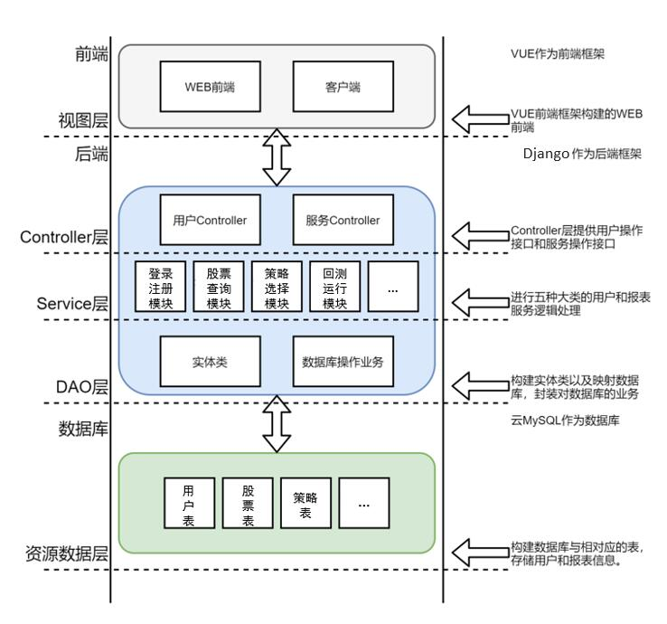

不同于公司中开发常用的技术栈Java及项目架构，本项目经过考虑，放弃了图3.2所示的Java B/S 总体架构，选择使用基于Python的Web框架Django，形成如图3.3的B/S总体架构。权衡原因如下：1、本项目中需要使用机器学习相关技术，使用基于Python的Web框架Django，可以很好地解决机器学习模型和开发语言不一致可能带来的潜在问题；2、本项目开发周期短，仅有一个月，实际编码时间不到两周，使用基于Python的Web框架Django，能减少编码量，高效率实现所有功能需求，同时使得项目结构更加简洁与清晰。

<center><p>图3.2 基于Java开发的总体架构图</p></center>


<center><p>图3.3 基于Python开发的总体架构图</p></center>

图3.3中，表现层即前端（最右红框），前端使用Vue框架，并辅以主流的组件库，如主要用于数据可视化的eacharts，用于页面组件设计的element UI进行页面前端的开发，形成了最终用户访问所能看到的效果。业务逻辑层即后端中的View层以及如URL配置等一些功能函数及工具函数（中间红框）。业务逻辑层针对功能模块所划分，在功能需求中所定义的每个模块对应一个View层，用于提供前后端交互所需要的接口，同时其中也使用到了URL分配器，用于定向，通过http协议和前端页面进行数据交互。数据访问层即的B/S架构中后端引用Django提供的model（最左红框），即ORM对象关系映射，用于实现面向对象编程语言里不同类型系统的数据之间的转换，能够对不同的数据库都提供统一调用的API进行开发与数据库进行交易，为业务逻辑层提供数据接口。

#### 3.2 工程包对应关系

工程包对应关系反映了功能需求（左边栏）和系统架构（右边栏）的关系，由于个人收藏模块是在开发临近尾声时老师临时要求加的需求，所以，为了开发方便，单独开发，和之前的系统集成，因此一个小小的功能成为了一个单独的模块。而量化策略和回测耦合紧密，为了更快的实现功能，所以当时直接放在了一起进行开发。

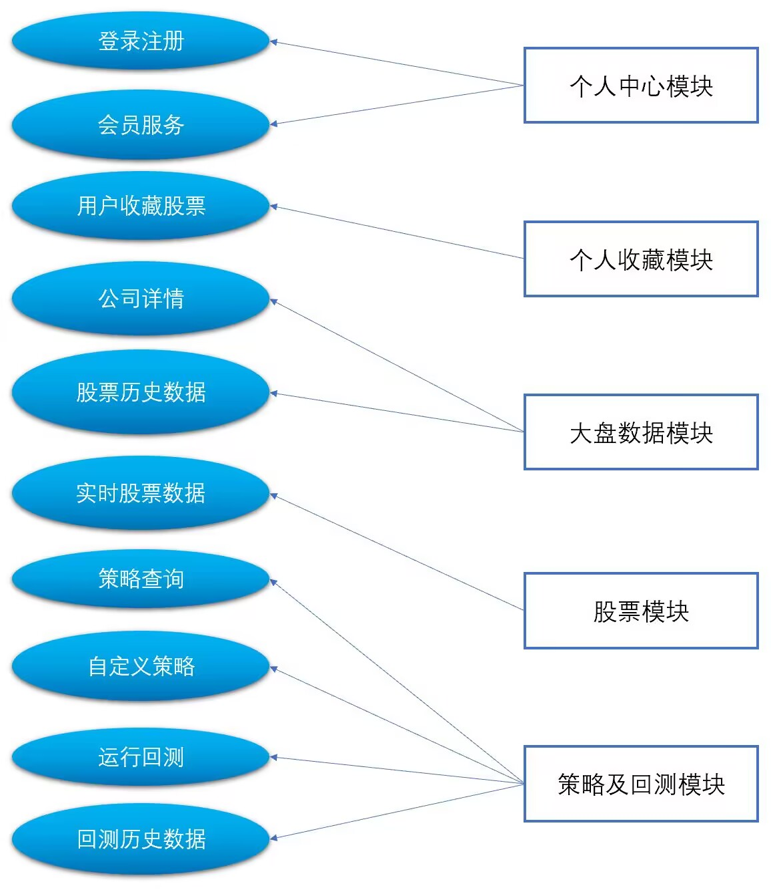

<center><p>图3.4 工程包对应关系</p></center>

#### 3.3 工程结构

工程结构展示了本项目各个模块的包,包按照需求分析出的功能模块所划分，每个包中都涉及了本章3.1所讲的业务逻辑层及数据访问层。每个包中都包含model，View以及URL配置文件等，经过对应，本项目中的工程结构与项目功能需求是一一对应的。3.2及3.3节展示了将体系结构模块划分对应到功能需求，将功能需求映射到工程结构的过程，论证了此种体系结构能有效满足我们的需求设计，并且具有实际可行性。

```
SEUQuant
├── Collection -- 个人收藏模块
├── Main -- 个人中心模块
├   ├── Login -- 注册登录 
├   └── ToVip -- 会员升级
├── MarketData -- 大盘数据模块
├── Stock -- 股票模块 
├── Strategy -- 策略及回测模块
├   ├── TraditionalStrategy -- 传统策略及回测
├   ├── AIStrategy -- 基于机器学习的策略及回测
├   └── HistoryBackTest -- 历史回测数据
└── └── UploadCode -- 自定义策略及回测
```

#### 3.4 组件设计

本章本小结以前部分从整体把握了体系结构设计与工程包之间层次模块是否达到设计与实现结构一一对应的要求，从全局上把握体系结构设计。此部分更加详细地深入具体组件，通过探究展示个人中心模块组件内部功能函数及对外接口开放的设计，将组件设计和功能需求对应起来，由面到点，层层深入。由于各模块均采用B/S架构，因此，此处仅展示个人中心模块本部分的组件设计，其他模块设计大同小异，详见附录第二部分说明。

##### 3.4.1 个人中心模块设计

**数据访问层——后端model层**

本层使用Django提供的model，从而实现对数据表的Select，Insert，Update，Delete的操作，具体的接口细节如下。

| UserCenter       | 个人中心模块的相关功能实现                                   |
| ---------------- | ------------------------------------------------------------ |
| **具体方法**     | **功能描述**                                                 |
| loginData()      | 从数据库获取用户名、密码，用于提供给业务逻辑层作为用户是否能成功登录的判断 |
| registerData()   | 将业务逻辑层提供的注册信息入库                               |
| toVipData()      | 用于接收业务逻辑层开通VIP信息的数据并更新数据库              |
| listData()       | 为业务逻辑层返回收藏的股票数据                               |
| removeCollData() | 接收业务逻辑层的请求，在数据库中删除指定的股票收藏记录       |

**业务逻辑层——后端View层及URL配置、cache设置等**

从功能需求分析知，我们个人中心的功能有登录、注册、查看我的收藏以及开通VIP的需求，这与表格中提供的功能函数接口是一一对应的。其中，删除收藏的某支股票是查看我的收藏中后续可选操作，是合理设计。

| UserCenter   | 个人中心模块的相关功能实现                                   |
| ------------ | ------------------------------------------------------------ |
| **具体方法** | **功能描述**                                                 |
| login()      | 从前端接收用户名、密码，并从数据库中验证；返回值为valid、isVIP,前者代表是否用户名与密码一致，Boolean型，后者代表是否为VIP用户，Boolean型 |
| register()   | 从前端接收注册界面的用户名与密码，判断两次输入是否一致，并保存到数据库中；返回值为isRegister,boolean型，代表是否注册成功 |
| toVip()      | 开通VIP                                                      |
| list()       | 查询已经收藏的股票                                           |
| removeColl() | 删除收藏的某支股票                                           |

另外，个人中心模块在此层进行了URL配置，cache设置，提供实现业务逻辑需要的资源和条件，与图3.3所展现的架构一一对应实现。

**表现层——前端Web层**

下表展示了个人中心模块组件前端提供的个人中心、登录、注册、导航栏页面，这些页面即组成个人模块中心模块组件，并了对应本章前几节所讲的使用Vue等技术栈实现的Web层。各个页面中提供图形化操作接口，如按钮以及输入框等，以支持浏览器端与系统进行交互。

| 页面           | 内容                                                         |
| -------------- | ------------------------------------------------------------ |
| /UserInterface | 用户个人中心页面                                             |
| /LoginView     | 用户登录界面                                                 |
| /RegisterView  | 用户注册界面                                                 |
| /TopNavigator  | 此为每个页面的一个子组件页面，通过该头部导航栏可以进行开通VIP的动作 |

#### 3.5 连接件设计

本项目中后端的各个模块中组件之间通过数据库共享数据，因此在后端中组件之间的连接件即Model层中对数据的接口调用，数据的传递、操作等表现为对数据库中的数据进行修改及调取。

前端UI层的组件和后端View层的组件之间的交互是通过HTTP协议进行的，本项目中使用axios封装前端UI层组件中的请求接口，axios作为连接件提供了良好的动态连接性，即指接口所提供的操作允许根据请求者或接收者成传送数据对象的不同，实施动态地确定处理方法的性能。也就是连接行为的动态约束特性。

前端UI层的不同组件之间主要通过vuex创建的全局拥有的state存放数据，进行组件之间的数据共享及互相修改，这也体现了组件之间的互操作性。

##### 3.5.1 axios——基于Promise的HTTP库

本项目使用axios库通过HTTP协议实现前端UI组件与后端View组件之间的交互。使用axios的优势在于封装好的库使用方便，在浏览器端/node端（服务器端）都可以使用。上古浏览器页面在向服务器请求数据时，因为返回的是整个页面的数据，页面都会强制刷新，这对于用户并不是很友好。并且我们只需要修改页面的部分数据，但从服务器端发送的却是整个页面的数据，十分消耗网络资源。因此异步网络请求就应运而生。Ajax(Asynchronous JavaScript and XML)：异步网络请求。Ajax能够让页面无刷新的请求数据。实现ajax的方式有多种，如jQuery封装的ajax，原生的XMLHttpRequest，以及axios。但各种方式都有利弊：

> 1. 原生的XMLHttpRequest的配置和调用方式都很繁琐，实现异步请求十分麻烦
> 2. jQuery的ajax相对于原生的ajax是非常好用的，但是没有必要因为要用ajax异步网络请求而引用jQuery框架

Axios，可以理解为ajax i/o system，本质上还是对原生XMLHttpRequest的封装，可用于浏览器和nodejs的HTTP客户端，只不过它是基于Promise的，符合最新的ES规范。具备以下特点：

> 1. 在浏览器中创建XMLHttpRequest请求
> 2. 在node.js中发送http请求
> 3. 支持Promise API
> 4. 拦截请求和响应
> 5. 转换请求和响应数据
> 6. 取消要求
> 7. 自动转换JSON数据
> 8. 客户端支持防止CSRF/XSRF(跨域请求伪造)，安全性更高

##### 3.5.2  UI层组件间vuex通信机制

前端的UI层之间一个模块或多个模块之间对应多个页面组件，组件与组件之间的数据传递或者共享可以通过Vuex实现，通过共享数据，可以实现组件和组件之间的互相修改，这体现了互操作性。Vuex实现了一个单向数据流，在全局拥有一个State存放数据，当组件要更改State中的数据时，必须通过Mutation进行，Mutation同时提供了订阅者模式供外部插件调用获取State数据的更新。而当所有异步操作(常见于调用后端接口异步获取更新数据)或批量的同步操作需要走Action，但Action也是无法直接修改State的，还是需要通过Mutation来修改State的数据。最后，根据State的变化，渲染到视图上。

#### 3.6 约束

前端不同组件进行通信时采用基于Promise的异步通信机制。这种方法解决了回调地狱问题，即有时我们要进行一些相互间有依赖关系的异步操作，比如有多个请求，后一个的请求需要上一次请求的返回结果。过去常规做法只能 callback 层层嵌套，但嵌套层数过多的话就会有 callback hell 问题，可读性和维护性都很差，通过promise机制代码变得扁平且更可读。通过 then 返回一个 promise，可以将 then 的调用不停地串连起来。其中 then 返回的promise 装载了由调用返回的值，解决了回调地狱问题。同时promise机制也有利于更好地进行错误捕捉。

### 4. 体系结构实现方案

本架构主要采用vue+Django+pymysql实现，vue完成前端页面的搭建，django完成后端逻辑开发，pymysql负责对数据库的操作。

### 5. 体系结构部署

图3.5 展示了B/S架构中的体系结构部署方案，浏览器端即我们前端提供的web页面，Server端代表的服务器部分主要对应本项目中后端的工作，前后端组件设计及层次结构划分已在本章前三节详细叙述，此处不再赘述。

前端Web页面通过高性能的HTTP和反向代理web服务器Nginx与uWSGI服务器进行交换，再通过wsgi实现python web程序和服务器之间的交互。经过实践，此种体系结构部署方案实现了本项目预期的组件设计及体系结构实现，并成功通过测试。

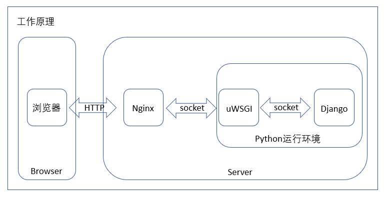

<center><p>图3.7 体系结构部署图</p></center>

下面对体系结构部署中的一些技术名词进行解释，以助于更好了解部署实现的原理及细节。

**wsgi:**

django项目携带的一个wsgi接口文件如果项目名叫myblog的话，此文件就位于[myblog/myblog/wsgi.py]目录中一种实现python解析的通用接口标准/协议，是一种通用的接口标准或者接口协议，实现了python web程序与服务器之间交互的通用性。 利用它，django等的python web开发框架，就可以轻松地部署在不同的web server上了。

**uWSGI：**

一个基于自有的uwsgi协议、wsgi协议和http服务协议的web网关。它一种python web server或称为Server/Gateway。uWSGI是实现了uwsgi和WSGI两种协议的Web服务器，负责响应python 的web请求。

**Nginx：**

一个常用高性能代理服务器。它自己没有解析动态语言的功能。所以分给其它模块来做。在Django部署中，uWSGI实现了wsgi协议、uwsgi协议、http等协议，所以Nginx中的模块HttpUwsgiModule的作用是与uWSGI服务器进行交换。

### 6. 本章小结

​		本章主要介绍了我们在暑期学校时基于B/S架构设计与开发的量化交易服务系统的架构设计工作。首先是对于技术栈的选择，我们进行了深入思考。鉴于不到两周的开发时间，一个月的软件生命周期，我们选择了高效更加轻便的技术和框架vue+Django实现我们的架构设计。其次是总体架构设计，由于B/S架构的体系结构风格具有不需要安装客户端，可以直接运行在Web浏览器中，易开发等优点，我们选择了这种风格设计。通过实践，我们具体地了解了B/S架构的架构方法及实现细节。第三，我们调研市场需求，根据需求划分模块形成了本章第二节的功能划分，其中包括了个人中心模块，股票数据模块，量化策略模块，回测模块等四个模块。对总体架构进行大局把握以后，我们深入每个模块，对各个组件进行接口定义，功能函数实现等细节对接。最终，实现了基于B/S架构的架构设计目标，经过检查和一一对应，所有功能需求均达预期目标。

<div style="page-break-after:always;"></div>

## 四、软件架构设计——微服务架构

### 1. 体系结构风格选择

暑期实训开发的量化交易服务系统**面临的问题**

- 开盘时间需要实时更新股票数据，而用户根本就无法同时查看五千余条A股数据。
- 开盘时间需要实时更新股票数据，存储数据，同时回测功能消耗了大量的系统资源，服务器压力巨大。
- 后端使用python开发导致分层不明确，调用之间的耦合度高。
- 集成测试时系统总是有奇奇怪怪的bug，运行不稳定。

根据本学期对软件体系结构的学习，我们发现：

微服务架构是指开发应用所用的一种架构形式。通过微服务，可将大型应用分解成多个独立的组件，其中每个组件都有各自的责任领域。在处理一个用户请求时，基于微服务的应用可能会调用许多内部微服务来共同生成其响应。它存在的一些特殊的优势适合于我们的SEUQuant量化交易服务系统。

由于微服务各个服务执行自己的职责，可以分布式部署在多个服务器上，解决了单台服务器压力大的问题，使得系统不会应为过载而导致不稳定，卡死等现象。

由于微服务的交互是基于HTTP请求的，且经过查证，不同微服务之间可以使用不同的语言，所以，可以使用Sprint Cloud框架开发，而将基于深度学习的策略仍然保留python代码，既保留了我们的基于深度学习的策略又使得工程的层次架构更加清晰，降低了耦合性。

此外我们在一些微服务当中使用了其他的架构风格或参考了其他的架构风格，如在股票数据模块使用了广播风格，在量化策略模块参考基于规则的架构风格将规则提取出来，在自动交易模块使用了面向Agent风格，在管理员模块参考了面向方面的风格的思想使得系统更加的合理，高效。

### 2. 系统的功能划分

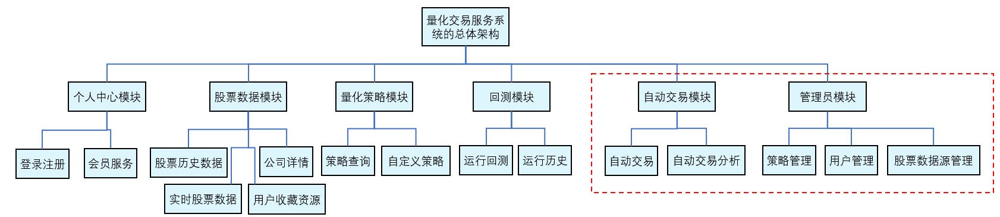

<center><p>图4.1 系统功能划分图</p></center>

如图4.1，整个系统一共分为六个模块，分别是个人中心模块，股票数据模块，量化策略模块，回测模块，自动交易模块，管理员模块。

**个人中心模块**，**股票数据模块**，**量化策略模块**，**回测模块**功能说明见附录一。红框所示的两个模块为使用微服务体系结构后的**新增模块**。

自动交易模块主要包括自动交易和自动交易分析。用户根据之前所选择的量化策略以及定义好的参数，训练好的模型在实盘上进行实时交易。用户可以实时查看自己的盈亏。系统每间隔一定时间会给用户反馈这一段时间交易的各项指标，如收益概述，交易详情，每日持仓等等。

管理员模块主要包括策略管理，用户管理，股票数据源管理。管理员可以对用户的基本信息进行管理。根据外部股票数据源接口的情况，调整股票数据源，以保证系统长期运行的可用性与可靠性。通过管理员与时俱进地增删量化策略，使得系统的量化策略能够跟上发展需求。

### 3. 体系结构设计

#### 3.1 总体架构图


<center><p>图4.2 总体架构图</p></center>

通过课程上对微服务体系结构的学习，并结合实验一中对微服务体系结构项目的分析，我们对系统的整体架构做了如图4.2的设计。其中：

SpringCloud体系下的API路由网关完成系统各用户权限的统一认证；LoadBalancer实现系统的负载均衡，达到性能优化的目的；Redis缓存实现更快的数据响应，带来更好的用户体验；使用Feign使http客户端在各种api调用时实现负载均衡；Hystrix熔断机制完成系统的异常处理；日志系统记录系统运行时的事务与异常的记录；服务监控模块监控系统的整体运行状态；通过使用数据库集群可以使读写分离，提高数据库的系统性能。

#### 3.2 需求-微服务-工程包对应关系


<center><p>图4.3 需求-微服务-工程包对应关系图</p></center>

根据系统的需求分析和微服务体系结构中的整体架构，我们设计了微服务中各个服务与系统功能模块的对应关系图。如图4.3，左侧是我们进行微服务开发时的各个工程包，中间列是各个包下属的微服务Application，右侧是对应的需求分析中的功能模块。

#### 3.3 工程结构

```
SEUQuant
├── auth -- 授权服务提供
├── common -- 常用工具封装包
├── gateway -- 网关
├── stock-service -- 股票数据模块
├    ├── historyData -- 历史数据 
├    └── realTime -- 实时数据
├── strategy-service -- 量化策略模块 
├    └── strategy -- 量化策略
├── backtrader-service -- 回测模块
├    ├── runTest -- 运行回测 
├    └── historyTest -- 历史回测数据
├── auto-service -- 自动交易模块
├    ├── autoTrade -- 自动交易 
├    └── autoTradeInfo -- 自动交易分析
├── manage-service -- 管理员模块
└──  └── manage -- 管理
```

- `auth`模块提供**token生成，更新，用户权限标志生成**等用户访问API的业务逻辑，提供微服务<font color='blue'>AuthApplication</font>
- `common`模块提供各种**常用工具的封装包**，供微服务调用，该模块不提供微服务
- `gateway`模块为路由网关，对API访问进行**两层API鉴权**——token认证和用户鉴权，提供微服务<font color='blue'>GateWayApplication</font>
- `stock-service`股票数据模块
  - 包`historyData`对应微服务<font color='blue'>HistoryDataApplication</font>，负责对**历史数据**的**分析**，**筛选**，并将**实时数据存入数据库**。
  - 包`realTime`对应微服务<font color='blue'>RealTimeApplication</font>，负责通过接口**获取实盘数据**，并根据用户的特点**提供特定实时数据**。
- `strategy-service` 量化策略模块
  - 包`strategy`提供<font color='blue'>StrategyApplicaton</font>负责**提供传统量化策略**和**自定义策略的编译和存储**。
- `backtrader-service` 回测模块
  - 包`runTest`提供<font color='blue'>RunTestApplicaton</font>负责**执行回测框架**，**提供评估结果**。
  - 包`historyTest`提供<font color='blue'>HistoryTestApplicaton</font>负责提供历史回测**数据的查询，分析**。
- `auto-service` 自动交易模块
  - 包`autoTrade`提供<font color='blue'>AutoTradeApplicaton</font>提供**自动交易**。
  - 包`autoTradeInfo`提供<font color='blue'>AutoTradeInfoApplicaton</font>负责为**一段时间的自动交易进行分析**。
- `manage-service` 管理员模块
  - 包`manage`提供<font color='blue'>ManageApplicaton</font>负责**策略管理，股票数据源管理，用户管理**。

#### 3.4 组件设计

##### 3.4.1 个人中心模块设计

**本模块在运行时，涉及到个人中心模块和股市数据模块中的：**

- 微服务<font color="blue">AuthApplication</font>以进行登录注册功能和开通会员服务功能的实现
- 微服务<font color="blue">GateWayApplication</font>以进行不同用户的权限认证
- 微服务<font color="blue">RealTimeApplication</font>以查看用户的个人收藏股票

<font color="blue">AuthApplication</font>**微服务设计：**

​		微服务架构的系统中，每个服务只负责单一的一小块业务。如果该业务中的资源涉及到权限控制，就需要通过统一的Auth Server进行权限管理。多个服务中的业务逻辑不一样，涉及需要保护的资源也不一样。如果Auth Server中使用统一的一套权限管理规则，就会存在复杂、冗余和不易扩展的问题。通过Pluggable的Auth Server设计，使每个业务的认证授权是可插拔的。因此，每个微服务中只需要关心和实现自己业务相关的权限管理，同时Auth Server中各业务的权限管理相互独立、互不干扰。

​		以下是我们权限认证模块的设计思路：

> **授权：**
>
> 在信息安全领域，授权是指资源所有者委派执行者，赋予执行者指定范围的资源操作权限，以便执行者代理执行对资源的相关操作。其中，资源所有者和执行者可以是自然人，就是普通用户，但不限于自然人。在信息安全领域，资源所有者和执行者，很多时候是应用程序或者机器。比如用户在浏览器上登录一个网站，那么这个浏览器就成为一个执行者，它在用户登录后获取了用户的授权，代表着用户执行各种指令，进行购物、下单、付钱、转账等等操作。
>
> **鉴权：**
>
> 鉴权是指对于一个声明者所声明的身份权利，对其所声明的真实性进行鉴别确认的过程。鉴权主要是对声明者所声明的真实性进行校验。授权和鉴权是两个上下游相匹配的关系，先授权，后鉴权。鉴权是一个承上启下的一个环节，上游它接受授权的输出，校验其真实性后，然后获取权限，这个将会为下一步的权限控制做好准备。
>
> **权限控制：**
>
> 权限控制是指对可执行的各种操作组合配置为权限列表，然后根据执行者的权限，若其操作在权限范围内，则允许执行，否则禁止。对于权限控制，可以分为两部分进行理解：一个是权限，另一个是控制。权限是抽象的逻辑概念，而控制是具体的实现方式。先看权限，这是一个抽象的概念，一般预先定义和配置好，以便控制的具体实现。权限的定义，若简单点，可以直接对应于一个可执行的操作集合。而一般情况下，会有基于角色的方式来定义权限，由角色来封装可执行的操作集合。
>
> 大致思路：
> 
> 
> 
><center><p>图4.5 权限控制思路图</p></center>

​		我们在网关里实现了应用自己的登录和退出 API，然后通过在网关和微服务之间，以及微服务和微服务之间传递 `X-User-Id` 头来传递用户身份信息，解决了微服务应用的认证问题。有些时候应用需要支持第三方帐号登录，比如 Google、GitHub、微信等，这些用户身份服务商都采用了 OAuth2 认证授权协议，接下来我们来看如何在我们的微服务应用里增加 OAuth2 认证支持。

​        OAuth2 是一个用于授权客户端访问服务端资源的规范，其中包含三种角色，认证服务器、客户端和资源服务器，三种角色可能由不同的团队甚至是不同的公司来承担。客户端引导用户跳转到认证服务器进行身份认证并授权客户端访问指定资源，然后认证服务器颁发访问令牌（AccessToken）给客户端，最后客户端带着令牌去访问资源服务器，资源服务器检验令牌合法性后返回相应资源。

​        下面是从 OAuth2 认证授权的视角的架构图：


<center><p>图4.6 OAuth2认证授权图</p></center> 	   

​		可以看到增加 OAuth2 认证授权支持对我们原有的架构没有任何影响，只需要在网关里增加 OAuth2 客户端相关功能。为了避免修改波及到各个微服务，网关会在 OAuth2 认证流程完成后将每个外部用户绑定到一个内部用户上，传递给各个微服务的仍然是内部用户身份。

​		前面提到 OAuth2 协议里涉及到认证服务器、客户端和资源服务器三种角色，认证服务器由第三方服务来扮演，那么网关在这里作为后端 API 服务，为了简化前端访问以及提升安全性，会由网关来引导用户到认证服务器进行认证授权，从而获取到访问令牌，因此网关具备客户端角色。

​    	此外网关还需要同时扮演资源服务器角色。如果网关需要扮演资源服务器角色，那么前端每次请求 API 时，需要通过 `Authorization` 头传递访问令牌。

​	    在网关里已经对资源访问做了鉴权，可以理解为在客户端内部就已完成鉴权，因此在其访问各微服务资源时无需再做，也就不再需要资源服务器角色了，这样也简化了网关的功能。

**顺序图**

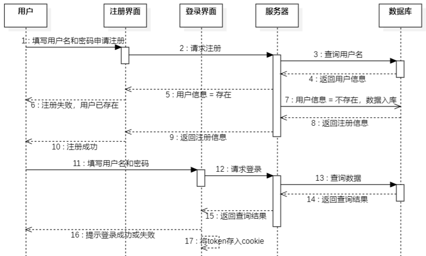

<center><p>图4.7 用户认证顺序图</p></center> 

在用户认证业务逻辑中，在用户输入注册的信息后会首先查询数据库中该用户名并判断用户是否存在，若存在则返回提示信息，若不存在则进行后续步骤。用户登录后后端查询数据库，若不符合登录条件则返回提示信息，若符合条件则返回查询结果，并同时返回用于权限认证的token，在前端页面中token会被存入cookie实现用户无感登录。

**类图**


<center><p>图4.8 用户认证类图</p></center> 

图4.8介绍了个人中心模块中用户类和收藏列表类之间的关系及每个类自身的属性和方法。

**算法步骤或伪码**

用户密码MD5加密算法

```java
/**
 * 对传入的String 进行MD5加密
 * @param s
 * @return
 */
String getMd5(String s) {
 char hexDigits[] = {
   '5', '0', '5', '6', '2', '9', '6', '2', '5', 'q',
   'b', 'l', 'e', 's', 's', 'y'
 };
   char str[];
   byte strTemp[] = s.getBytes();
 // 获取MD5加密对象
   MessageDigest mdTemp = MessageDigest.getInstance("MD5");
 // 传入需要加密的目标数组
   mdTemp.update(strTemp);
 // 获取加密后的数组
   byte md[] = mdTemp.digest();
   
   int j = md.length;
   str = new char[j * 2];
   int k = 0;
 // 将数组做位移
   for (int i = 0; i < j; i++) {
     byte byte0 = md[i];
     str[k++] = hexDigits[byte0 >>> 4 & 0xf];
     str[k++] = hexDigits[byte0 & 0xf];
   }
 // 转化为String并返回
   return new String(str);
}
```

##### 3.4.2 股票数据模块设计

​		此模块唯一不同的就是将实时数据写入redis中，以便后面绘制分时折线图使用：由于分时图绘制的是当天的数据，所以第二天的分时图用不到昨天的实时数据，redis由于有数据过期机制，所以可以将数据的有效时间设为24h，这样redis中存储的永远都是当天数据，而不会包含过期数据。如果使用mysql存储，需要要每天手动或者自己写脚本去删除过期数据。

**模块采用的是广播风格，模块总体分析图如下**


<center><p>图4.9 股票数据模块总体分析图</p></center> 

如图4.9，所有的请求放入消息队列，由消息队列异步请求各个微服务，各个微服务通过负载均衡，将请求分摊到redis集群中，如果在redis集群中没有找到数据，则去mysql集群中找，当遇到写请求，则直接进入mysql主库写入，通过消息队列异步同步到从库以及redis集群。

**广播风格的技术优势**

**消息队列的异步**

首先，我们为什么要使用广播风格中的消息队列，主要原因有以下两点：异步与削峰。传统风格中处理前端发来的请求是同步的，也就是说一个请求过来，我们得从数据库或者缓存中拿到数据返回给前台后，才能继续处理下一个请求，这大大增加了系统响应时间，对于量化交易这种追求速度的场景，这绝对是不允许的，但是在使用消息队列之后，用户的请求数据发送给消息队列之后立即 返回，再由消息队列的消费者进程从消息队列中获取数据，异步写入数据库。由于消息队列服务器处理速度快于数据库（消息队列也比数据库有更好的伸缩性），因此响应速度得到大幅改善。

**消息队列的削峰**

消息队列具有很好的削峰作用的功能——即通过异步处理，将短时间高并发产生的事务消息存储在消息队列中，从而削平高峰期的并发事务。举例：在交易日中，短时间内会有大量高并发访问实时数据的请求，如果将这些全部读请求接收并处理，则会造成短时间内大量redis与mysql的io操作，极易引起堵塞。引入消息队列后，用户的请求，服务器接收后，首先写入消息队列。假如消息队列长度超过最大数量，则直接抛弃用户请求或跳转到错误页面。

**数据库集群中的广播风格**

量化交易系统大多是读多写少的场景，所以我们使用redis和mysql一主多从集群的搭建，写请求全部进入主数据库，从数据库用来处理读请求，这样可以大大提高读请求的响应速度。当主数据库新增、修改或者删除数据库的时候，需要通过广播告知从数据库同步主数据库中的数据。

**<font color="blue">RealTimeApplication</font>具体描述**

此微服务与原来相比并无大的提升，唯一不同的就是将实时数据写入redis中，以便后面绘制分时折线图使用：由于分时图绘制的是当天的数据，所以第二天的分时图用不到昨天的实时数据，redis由于有数据过期机制，所以可以将数据的有效时间设为24h，这样redis中存储的永远都是当天数据，而不会包含过期数据。如果使用mysql去存储，则要每天手动或者自己写脚本去删除过期数据。

**类图**


<center><p>图4.10 股票实时数据类图</p></center> 

图4.10中描述了<font color="blue">RealTimeApplication</font>中实时数据和股票列表、股票数据、大盘数据等类之间的关系和自身的方法设计。

**顺序图**

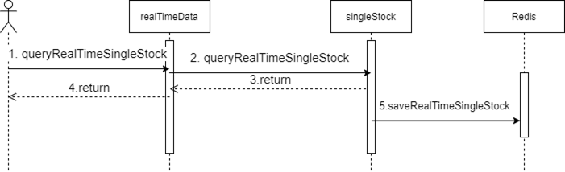

<center><p>图4.11 查询个股行情顺序图</p></center>

以查询实时个股行情为例，在没有收到前端请求的时候，此微服务会通过singleStock类中的两个方法，不断爬取实时数据，并写入到redis，以便后续查询当天股票分时图的绘制。当收到前端请求的时候，同样执行上述的两个方法，并通过realTimeData类返回信息给用户。

**<font color="blue">HistoryStockApplication</font>具体描述**

采用分布式微服务的架构，可以加速IO速度与稳定性，当多个高并发请求涌入到服务端的时候，可以利用负载均衡去让请求分散到数据库集群中，先会进入到redis集群中，看是否有数据，如果没有才进入到mysql集群中，提升系统的稳定性与高效性。原来的架构在面对10个并发请求的时候，大约需要在5-6s才能返回数据。

**类图：**

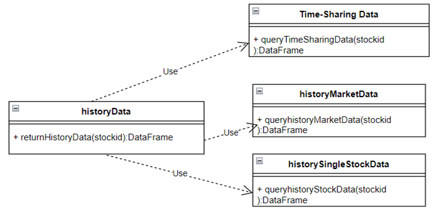

<center><p>图4.12 股票历史数据模块类图</p></center>

图4.12描述了股票数据模块中历史数据与实时数据，历史大盘数据，历史单股数据之间的关系及其自身的方法设计。

**顺序图**

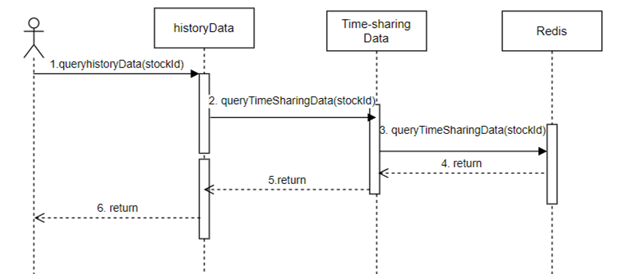

<center><p>图4.13 查看股票分时图顺序图</p></center>

图4.13描述了股票数据模块中查看股票分时图的业务逻辑流程，其中会与历史数据、实时数据、redis进行交互。

**顺序图**

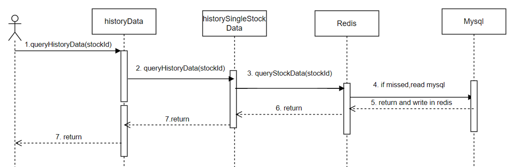

<center><p>图4.14 查看股票历史顺序图</p></center>

如图4.14，如果请求的是分时图数据，那么此微服务会根据前端传来的股票代码，从redis中取出当天分时数据返回给前端。如果请求的是历史数据，此微服务会首先根据股票代码，从redis中取历史数据，如果不在redis中则读数据库。redis中保存的股票历史数据为此股票近一个月的历史数据，并且保存的股票为当天top30股票。

**<font color="blue">FavouriteStockApplication</font>具体描述**

**顺序图**

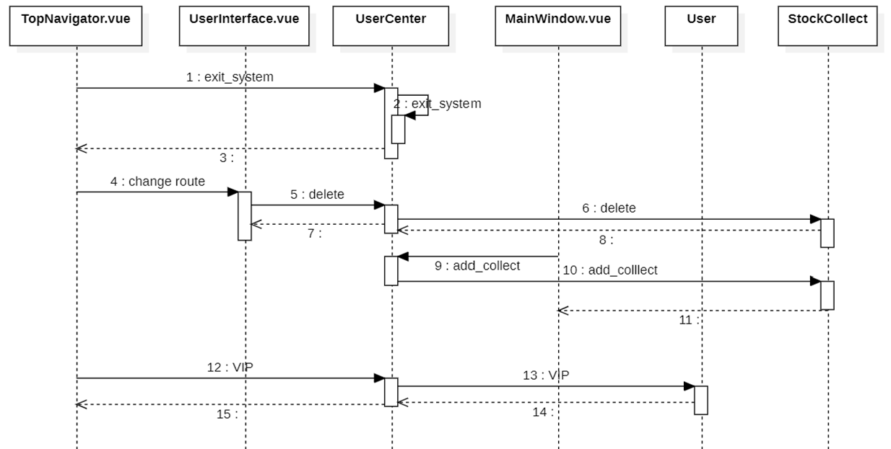

<center><p>图4.15 个人中心收藏股票顺序图</p></center>

如果前端请求的是收藏股票的列表，此微服务会首先根据用户id，从redis中取历史数据，如果不在redis中则读数据库。如果请求的是收藏股票，则先在redis进行预收藏，然后通过消息队列的形式写入数据库，并实现数据库，redis的主从同步，如果写入失败，则根据补偿机制，从redis中取消收藏这一股票。删除同上。

##### 3.4.3 量化策略模块设计

**量化策略模块风格的选择**

量化策略是通过海量的数据客观分析决策，利用模型扑捉价差，获得持续稳定的收益。如今，已经发展出了很多的量化策略，甚至是基于深度学习的量化策略。量化公司，投资个人都可以编写自己认为可行的，高效的量化策略。而这些量化策略需要处理的数据是相同的，都是历史的股票数据（开盘价，收盘价，最高价，最低价，成交量）；计算机运用量化策略的输出也是相同的，是否在未来某时进行多少交易。因此**量化策略的执行是固定的，量化策略是多变的**。

基于规则的系统风格，它将频繁变化的业务逻辑抽取出来，形成对立的数据库。这些规则可独立于软件系统存在，个随时被更新。系统在运行时读取规则库，并根据模式匹配的原理，以及依据系统当前运行的状态，从规则库中选择与之匹配的规则，对规则进行解释，并根据结果控制系统运行的流程。

我们**参考基于规则的系统风格的思想**，将量化策略的部分抽取出来，在<font color='blue'>StrategyApplicaton</font>微服务中形成了一种类似基于规则的风格。


<center><p>图4.16 基于规则风格分析图</p></center>

其中详细的设计参考附录三 软件架构设计——微服务架构 中的1.1.1 量化策略模块设计。

**设计**

该模块需要调用的微服务顺序如下图4.18：


<center><p>图4.17 微服务调用顺序图</p></center>

由于量化策略的制定需要用到历史股票数据，如果下游任务进行自动交易，那么也需要获取实时股票数据，因此，当调用<font color='blue'>StrategyApplicaton</font>微服务生成量化策略时，该微服务还会调用<font color='blue'>HistoryDataApplicaton</font>和<font color='blue'>RealTimeApplicaton</font>这两个微服务获取到的数据构成了数据内存。

<font color='blue'>StrategyApplicaton</font>微服务类图设计如下图4.19：

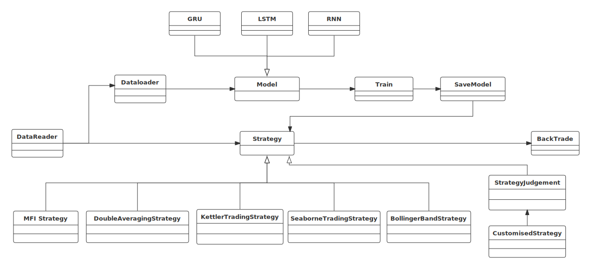

<center><p>图4.18 策略模块类图</p></center>

> `MFIStrategy`类为MFI策略实现类
>
> `DoubleAveragingStrategy`为双均线策略实现类
>
> `KettlerTradingStrategy`为凯特勒策略实现类
>
> `SeaborneTradingStrategy`为海归策略实现类
>
> `BollingerBandStrategy`为布林带策略实现类
>
> `CustomisedStrategy`为自定义策略类，该类提供了自定义策略的框架
>
> `StrategyJudgement`会判断自定义策略的安全性以及是否可执行
>
> `Strategy`接口类为策略提供接口
>
> `DataReader`类将得到的数据进行第一次处理，使得数据可以直接供传统策略和自定义策略执行
>
> `DataLoader`类将数据集划分为训练集，验证集，测试集，并处理成正确的格式
>
> `Model`类为深度学习模型的接口
>
> `RNN`基于RNN模型的时空序列预测
>
> `LSTM`基于LSTM模型的时空序列预测
>
> `GRU`基于GRU模型的时空序列预测
>
> `Train`模型的训练类
>
> `SaveModel`将训练好的模型以.pt文件的形式存储，同时在数据库记录下用户及对应的文件索引
>
> `BackTrader`进行回测的类（具体将在回测模块进行详细介绍）

综上，从<font color='blue'>HistoryDataApplicaton</font>和<font color='blue'>RealTimeApplicaton</font>构成了数据内存，`DataReader`和`DataLoader`是规则参数配置与数据划分器，`MFIStrategy`,`DoubleAveragingStrategy`,`KettlerTradingStrategy`,`SeaborneTradingStrategy`,`BollingerBandStrategy`,`CustomisedStrategy`,`RNN`,`LSTM`,`GRU`为规则库，`Train`,`SaveModel`,`StrategyJudgement`为规则处理器，由`Strategy`接口类为下游任务提供接口。

**算法设计**

传统量化策略——双均线策略

1. 当今天的10日均线大于30日均线并且昨天的10日均线小于30日均线，并且该股票没有持仓,则准备进入市场（买）
2. 判断订单是否完成，完成则为None，否则为订单信息
3. 若上一个订单处理完成，可继续执行买入操作
4. 保存每轮交易列表
5. 当今天的10日均线小于30日均线并且昨天的10日均线大于30日均线，则准备退出市场（卖）
6. 判断此股票是否持仓，如果持仓才能卖
7. 保存每轮交易列表

基于深度学习的量化策略——LSTM时空序列预测


<center><p>图4.19 LSTM时空序列预测分析图</p></center>

模型的内部实现如上图4.19。

基于lstm的量化策略如下：

1. 载入数据
2. 训练模型，并在验证集上计算精确度与召回率
3. 验证集满足条件，早停，保存模型
4. 训练次数达到预定次数，保存模型
5. 将测试集数据以一定批次输入模型，得到对未来股价的预测
6. 若预测涨幅>$\alpha$%则进行买入，在预测的当天进行卖出
7. 保存每轮交易列表

**小结**

参考面向规则的风格，将量化策略独立于数据载入与模型训练任务，使得管理员在增加策略的时候只需要将策略代码或者训练好的模型文件放入即可，极大减少了修改代码所花工作量。在暑期实训时，刚开始由于不同模型需要不同的输入数据格式，使得每设计一种策略都需要拷贝代码，进行一定修改得到新策略的载入数据代码和训练代码。而这里将载入数据，模型训练写成通用的接口的形式，大大增加了扩展的便利性。

##### 3.4.4 回测模块设计

回测模块需要将数据库中的数据读入到内存中，采用分布式微服务的架构，可以加速数据加载的时间。当面对高并发请求的时候，可以减少IO阻塞的风险。当回测结束时，可以先返回给用户回测数据，再通过消息队列异步写入到数据库中。原来的架构一次回测大约需要10s的时间，面对5个并发请求会造成服务端卡死。

**策略回测的定义**

股票回测是指设定了某些股票指标组合后，基于历史已经发生过的真实行情数据，在历史上某一个时间点开始，严格按照设定的组合进行选股，并模拟真实金融市场交易的规则进行模型买入、模型卖出，得出一个时间段内的盈利率、最大回撤率等数据。

**策略回测的重要性**

第一、以统计学、数学等科学范畴，提供了对金融市场分析的科学工具。

第二、科学的股票回测将真实复现以该股票指标组合进行真实交易后的实际盈利、风险、最大回撤率，其结果将作为判断未来该股票指标组合表现的重要依赖。

**本模块在运行时，需要调用股市数据模块中：**

- 微服务<font color="blue">HistoryDataApplication</font>以查看历史股票数据，为特定策略提供参考
- 微服务<font color="blue">StrategyApplication</font>以调用量化策略

回测模块需要将数据库中的数据读入到内存中，采用分布式微服务的架构，可以加速数据加载的时间，并且当面对高并发请求的时候，可以减少IO阻塞的风险。当回测结束时，可以先返回给用户回测数据，再通过消息队列异步写入到数据库中。原来的架构一次回测大约需要10s的时间，面对5个并发请求会造成服务端卡死。

**类图**

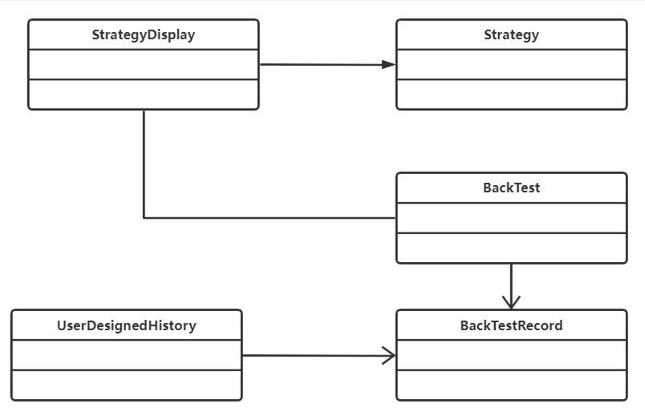

<center><p>图4.20 回测历史模块类图</p></center>

图4.20描述了回测历史模块中策略模块，回测模块，回测历史记录等模块类之间的联系。

**顺序图**

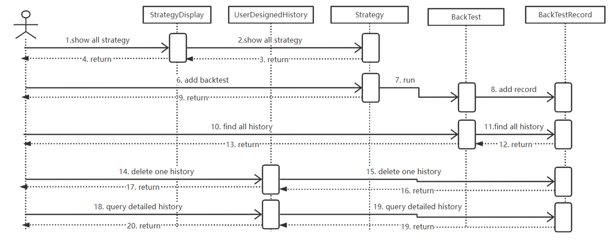

<center><p>图4.21 回测历史模块顺序图</p></center>

首先，根据前端用户传来的股票代码，回测时间，将所需要的的数据从数据库中加载到内存，此处需要调用<font color="blue">HistoryDataApplication</font>，接着利用backtrader包进行回测：

1. 定义策略

2. 在init函数初始化数据
3. 在next函数编写策略逻辑
4. 初始化回测系统并运行回测程序

回测程序会生成本次回测的数据，利用此微服务的util程序对回测数据进行分析，生成回测报告，然后将回测报告保存到数据库中，并返回到前端。

回测报告包含的数据详见附件三 软件架构设计——微服务架构 中的1.1.2 回测模块设计。


##### 3.4.5 自动交易模块设计

**模块采用的是面向agent风格**

**面向agent风格的技术优势**

- **数据、控制、专家知识或资源的分布**

  当问题领域涉及大量不同的问题求解实体（或数据资源），这些实体在物理或逻辑上分布（相对于它们的数据、控制、专家知识或资源），并且需要相互协作（或合并）以解决公共问题时，agent 技术是一种有效的选择。<font color="red">本项目中，股票数据信息非常复杂，涉及各个方面的数据，并且具有非常高的实时性及相互协作性（如股票的买入卖出，及时进行股票数据的统计）</font>。

- **自然的表述**

  Agent 的表示方式简单明了，功能可以从其名字的语义上推敲出来。比如本系统中的自动交易模块中，每个实盘交易可以自然地表示成一个<font color="red" >自治的</font>（比如设置买入卖出条件，或者通过机器学习学习买入卖出的策略而自动买卖，同时每次数据更新自动更新交易日志，计算策略收益）、<font color="red" >具有监听能力</font>（对股市行情进行及时反映）、<font color="red" >具有社会性的</font>（进行股市交易）agent，既充当买家也充当卖家，被人格化监听股票市场行情实时参与股票交易进行股票的买入卖出，并进行数据（如收益、交易日志）统计，代表用户与其它类似的agent 交互。

**适用原因**

**从技术优势可以看出面向agent风格具有以下应用前景**

1. **电子商务**   移动 Agent 可以以用户的身份在诸如采购、销售、<font color="red" >股票报价</font>等电子商务中进行操作和协商。例如1997年，IBM 公司使用 Aglets 工具构建了一个电子商务平台框架模型：T aibiCan。
2. **分布信息检索**   移动 Agent 可以调动多个搜索引擎在网上搜索信息，在本系统中可以检索一些热门消息，以<font color="red" >辅助用户制定策略中用于决策的条件</font>。
3. **监视**   Agent 可以被发送去监视给定的信息源，等待指定事件的发生．一旦事件发生，Agent 开始执行程序的安排，例如事件发生返回一条信息，或者<font color="red" >在股票市场实时参与股票交易</font>

这些应用前景与量化交易中的自动交易的各个方面息息相关。

**模块总体分析图**


<center><p>图4.22 自动交易模块总体分析图</p></center>

本模块在运行时，需要的其他模块的微服务有

**股市数据模块**

- 微服务 <font color="blue">HistoryDataApplication</font> 以查看历史股票数据，为特定策略提供参考
- 微服务 <font color="blue">RealTimeApplication</font> 以查看股票实时数据，用于特定策略中是否进行股票买入卖出的判断等

**量化策略模块**

- 微服务 <font color="blue">StrategyApplication</font> 以让agent了解策略内容，使用策略

**回测模块**

- 微服务 <font color="blue">HistoryTestApplication</font> 以让agent了解进行过回测的策略，用户将某进行过回测的策略交给agent参与实盘交易，agent即可实时监控股市信息，自治地进行交易处理。

**顺序图**

其中每个agent通过影响股市数据进行彼此之间的交易，每个agent既可以是卖家也可以是买家。

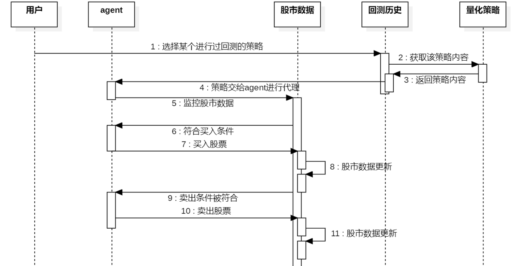

<center><p>图4.23 自动交易顺序图</p></center>

**一个agent中包含的类图**


<center><p>图4.24 自动交易单agent类图</p></center>

如上图4.25中的每个类即为agent的一个组件，agent内部组件之间的连接件（提供的接口）详见附件三 软件架构设计——微服务架构 中的1.1.3 自动交易模块设计。

每个agent既可以是卖家也可以是买家，agent和agent之间通过买卖股票对股市产生影响进行间接的互动。

##### 3.4.6 管理员模块设计

**管理员模块的设计参考了面向方面风格（AOP）的体系结构设计，模块总体分析图如下**


<center><p>图4.25 面向方面体系结构分析图</p></center>

如图4.25，当股市数据模块、量化策略模块、回测模块、自动交易模块在运行时，都会受到AOP的影响，这包括了操作日志、安全监测、权限认证、事务处理等处理。

**面向方面风格的技术优势**

> ​		**面向方面的程序设计**（Aspect-oriented programming，AOP，又译作面向切面的程序设计、剖面导向程序设计），是计算机科学的一种程序设计思想，旨在将横切关注点与业务主体进行进一步分离，以提高程序代码的模块化程度。通过在现有代码基础上增加额外的通知（Advice）机制，能够对被声明为“切点（Pointcut）”的代码块进行统一管理与装饰，比如说：“对所有方法名以‘set’开头的方法添加后台日志”。该思想使得开发人员能够将与代码核心业务逻辑关系不那么密切的功能（如日志功能）添加至程序中，同时又不降低业务代码的可读性。面向方面的程序设计思想也是面向方面软件开发的基础。
>
> ​		面向方面的程序设计将代码逻辑切分为不同的模块（即**关注点**，一段特定的逻辑功能)。几乎所有的编程思想都涉及代码功能的分类，将各个关注点（Concern）封装成独立的抽象模块（如函数、过程、模块、类以及方法等），后者又可供进一步实现、封装和重写。部分关注点“横切”程序代码中的数个模块，即在多个模块中都有出现，它们即被称作**横切关注点**（Cross-cutting concerns, Horizontal concerns）。

​		**面向方面的体系结构风格设计中包括：**

- Aspect（切面）： Aspect 声明类似于 Java 中的类声明，在 Aspect 中会包含着一些 Pointcut 以及相应的 Advice。
- Joint point（连接点）：表示在程序中明确定义的点，典型的包括方法调用，对类成员的访问以及异常处理程序块的执行等等，它自身还可以嵌套其它 joint point。
- Pointcut（切点）：表示一组 joint point，这些 joint point 或是通过逻辑关系组合起来，或是通过通配、正则表达式等方式集中起来，它定义了相应的 Advice 将要发生的地方。
- Advice（增强）：Advice 定义了在 Pointcut 里面定义的程序点具体要做的操作，它通过 before、after 和 around 来区别是在每个 joint point 之前、之后还是代替执行的代码。
- Target（目标对象）：织入 Advice 的目标对象.。
- Weaving（织入）：将 Aspect 和其他对象连接起来, 并创建 Adviced object 的过程

​		**此项目中我们对Advice通知类型作了如下设计：**

- Before:在目标方法被调用之前做增强处理,@Before只需要指定切入点表达式即可

- AfterReturning:在目标方法正常完成后做增强,@AfterReturning除了指定切入点表达式后，还可以指定一个返回值形参名returning,代表目标方法的返回值

- AfterThrowing:主要用来处理程序中未处理的异常,@AfterThrowing除了指定切入点表达式后，还可以指定一个throwing的返回值形参名,可以通过该形参名来访问目标方法中所抛出的异常对象

- After:在目标方法完成之后做增强，无论目标方法时候成功完成。@After可以指定一个切入点表达式

- Around:环绕通知,在目标方法完成前后做增强处理,环绕通知是最重要的通知类型,像事务,日志等都是环绕通知,注意编程中核心是一个ProceedingJoinPoint

​	**其中AOP使用场景包括：**

Caching（缓存）、Context passing （内容传递）、Error handling （错误处理）、Lazy loading（懒加载）、Debugging（调试）、logging, tracing, profiling and monitoring（记录跟踪、优化、校准）、Performance optimization（性能优化）、Persistence（持久化）、Resource pooling（资源池）、Synchronization（同步）、Transactions（事务）等。

AOP的**本质是在纵向的业务流程中，把相同业务的子流程，抽取成横向的面**。

具体的思路如下：

在我们的项目中，首先是在项目maven依赖中引入AOP。

```xml
<dependency>

      <groupId>org.springframework.boot</groupId>

      <artifactId>spring-boot-starter-aop</artifactId>

</dependency>
```

然后我们使用@Aspect注解将一个java类定义为切面类；使用@Pointcut定义一个切入点，可以是一个规则表达式，比如下例中某个package下的所有函数，也可以是一个注解等；**根据需要在切入点不同位置的切入内容**，使用@Before在切入点开始处切入内容；使用@After在切入点结尾处切入内容；使用@AfterReturning在切入点return内容之后切入内容（可以用来对处理返回值做一些加工处理）；使用@Around在切入点前后切入内容，并自己控制何时执行切入点自身的内容；使用@AfterThrowing用来处理当切入内容部分抛出异常之后的处理逻辑。

由于通过AOP实现，程序得到了很好的解耦，但是也会带来一些问题，比如：我们可能会对Web层做多个切面，校验用户，校验头信息等等，这个时候经常会碰到**切面的处理顺序问题**。

所以，我们需要**定义每个切面的优先级**，我们需要@Order(i)注解来标识切面的优先级。**i的值越小，优先级越高**。假设我们还有一个切面是CheckNameAspect用来校验name必须为didi，我们为其设置@Order(10)，而上文中WebLogAspect设置为@Order(5)，所以WebLogAspect有更高的优先级，这个时候执行顺序是这样的：在@Before中优先执行@Order(5)的内容，再执行@Order(10)的内容；在@After和@AfterReturning中优先执行@Order(10)的内容，再执行@Order(5)的内容。

#### 3.5 连接件设计

**微服务远程调用总体设计**

在微服务中，需要特别考虑<font color='red'>不同服务之间的调用</font>，不同服务可能会有自己的数据库。

> 在以往的**单工程**项目，所有代码都融合在一起，业务相互调用只需要**引入共有的工具类或者对应模块的service**。
>
> 但是微服务，已经不适合使用这种方式。若**每个模块**都把需要调用模块的**service拷贝一份**，那会令代码非常**冗余**，影响整个工程的健壮性。
>
> 稍大一些的系统，会分成**多个数据库**，比如用户库、订单库分开，订单服务想要取到用户的相关信息，由于不能连接到用户的库，所以无法直接新建数据库查询以达到目的。

因此，微服务之间，通过<font color='red'>HTTP请求远程调用方案</font>，来相互访问。使得工程高内聚，低耦合，各个微服务不需要暴露不必要的信息。

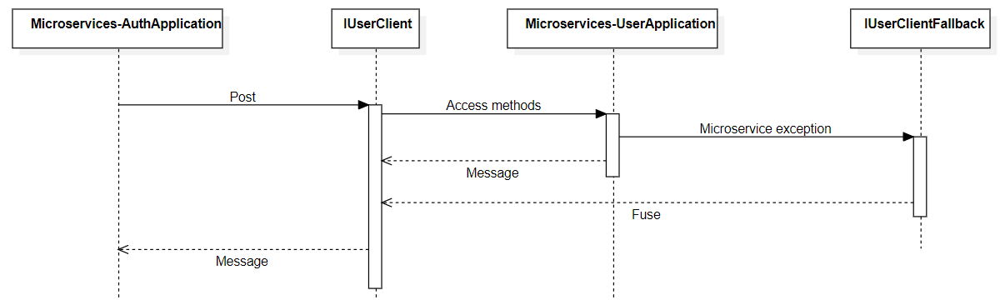

<center><p>图4.26 微服务调用顺序图</p></center>

**例如**<font color='blue'>AuthApplication</font>微服务对<font color='blue'>UserApplication</font>微服务中的方法进行调用，如图4.26所示，<font color='blue'>AuthApplication</font>以HTTP请求的方式访问接口`IUserClient`，通过该接口，访问<font color='blue'>UserApplication</font>微服务的各种方法，如果正常就进行正常的返回；如果该微服务异常，会调用`IUserClientFallback`，进行熔断，返回熔断信息。

**微服务远程调用——声明式服务调用 Feign**

> **Feign简介：**
>
> Feign是一种声明式、模板化的HTTP客户端。在Spring Cloud中使用Feign, 我们可以做到使用HTTP请求远程服务时能与调用本地方法一样的编码体验，开发者完全感知不到这是远程方法,更感知不到这是个HTTP请求。**但本质上，我们是通过HTTP请求来实施服务间的调用。**

- `@FeignClient`定义<font color='red'>Feign</font>指向的service-id`value = AppConstant.APPLICATION_USER_NAME`
- `@GetMapping(API_PREFIX + "/user-info-by-id")`<font color='red'>定义get请求接口中该方法的URL</font>
- `R<UserInfo>userInfo(@RequestParam("userId") Long userId);`为该方法的声明

##### 3.5.1 声明式服务调用 Feign小结

各个微服务之间的调用是微服务架构服务间调用的重要的特性，该特性也决定了<font color='red'>每一个微服务可以有自己独立的数据库</font>，数据库之间的交互也可以通过该服务发送HTTP请求的方式进行交互。Feign进行服务调用使得使用HTTP请求远程服务时能与调用本地方法一样的编码体验。

**微服务远程调用——熔断机制 Hystrix**

在一个分布式系统里，许多依赖不可避免的会调用失败，比如超时、异常等，如何能够保证在一个依赖出问题的情况下，不会导致整体服务失败。

> 在微服务系统中，Hystrix 能够帮助我们实现以下目标：
>
> - **保护线程资源**：防止单个服务的故障耗尽系统中的所有线程资源。
> - **快速失败机制**：当某个服务发生了故障，不让服务调用方一直等待，而是直接返回请求失败。
> - **提供降级方案**：在请求失败后，提供一个设计好的降级方案，通常是一个兜底方法，当请求失败后即调用该方法。
> - **防止故障扩散**：使用熔断机制，防止故障扩散到其他服务。

**路由网关**

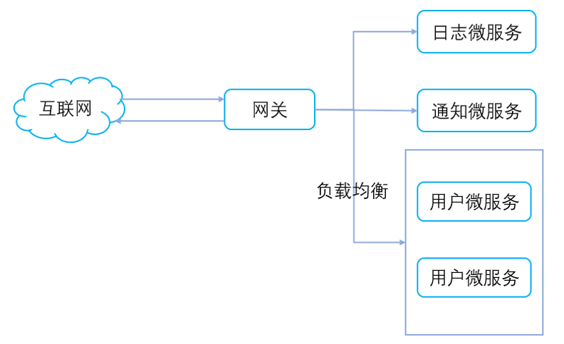

<center><p>图4.27 路由网关示意图</p></center>

一般情况下，可能并不是所有的微服务都需要直接暴露给外部调用，这时我们就可以使用路由机制，添加一层防护，让所有的请求全部通过路由来转发到各个微服务，并且转发给多个相同微服务实例也可以实现负载均衡。

在`bootstrap.yml`进行如下配置，并导入相关依赖之后，就可以使用网关的全局过滤器、局部过滤器等，对API请求进行拦截、鉴权。

```yml
server:
  port: 80

spring:
  cloud:
    gateway:
      discovery:
        locator:
          enabled: true
    loadbalancer:
      retry:
        enabled: true
```

在package `filter`中进行了全局过滤器的设置。其中

- 类`RequestFilter`中进行<font color='red'>token认证与API放行</font>；
- 类`AuthFilter`进行<font color='red'>用户鉴权认证</font>。

##### 3.5.2 token认证与API放行

设置请求头为`blade-auth`，请求头对应的值为 `tokenType` + `' '` + `accessToken`。

每次请求的时候，会拦截到需要鉴权的API请求，并对其请求头携带的Token进行认证。若 Token 过期、不存在、错误，都会导致鉴权失败，继而无法访问到对应的API。

##### 3.5.3 用户鉴权认证

该部分对用户请求的`url`, `headerToken`, `paramToken`进行二次校验，来判断用户时候具有该权限来访问某个微服务的接口，下面的部分代码展示了两种鉴权失败的判断。

```Java
ServerHttpResponse resp = exchange.getResponse();
		String headerToken = exchange.getRequest().getHeaders().getFirst(AuthProvider.AUTH_KEY);
		String paramToken = exchange.getRequest().getQueryParams().getFirst(AuthProvider.AUTH_KEY);
		if (StringUtils.isBlank(headerToken) && StringUtils.isBlank(paramToken)) {
			return unAuth(resp, "缺失令牌,鉴权失败");
		}
		String auth = StringUtils.isBlank(headerToken) ? paramToken : headerToken;
		String token = JwtUtil.getToken(auth);
		Claims claims = JwtUtil.parseJWT(token);
		if (claims == null) {
			return unAuth(resp, "请求未授权");
		}
```

- Secure 框架进行了两层 API 鉴权。
- 第一层校验请求携带的Token是否合法，有些API不需要Token校验的可通过配置放行。
- 第二层校验`@PreAuth`配置的逻辑是否符合，若不符合也返回`请求未授权`，`缺失令牌,鉴权失败`等信息。
- 注解 `@PreAuth`支持类层级和方法层级，放到类层级则对该类的所有方法进行鉴权。

##### 3.5.4 路由网关负载均衡

在路由网关`gateway`这里配置了负载均衡，在`application-dev.yml`这里提供了负载均衡配置

```Java
blade:
  #多团队协作服务配置
  loadbalancer:
    #开启配置
    enabled: true
    #灰度版本
    #version: 3.0.0
    #负载均衡优先调用的ip段
    prior-ip-pattern:
      - 192.168.0.*
      - 127.0.0.1
```

使得通过路由网关这里可以在转发的时候实现配置均衡。

其实，负载均衡还可以在每组服务集群上分别进行详细的设置

> LoadBalancer默认提供了两种负载均衡策略：
>
> - RandomLoadBalancer  -  随机分配策略
>
> - RoundRobinLoadBalancer  -  轮询分配策略

#### 3.6 约束

中心服务器中的路由配置规定了每个模块服务器对应的路由前缀，组件之间会根据请求资源的路由来建立连接。如某模块服务器需要请求资源“/api/user”，则代表该模块与基础信息与账户身份管理模块服务器会建立连接。

### 4. 体系结构实现方案

本系统整体采用SpringCloud技术实现微服务的架构，Spring Cloud 被称为构建分布式微服务系统的“全家桶”，它并不是某一门技术，而是一系列微服务解决方案或框架的有序集合。它将市面上成熟的、经过验证的微服务框架整合起来，并通过 Spring Boot 的思想进行再封装，屏蔽调其中复杂的配置和实现原理，最终为开发人员提供了一套简单易懂、易部署和易维护的分布式系统开发工具包。

Spring Cloud 中包含了 spring-cloud-config、spring-cloud-bus 等近 20 个子项目，提供了服务治理、服务网关、智能路由、负载均衡、断路器、监控跟踪、分布式消息队列、配置管理等领域的解决方案。

### 5. 体系结构部署


<center><p>图4.28 微服务体系结构部署图</p></center>

​		如图4.28，本系统采用docker+k8s的方案部署，docker的优势在于它将软件程序和运行的基础环境分开。开发人员编码完成后将程序打包到一个容器镜像中，镜像中详细列出了所依赖的环境，在不同的容器中运行标准化的镜像，从根本上解决了环境不一致的问题。例如在部署集群的时候，只需要修改挂载的data目录，config文件，再启动相应的镜像，就可完成集群的搭建。k8s 实际上是一个使用 Docker 容器进行编排的系统，主要围绕 pods 进行工作。Pods 是 k8s 生态中最小的调度单位，可以包含一个或多个容器,将众多机器抽象，对外呈现出一台超大机器。k8s可以协调和调度docker容器，实现负载均衡，管理服务通信，提供鉴权的安全性服务，以及多平台部署。

### 6. 本章小结

​		本模块主要介绍了我们在学习完体系结构课程后基于微服务架构风格设计的量化交易服务系统，对原系统经过详细的分析后我们增加了自动交易模块和管理员模块。在该系统中，每个服务只负责单一的一小块业务。如果该业务中的资源涉及到权限控制，就需要通过统一的Auth Server进行权限管理。每个微服务中只需要关心和实现自己业务相关的权限管理。该部分我们选用的技术是微服务开发中最流行的Spring Cloud。

<div style="page-break-after:always;"></div>

## 五、体系结构评估

### 1. 质量属性效应树

在本部分，我们主要分为 “分析整体设计目标”，“描述体系结构”，“构建质量属性效用树”三个步骤。其中第一个步骤为分析整体设计目标，包括映射质量属性以及测粗属性优先级；第二步是描述体系结构，包括三方面：系统的整体结构，细化属性质量和拟定质量属性战术；最后一步是构建质量属性效用树，分为质量场景映射及确认场景优先级别。其中，映射质量属性、细化质量属性和质量场景映射构成了我们的质量场景评估，粗测属性优先级和确认场景优先级别构成了质量属性优先级确认，而系统的整体结构和拟定质量属性战术组成了我们的战术设计。

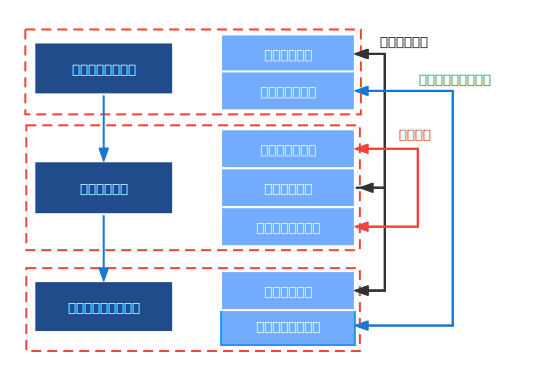

<center><p>图5.1 分析步骤图</p></center>

#### 1.1 分析整体设计目标

首先对整体设计目标进行分析

**目标人群（股民）角度**

​        股民进行量化交易，原因之一是一个人难以在复杂且巨量的历史股票数据集上对自己的经验决策进行试验和效果判断；二是在实际买卖中个人缺乏足够精力实时跟进多个股票数据的变动，根据市场结合自己的经验及时改变投资组合，以及判断买卖的时机以获取更优的收益。另外，股票的买卖往往还受个人情绪喜好等主观因素的影响。股民需要平台为他们提供可供验证他们个人经验的工具，即进行回测以判断效果；也缺乏可自动化的工具帮助他们在实盘交易中将股票买卖自动化。

**从产品客户（平台）角度**

​        平台需要吸引客源，就需要提供更加全面而完善的服务。本系统超越了现有的量化交易平台只提供量化投资操作却不能同时兼容自定义策略或者提供策略给股民的缺陷，集成了股市行情板块，以及回测、实盘自动交易、自定义策略等功能，形成一条龙服务，满足股民只需在一个平台即可获取几乎所有股票投资所需行情数据并进行量化投资操作的需求。

**开发者角度**

​        首先，股票数据对实时性要求非常高，股票数据来源需要稳定且可靠，数据分析及呈现应该及时，其次，股市交易频繁，对高并发要求非常高。第三，本平台股票数据、回测、实盘自动交易等模块彼此耦合性应较低。功能模块化有利于对某个模块进行改善或移植等，也有利于根据市场需求添加新模块。另外，因股票交易涉及用户的个人财产等高度敏感信息，因此要确保用户交易的安全性。最后，界面应简洁清晰，数据排版等一目了然，界面做到用户友好。

##### 1.1.1 质量属性映射

​        根据上述从目标人群（股民）、产品客户（平台）、开发者这三个角度出发对整体目标进行分析，我们抽离出如下的质量属性，并可以规划为以下两类：

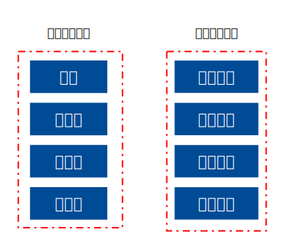

<center><p>图5.2 质量属性图</p></center>

| 质量属性目标 | 属性目标                                                     |
| ------------ | ------------------------------------------------------------ |
| 性能         | 软件应该有较好的响应时间，程序运行应是流畅的                 |
| 安全性       | 软件应该确保用户账户密码资产等敏感信息的安全，防止未授权的访问、修改，保证已授权的可以持续且及时准确地访问 |
| 可用性       | 软件的系统服务不中断运行时间占实际运行时间的比例高，系统崩溃能够恢复运行的时间较快 |
| 可靠性       | 保护程序不受错误使用和错误输入的影响，有一定的容错能力       |
| 可维护性     | 在使用软件时，股票数据源变更能够适应性维护                   |
| 可修改性     | 软件的功能模块能在需要时快速地以较高的性价比对系统进行变更   |
| 可集成性     | 其他独立开发的系统组件能够与待开发系统协同运行的能力         |
| 可移植性     | 系统能够在不同计算环境下运行                                 |

##### 1.1.2 功能质量属性分析

​       此处，我们将结合第二部分中对于项目整体需求分析内容中的分析，将一个个详细需求以及系统的非功能需求，与我们抽离的质量属性一一对应。通过这样的方式评估每一个质量属性的重要程度和与系统实现的关系。这样的方式去评估每一个质量属性的重要程度和与系统实现的关系。从而确定质量属性的的优先级和重要程度，初步的粗粒度的确定属性优先顺序。

**外部质量属性分析**


<center><p>图5.3 外部质量属性分析图</p></center>

**功能需求模块**

1. 六个模块都是本系统的重要功能点，因此都需要保证有较高的<font color="red">可用性</font>。
2. <font color="red">个人中心模块</font>由于涉及用户个人敏感信息，因此对<font color="red">安全性</font>有非常高的要求。
3. <font color="red">股票数据模块</font>涉及大量股票实时数据的传送及处理，因此对<font color="red">性能</font>方面的要求极高，由于股票数据庞杂，因此从不同渠道获取股票数据应该有容错能力，保证系统正确行为，进行内部修复，满足<font color="red">可靠性</font>。
4. <font color="red">量化策略模块</font>由于用户可自行定义策略，保证用户在输入错误时程序会识别出并不受影响，具有<font color="red">可靠性</font>。此外，为防止用户恶意攻击系统，应检查有无sql注入之类的安全性问题，对<font color="red">安全性</font>要求极高。
5. <font color="red">回测模块</font>应易于使用，如进行回测前确定回测时间回测范围等条件选择的界面应该用户友好，应操作方便删繁就简。注重<font color="red">性能</font>，减少回测时用户等待时间。
6. <font color="red">自动交易模块</font>涉及实盘交易，涉及用户金融账户等敏感信息，同时存在涉及大量股票买入卖出的可能性，要及时对市场数据做出反应，对性能要求高，该模块是用户实盘交易所在的敏感且关键模块，因此应是使用方便，展示有序美观易懂的，故此模块<font color="red">对性能、安全性、可靠性</font>的要求极高。
7. <font color="red">管理员模块</font>由于管理员的权限较高，因此该模块管理员的信息应该严格保密，防止泄露或被攻击，因此对<font color="red">安全性</font>的要求极高，另外为了方便管理员的操作，界面应是简洁明了的。

**非功能需求模块**

1. 本系统涉及金融市场，信息比较敏感，因此系统出错应能及时追溯，对错误日志有较高要求
2. 股市数据庞杂，对计算及存储资源的要求较高，因此资源利用率有较高要求

**内部功能质量属性分析**

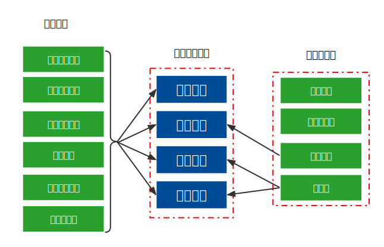

<center><p>图5.4 内部质量属性分析图</p></center>

**功能需求模块**

系统应具有较高的<font color="red">可维护性</font>、<font color="red">可移植性</font>、<font color="red">可集成性</font>、<font color="red">可修改性</font>，以便于根据用户需求变化增删系统功能，及适应股票市场需求变化；系统组件及架构应能实现跨平台，以在市场中拥有更好的竞争力。

**非功能需求模块**

系统中各个部分应模块化，易于修改，有利于代码重用以及降低耦合度，如此也更方便移植及集成。

#### 1.2 描述体系结构

##### 1.2.1 系统整体架构

**B/S架构**：

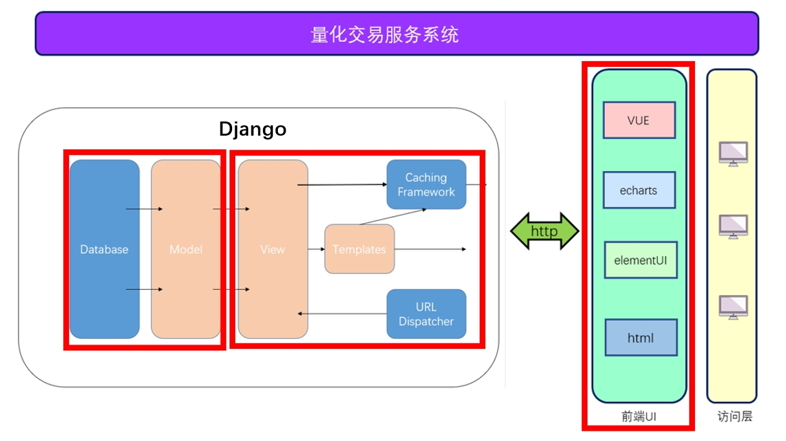

<center><p>图5.5 B/S架构图</p></center>

如图5.5所示，为基于Django框架的B/S架构。

表现层即前端（最右红框），前端使用Vue框架，并辅以主流的组件库，如主要用于数据可视化的eacharts，用于页面组件设计的element UI进行页面前端的开发，形成了最终用户访问所能看到的效果。

业务逻辑层即后端中的View层以及如URL配置等一些功能函数及工具函数（中间红框）。业务逻辑层针对功能模块所划分，在功能需求中所定义的每个模块对应一个View层，用于提供前后端交互所需要的接口，同时其中也使用到了URL分配器，用于定向，通过http协议和前端页面进行数据交互。

数据访问层即的B/S架构中后端引用Django提供的model（最左红框），即ORM对象关系映射，用于实现面向对象编程语言里不同类型系统的数据之间的转换，能够对不同的数据库都提供统一调用的API进行开发与数据库进行交易，为业务逻辑层提供数据接口。

**微服务架构：**


<center><p>图5.6 微服务架构图</p></center>

如图5.6所示，为基于Spring Cloud框架的微服务架构。

SpringCloud体系下的API路由网关完成系统各用户权限的统一认证；LoadBalancer实现系统的负载均衡，达到性能优化的目的；Redis缓存实现更快的数据响应，带来更好的用户体验；使用Feign使http客户端在各种api调用时实现负载均衡；Hystrix熔断机制完成系统的异常处理；日志系统记录系统运行时的事务与异常的记录；服务监控模块监控系统的整体运行状态；通过使用数据库集群可以使读写分离，提高数据库的系统性能。

在服务集群中，不同种类的微服务采用了不同的架构，比如：量化策略模块采用了基于规则的风格，管理员模块采用了面向方面的风格，自动交易模块采用了面向agent风格。对于不同模块采用了1-3个微服务，采用适当的风格以更好适应各个模块的功能。

##### 1.2.2 拟定质量属性战术

<table align="center" text-align="center">
    <thead>
    	<th width="20%">质量属性目标</th>
    	<th width="50%">实现方法</th>
    	<th width="30%">所采用的战术</th>
    </thead>
    <tbody>
    	<tr>
        	<td rowspan="2">性能</td>
            <td>客户端请求增多，通过服务缓冲池和IP限流，保证吞吐量及保证服务器资源量</td>
            <td>请求服务缓冲池<br>同 IP 限流</td>
        </tr>
        <tr>
        	<td>对于在较短时间多次重复的查询请求，可合并为仅发送一次请求</td>
            <td>前端请求拦截</td>
        </tr>
        <tr>
        	<td rowspan="3">安全性</td>
            <td>在系统每一次进行请求时，应该查看是否带有登录信息，若没有，则进行拦截</td>
            <td>OAuth2 认证授权</td>
        </tr>
        <tr>
            <td>用户的敏感信息及交易流水只户自己才能查看，其他用户无权获取</td>
            <td>OAuth2 认证授权</td>
        </tr>
        <tr>
            <td>用户进行sql注入攻击</td>
            <td>拒绝用户行为</td>
        </tr>
        <tr>
            <td rowspan="2">可用性</td>
            <td>微服务故障，由其他同类型微服务分担工作</td>
            <td>负载均衡</td>
        </tr>
        <tr>
            <td>由于网络配置或网络阻塞引起的大规模负载，对一些微服务进行服务降级直至熔断</td>
            <td>服务降级<br>熔断机制</td>
        </tr>
        <tr>
            <td rowspan="2">可靠性</td>
            <td>在错误发生时确保系统正确行为，并进行内部修复</td>
            <td>故障恢复机制</td>
        </tr>
        <tr>
            <td>用户进行错误的输入，保护系统不受错误输入的意外影响</td>
            <td>拒绝用户行为</td>
        </tr>
        <tr>
            <td rowspan="1">可维护性</td>
            <td>股票数据源发生变更，将信息及时报告管理员，请求调整数据源</td>
            <td>监测报告机制</td>
        </tr>
        <tr>
            <td rowspan="2">可移植性</td>
            <td>使用可以跨平台的外部组件</td>
            <td>跨平台组件</td>
        </tr>
        <tr>
            <td>将软件部署到 Docker 容器中，从而
使软件使软件与物理机器隔离</td>
            <td>Docker</td>
        </tr>
        <tr>
            <td rowspan="2">可修改性</td>
            <td>根据功能将系统周到地设计为几个模块，尽量满足“高内聚低耦合“的特点</td>
            <td>模块划分</td>
        </tr>
        <tr>
            <td>在修改到达时，尽量不要改变模块接口约定，只在模块内部修改</td>
            <td>防止连锁反应<br>局部化修改</td>
        </tr>
        <tr>
            <td rowspan="1">可集成性</td>
            <td>使得其他独立开发的系统组件能够与待开发系统协同运行的能力</td>
            <td>模块划分<br>降低微服务耦合依赖</td>
        </tr>
    </tbody>
</table>


##### 1.2.3 细化质量属性

对照1.2.1中的体系整体架构和1.1.2粗测质量属性优先级分析，我们可以对质量属性的属性要求进行精化，其具体内容如下表。

<table align="center">
    <tr>
        <th>质量属性</th>
        <th>属性求精</th>
    </tr>
    <tr>
        <td rowspan='2'>性能</td>
        <td>数据延迟</td>
    </tr>
    <tr>
        <td>交易吞吐量</td>
    </tr>
    <tr>
        <td rowspan='5'>安全性</td>
        <td>交易数据机密性</td>
    </tr>
    <tr>
        <td>数据完整性</td>
    </tr>
    <tr>
        <td>认证完整性</td>
    </tr>
    <tr>
        <td>鉴权完整性</td>
    </tr>
    <tr>
        <td>用户数据安全性</td>
    </tr>
    <tr>
        <td rowspan='3'>可用性</td>
        <td>软件故障</td>
    </tr>
    <tr>
        <td>数据库服务器硬件故障</td>
    </tr>
    <tr>
        <td>系统服务器硬件故障</td>
    </tr>
    <tr>
        <td rowspan='1'>可靠性</td>
        <td>用户输入错误</td>
    </tr>
    <tr>
        <td rowspan='1'>可维护性</td>
        <td>股票数据源变更</td>
    </tr>
    <tr>
        <td rowspan='2'>可修改性</td>
        <td>新增量化策略</td>
    </tr>
    <tr>
        <td>新增数据展示页面</td>
    </tr>
    <tr>
        <td rowspan='1'>可集成性</td>
        <td>新增功能模块</td>
    </tr>
</table>


#### 1.3 构建质量属性效用树

根据前文的项目内容分析，抽离出了相关场景，并通过基于场景的分析方法，将各个场景对应其质量属性绘制了如下的质量效用树：

<table>
    <tr>
        <th>质量属性</th>
        <th>质量求精</th>
        <th>场景编号</th>
        <th>场景</th>
    </tr>
    <tr>
        <td rowspan='2'>性能</td>
        <td>数据延迟</td>
        <td>XN01</td>
        <td>(H,H) 开盘时期数据同步延迟减到最小值500ms；查看历史数据响应时间见到最小值200ms</td>
    </tr>
    <tr>
        <td>交易吞吐量</td>
        <td>XN02</td>
        <td>(M,M) 使得认证服务器的平均吞吐量最大化</td>
    </tr>
    <tr>
        <td rowspan='5'>安全性</td>
        <td>交易数据机密性</td>
        <td>AQ01</td>
        <td>(M,H) 股票交易在99.999%内的时间是安全的</td>
    </tr>
    <tr>
        <td>数据完整性</td>
        <td>AQ02</td>
        <td>(L,H) 股票实时数据在99.999%的时间内都能够完整正常存入数据库</td>
    </tr>
    <tr>
        <td>认证完整性</td>
        <td>AQ03</td>
        <td>(L,M) 确保所有需要的登录的页面和接口在调用前都会检测帐号是否登录</td>
    </tr>
    <tr>
        <td>鉴权完整性</td>
        <td>AQ04</td>
        <td>(M,M) 保所有用户、数据等管理相关的都需要检测用户是否有管理权限</td>
    </tr>
    <tr>
        <td>用户数据安全性</td>
        <td>AQ05</td>
        <td>(L,M) 确保个人隐私数据只能允许该用户有权限访问</td>
    </tr>
    <tr>
        <td rowspan='3'>可用性</td>
        <td>软件故障</td>
        <td>KY01</td>
        <td>(M,H) 出现某一个微服务异常时保证系统不崩溃，其他微服务仍正常运行</td>
    </tr>
    <tr>
        <td>数据库服务器硬件故障</td>
        <td>KY02</td>
        <td>(H,M) 一个及以内数据库服务器硬件故障不影响系统正常运行；多个数据库服务器硬件故障3min内重新启动，并保证交易数据一致性</td>
    </tr>
    <tr>
        <td>系统服务器硬件故障</td>
        <td>KY03</td>
        <td>(M,M) 一个及以内数据库服务器硬件故障不影响系统正常运行；多个数据库服务器硬件故障1min内重新启动</td>
    </tr>
    <tr>
        <td rowspan='1'>可靠性</td>
        <td>用户输入错误</td>
        <td>KK01</td>
        <td>(L,M) 识别出错误，拒绝用户行为，弹窗提示错误原因</td>
    </tr>
    <tr>
        <td rowspan='1'>可维护性</td>
        <td>股票数据源变更</td>
        <td>KW01</td>
        <td>(L,H) 识别出股票数据源变更，报告管理员</td>
    </tr>
    <tr>
        <td rowspan='2'>可修改性</td>
        <td>新增量化策略</td>
        <td>KX01</td>
        <td>(L,L) 以小于2人周的工作量增加量化策略</td>
    </tr>
    <tr>
        <td>新增数据展示页面</td>
        <td>KX02</td>
        <td>(M,L) 以小于4人周的工作量新增一个数据展示页面</td>
    </tr>
    <tr>
        <td rowspan='1'>可集成性</td>
        <td>新增功能模块</td>
        <td>KJ01</td>
        <td>(L,L) 未完成的模块不完全向用户提供服务，但是可以和当前系统共存</td>
    </tr>
</table>


### 2. 架构评估

在软甲架构评估技术中，一般有基于问卷调查和检查表的评估技术，基于场景的评估技术，基于度量的评估技术。

对于基于问卷调查和检查表的评估技术，评估者对评估架构只需要简单了解，主观性较强，适用于架构评估的早期阶段；对于基于场景的评估技术，评估者对评估架构需要比较熟悉，具有一定的客观性，也保有一定的主观性，适用于架构评估的中期；对于基于度量的评估技术，评估者对评估架构需要精确掌握，客观性强，使用与架构评估的中后期。

我们现对我们设计的**基于微服务架构的量化交易服务系统**进行架构评估，选择使用最合适我们的**基于场景的评估技术**对架构进行评估。

#### 2.1 基于质量场景的评估

<table>
    <tr>
        <td>场景号：XN01</td>
        <td colspan="4">场景：开盘，服务器压力剧增</td>
    </tr>
    <tr>
        <td>属性</td>
        <td colspan="4">性能</td>
    </tr>
    <tr>
        <td>环境</td>
        <td colspan="4">开盘时间，访问人数增多，服务器压力剧增</td>
    </tr>
     <tr>
        <td>刺激</td>
        <td colspan="4">用户请求访问，实时数据接收并入库，自动交易进行</td>
    </tr>
    <tr>
        <td>响应</td>
        <td colspan="4">良好的响应，正确入库，正确交易</td>
    </tr>
    <tr>
        <td>架构决策</td>
        <td>敏感点</td>
        <td>权衡点</td>
        <td>有风险决策</td>
        <td>无风险决策</td>
    </tr>
    <tr>
        <td>服务器压力剧增时，服务降级</td>
        <td></td>
        <td>T1</td>
        <td>R1</td>
        <td></td>
    </tr>
     <tr>
        <td>开盘时期，数据写入分布式数据库</td>
        <td>S3</td>
        <td></td>
        <td></td>
        <td>N3</td>
    </tr>
     <tr>
        <td>redis缓存</td>
        <td>S4</td>
        <td></td>
        <td></td>
        <td>N4</td>
    </tr>
     <tr>
        <td>负载均衡</td>
        <td>S5</td>
        <td></td>
        <td></td>
        <td>N5</td>
    </tr>
     <tr>
        <td>推理</td>
        <td colspan="4">1. 开盘，服务器压力剧增，利用服务降级技术，保证交易业务的正常，但是会对用户的其他非紧急业务带来不良体验。<br>2. 对开盘时期产生的大量数据，多个微服务将数据写入分布式数据库<br>3. 使用redis缓存，减少数据库服务器访问压力<br>4. 通过路由网关实现负载均衡，使得相同功能的微服务能够均衡地运行，提高整体系统性能</td>
    </tr>
</table>
<table>
    <tr>
        <td>场景号：XN02</td>
        <td colspan="4">场景:有用户试图访问其他用户隐私信息(例如交易信息，个人信息)</td>
    </tr>
    <tr>
        <td>属性</td>
        <td colspan="4">安全性</td>
    </tr>
    <tr>
        <td>环境</td>
        <td colspan="4">系统正常运行</td>
    </tr>
     <tr>
        <td>刺激</td>
        <td colspan="4">用户访问请求，token异常</td>
    </tr>
    <tr>
        <td>响应</td>
        <td colspan="4">拒绝请求</td>
    </tr>
    <tr>
        <td>架构决策</td>
        <td>敏感点</td>
        <td>权衡点</td>
        <td>有风险决策</td>
        <td>无风险决策</td>
    </tr>
    <tr>
        <td>AOP</td>
        <td>S10</td>
        <td></td>
        <td>N10</td>
        <td></td>
    </tr>
     <tr>
        <td>推理</td>
        <td colspan="4">1. 系统利用反射机制创建过滤器,此过滤器会根据传来的用户token,在redis中查询到此用户权限<br>2. 如果redis中用户权限不能访问其他用户信息，那么直接拦截<br>3. 返回权限不够或非法窃取数据的提示</td>
    </tr> 
</table>

#### 2.2 风险决策与敏感点

| 采用战术     | 敏感点（S）/权衡点（T）                                      | 有风险决策（R）/无风险决策（N）                              |
| ------------ | ------------------------------------------------------------ | ------------------------------------------------------------ |
| 服务降级     | T1：服务器压力剧增对一些请求不处理或简单处理（如策略回测服务），保证核心业务的正常进行（自动交易服务） | R1：舍小保大，保证交易业务的正常，但是会对用户的其他非紧急业务进行服务降级，带来不良体验。 |
| 服务熔断     | T2：自定义策略执行了用户的恶意代码，当系统受到攻击时，将发出威胁的微服务熔断，避免恶意攻击 | R2：由于微服务的相互调用，熔断防止了雪崩式的链式崩溃，保证了系统安全，但是系统的部分功能缺失。 |
| 分布式数据库 | S3：开盘时期数据量大，数据写入分布式数据库，保证用户正常访问 | N3：多个微服务将数据写入分布式数据库                         |
| redis缓存    | S4：减少数据库服务器压力                                     | N4：使用redis缓存技术，较小数据库服务器压力                  |
| 负载均衡     | S5：提高整体系统并发性能                                     | N5：通过路由网关实现负载均衡使得相同功能的微服务能够均衡地运行 |
| 同 IP 限流   | T6：避免违法用户的恶意攻击，提高系统的安全和稳定性           | R6 :可能会对系统的可用性有一定程度的降低。                   |
| 前端请求拦截 | T7：减少不必要的请求                                         | R7 :对于有副作用的请求， 若在后期开发中不加以注意，如果拦截则会产生错误的结果 |
| Docker       | T8：可以借助 Docker 的跨平台能力，将软件与物理机器隔离，同时便于部署 | R8：由于对物理机器执行操作前需要 Docker 进行翻译，可能会导致效率下降 |
| 消息队列     | T9：当大量用户并发进行回测的时候，可以先将回测的结果返回给用户，通过消息队列异步将回测结果写入数据库。 | R9：消息队列可能存在丢失消息以及数据一致性问题，引入中间件增加了系统的复杂度 |
| token认证    | S10：对所有的用户请求进行token认证                           | N10：每次登录成功给用户签发token，token保证用户访问的安全性  |

### 3. 两种系统结构的对比

| 场景                                                         | 架构一                         | 架构二                                 |
| ------------------------------------------------------------ | ------------------------------ | -------------------------------------- |
| (H,H)  开盘时期数据同步延迟减到最小值500ms；查看历史数据响应时间见到最小值200ms | 采用上述分布式存储战术可以实现 | 数据量太大，无法实现                   |
| (M,M)  使得认证服务器的平均吞吐量最大化                      | 通过负载均衡实现               | 服务器性能决定了上线                   |
| (M,H)  股票交易在99.999%内的时间是安全的                     | OAuth2 认证授权                | OAuth2 认证授权                        |
| (L,H)  股票实时数据在99.999%的时间内都能够完整正常存入数据库 | 采用上述分布式存储战术可以实现 | 数据量太大，无法实现                   |
| (L,M)  确保所有需要的登录的页面和接口在调用前都会检测帐号是否登录 | OAuth2 认证授权                | OAuth2 认证授权                        |
| (M,M)  保所有用户、数据等管理相关的都需要检测用户是否有管理权限 | OAuth2 认证授权                | OAuth2 认证授权                        |
| (L,M)  确保个人隐私数据只能允许该用户有权限访问              | OAuth2 认证授权                | OAuth2 认证授权                        |
| (M,H)  出现某一个微服务异常时保证系统不崩溃，其他微服务仍正常运行 | 熔断机制                       | 系统崩溃                               |
| (H,M)  一个及以内数据库服务器硬件故障不影响系统正常运行；多个数据库服务器硬件故障3min内重新启动，并保证交易数据一致性 | 服务降级，熔断机制             | 系统崩溃                               |
| (M,M)  一个及以内数据库服务器硬件故障不影响系统正常运行；多个数据库服务器硬件故障1min内重新启动 | 服务降级，熔断机制             | 系统崩溃                               |
| (L,M)  识别出错误，拒绝用户行为，弹窗提示错误原因            | 可以实现                       | 可以实现                               |
| (L,H)  识别出股票数据源变更，报告管理员                      | 可以实现                       | 可以实现                               |
| (L,L)  以小于2人周的工作量增加量化策略                       | 低耦合，可以实现               | 耦合度高，难以实现，容易干扰到其他功能 |
| (M,L)  以小于4人周的工作量新增一个数据展示页面               | 低耦合，可以实现               | 耦合度高，难以实现，容易干扰到其他功能 |
| (L,L)  未完成的模块不完全向用户提供服务，但是可以和当前系统共存 | 微服务架构可以实现             | 无法实现，系统必须下线完成             |

### 4. 评审结论

我们使用ATAM分析方法，构造了质量属性效应树。我们团队成员进行投票，对质量属性的实现难度以及重要性进行打分。对两个有代表性的场景进行了敏感点和权衡点分析，进行推理。最后，我们对比了SEUQuent量化交易服务系统使用B/S架构和微服务架构的优劣，我们讨论认为暑期实训使用的B/S架构存在消息响应不稳定，系统不易修改，面向的用户量有限等问题。使用微服务架构并在每一个微服务当中使用何时的架构方案更利于我们系统的进一步开发，更能够满足性能、安全性等外部属性，及可维护性，可修改性等内部属性，提高系统稳质量。

总体而言，我们通过对质量属性场景的分析，更加清楚的认识到不同系统架构带来的优势和劣势。讨论出了改进方案，使得系统能够通过架构调整，取得更好的质量。

<div style="page-break-after:always;"></div>

## 六、实验总结

**罗茂林：**

本次实验是基于暑期实训的项目进行需求再分析，原始架构分析，根据需求内容和原始架构的不足进行架构设计，最后进行体系结构评估。在对课上所学知识不断应用的过程中加深了对这些知识的理解，能够在一个切实的设计场景中把握整体与方向，有条理的推进工作。同时，对遗产软件如何演变到新设计架构的软件有了一些思考。

当不再需要每两天就更新一个功能，在一个月就开发出只有极为短暂的生命周期的软件时，便真正从体系结构的角度去思考一个能至少使用两三年，还能继续进行架构演化的软件应该是什么样的。先从整体的功能需求与非功能需求出发，讨论得出我们设计的软件最适合微服务架构。在每一个模块当中，由一至多种微服务完成的一个模块又可以再考虑其架构。虽然有的模块不能完全由某一种架构适配，但是在设计的时候可以参考这种架构的特点，做出一些的改变，使得该模块的性能，可用性，可维护性变得更好。最后使用ATAM方法对架构进行评估，并对两种架构进行对比。通过评估更加深刻认识到软件架构对软件质量的影响。

对于遗产软件，由于进度压力，开发者经验缺乏等原因，欠下了不少的技术债，包括设计债和代码债。如果我们基于微服务开发新的软件，个人中心模块必须重新开发，而其余模块可以封装成微服务后暂时使用，在接下来的过程中，逐步地替换掉原来的模块。但是在未完全替换的过程中会面临安全，性能等方面不小的挑战。

本次实验，也更加明白了一份好的文档需要注意哪些方面。文档写作中分工合作，将课上所学的知识点，融会贯通，学以致用，进行架构设计与评估。根据这份详细的文档，以及自己对Spring Cloud框架的尝试，基于微服务架构的量化交易服务系统完全可以实现。相信本次全流程的设计为今后的学习及职业生涯又积累了一次难得的，宝贵的经验。

**昝崇崇：**

本次软件体系结构风格的实验我们对暑期学校做的量化交易服务系统进行了架构层面的分析和重新设计，暑假里我们是基于B/S架构开发的系统，当时还没有太多架构的概念在里面，只是说实现功能就好了，但经过这一学期的课程学习，再看待之前的项目或者遇到新的项目时，我都会主动地去从架构的角度分析，考虑其架构是否有潜在的问题，是否能够应对后期可能出现的需求变更，什么样的架构更适合这个系统，具体的某个模块又应该参考哪个风格去进行设计，等等。带着这些问题去重新审视一个软件，将会有不一样的看法和体会，这也是软件结构与体系课程带给我的收获吧。此外，在这次实验中，我也深切体会到了文档撰写的重要性，一篇优秀的文档对于项目的意义举足轻重。无论是对外介绍项目，还是对内实际开发，一份好的文档会极大地提高工作效率的。清晰的结构，正确的逻辑，恰到好处的配图，详略得当的文字说明，这些都是一份好的文档的必备成分。此次实验中我们基于GitHub进行文档的协同编辑，也充分感受到了团队合作和合适工具使用的重要性。总之，此次实验我收获了很多，相信这会为我以后的实习和工作提供前瞻性的帮助。

**谢瀛增：**

本次工作中我们小组对暑期的实训项目进行原项目架构分析，并利用在软件设计与体系结构课上所学进行架构的再设计。其中我主要负责概述；自动交易模块；原先的B/S架构部分的组件及连接件设计；第五章较粗粒度的质量分析。

在本次工作中，感触最深的是第四章和第五章的工作。首先是面向agent风格，对我而言有些抽象，没有更加具体的例子进行解释以帮助理解。为了更好地把握面向agent风格，我在网上查阅了相关论文，对该风格的优点使用场景等有所了解，从宏观上能大体把握其风格。在第五章的工作中，在进行粗粒度的质量属性分析时，会深刻体会到暑期开发没有考虑过的场景及意外情况，同时查阅资料也在广度上扩宽我对这些问题解决方法的技术面了解。

这次的架构分析与设计，最大的好处之一是查阅资料的过程中会顺藤摸瓜加深自己一些架构的体会。比如查阅架构设计风格等方面时，通过网上技术文章对同一功能不同实现代码的分析，能更加具体直观体会到软件架构设计的精妙之处。第二大好处是团队协作，每次自己部分编写完后，团队一起把关提建议，可以进行头脑风暴，发现自己考虑不周的地方，同时学习团队其他成员做得好的部分。我们团队每次任务按时按质完成，保证工作进度严格按照计划甚至超前。这也让我体会到软件工程课中所说的一个好团队是多么的重要。

最后是文档编写部分。实验一我的文档写完没有主动找老师交流过，因此对于自己的不足认识的不够充分。这次小组文档向老师请教后，我发现文档的编写有很多技巧。虽然上课老师常常提醒文档的可读性，考虑面向的群体等，但百听不如一练来得深刻。和同学讨论如何将文档编写得更有逻辑性也让我收获良多。总而言之，本次实验无论是知识学习还是团队合作十分快乐，让我觉得有不小的收获！

<div style="page-break-after:always;"></div>

## 附录

### 附录一 需求分析

#### 1.1 个人中心模块


##### 1.1.1  用户注册用例描述

| ID         | A111                                                         |
| ---------- | ------------------------------------------------------------ |
| 用例名称   | 注册                                                         |
| 父用例ID   | 无                                                           |
| 主要执行者 | 普通用户、会员用户、管理员                                   |
| 前置条件   | 无                                                           |
| 事件流     | a.打开登录页面，点击“没有账号？去注册”，跳转到注册页面<br/>b.在用户名输入框输入用户名<br/>c.在密码输入框内输入密码<br/>d.再次输入密码，点击注册按钮注册<br/>e.注册成功后跳转到登录页面 |
| 可选事件流 | 无                                                           |
| 异常条件流 | 两次输入密码不一致，提示两次密码输入不一致                   |
| 后置条件   | 用户已注册或登录成功，跳转到登录页面                         |

##### 1.1.2  用户登录用例描述

| ID         | A112                                                         |
| ---------- | ------------------------------------------------------------ |
| 用例名称   | 登录                                                         |
| 父用例ID   | 无                                                           |
| 主要执行者 | 普通用户、会员用户、管理员                                   |
| 前置条件   | 无                                                           |
| 事件流     | a.打开登录页面，在用户名输入框内输入用户名  <br/>b.在密码输入框内输入密码  <br/>c.点击登录按钮登录 |
| 可选事件流 | 无                                                           |
| 异常事件流 | a.用户不存在，提示“用户不存在”<br/>b.用户密码输入错误，提示“用户名或者密码错误”(防止多次恶意试错用户密码)<br/>c.输入的用户名或者密码为空，提示“表单项不能为空” |
| 后置条件   | 登录成功，跳转到行情中心页面                                 |

<div style="page-break-after:always;"></div>

##### 1.1.3  用户会员服务用例描述

| ID         | A113                                                         |
| ---------- | ------------------------------------------------------------ |
| 用例名称   | 会员服务                                                     |
| 父用例ID   | 无                                                           |
| 主要执行者 | 普通用户、会员用户                                           |
| 前置条件   | 无                                                           |
| 事件流     | a.在导航栏的用户名处点击开通VIP或续费VIP <br/>b.弹出支付界面  <br/>c.用户进行支付，支付成功成为会员用户 |
| 可选事件流 | 无                                                           |
| 异常事件流 | 无                                                           |
| 后置条件   | 成为会员才可使用自定义策略的运行功能以及平台提供的会员专属策略进行回测 |

##### 1.1.4  查看我的收藏用例描述

| ID         | A114                                                         |
| ---------- | ------------------------------------------------------------ |
| 用例名称   | 查看我的收藏                                                 |
| 父用例ID   | 无                                                           |
| 主要执行者 | 普通用户、会员用户                                           |
| 前置条件   | 用户已登录                                                   |
| 事件流     | a.导航栏点击个人中心按钮  <br>b.跳转到我的收藏界面，展示该用户收藏的股票 |
| 可选事件流 | a.点击红心图标即可取消收藏该股票                             |
| 异常事件流 | 无                                                           |
| 后置条件   | 无                                                           |

<div style="page-break-after:always;"></div>

#### 1.2 股市数据模块


##### 1.2.1  用户查看股票列表用例描述

| <span style="white-space:nowrap;">ID&emsp;&emsp;&emsp;&emsp;&emsp;</span> | A121                                                         |
| ------------------------------------------------------------ | ------------------------------------------------------------ |
| 用例名称                                                     | 查看股票列表                                                 |
| 父用例ID                                                     | 无                                                           |
| 主要执行者                                                   | 普通用户、会员用户                                           |
| 前置条件                                                     | 无                                                           |
| 事件流                                                       | 在行情中心界面最下为所有股票的列表，展示股票的代码、名称、现价、涨跌幅(%)、涨跌、涨速(%)、换手(%)、量比、振幅(%)、成交额、流通股 、流通市值、市盈率等实时信息，股票按照涨跌幅降序排列 |
| 可选事件流                                                   | a.点击列表中的代码栏可以跳转到具体的股票信息界面  <br/>b.点击股票名称可以展示该股票的公司信息  <br/>c.点击收藏按钮即可将该股票加入个人中心我的收藏列表 |
| 异常事件流                                                   | 用户未登录无法使用将股票加入我的收藏功能                     |
| 后置条件                                                     | 无                                                           |

<div style="page-break-after:always;"></div>

##### 1.2.2 用户查看大盘数据用例详情

| <span style="white-space:nowrap;">ID&emsp;&emsp;&emsp;&emsp;&emsp;</span> | A122                                                         |
| ------------------------------------------------------------ | ------------------------------------------------------------ |
| 用例名称                                                     | 查看大盘数据                                                 |
| 父用例ID                                                     | 无                                                           |
| 主要执行者                                                   | 普通用户、会员用户                                           |
| 前置条件                                                     | 在开盘时间9:30之后进入行情中心显示实时数据，否则提示“未到开盘时间” |
| 事件流                                                       | a.成功登录后在首页即可看到大盘实时数据，包括涨跌分布，涨跌停，昨日涨停今日收益   <br/>b.大盘评级，并根据大盘的形势给予投资建议  <br/>c. 实时更新三大指数（上证指数，深证指数，创业板指）的实时走势图及涨跌幅 |
| 可选事件流                                                   | 无                                                           |
| 异常事件流                                                   | 无                                                           |
| 后置条件                                                     | 无                                                           |

##### 1.2.3  用户查询单支股票行情

| <span style="white-space:nowrap;">ID&emsp;&emsp;&emsp;&emsp;&emsp;</span> | A123                                                         |
| ------------------------------------------------------------ | ------------------------------------------------------------ |
| 用例名称                                                     | 查询单支股票行情                                             |
| 父用例ID                                                     | 无                                                           |
| 主要执行者                                                   | 普通用户、会员用户                                           |
| 前置条件                                                     | 无                                                           |
| 事件流                                                       | a.在首页的股票列表中选择某支股票，或者在导航栏的搜索框中输入股票代码<br/>b.进入该股票的详情界面，会显示其k线图（日k,周k，月k，分时图），最新指标（每隔1秒实时刷新），以及近期热门资讯。  <br/>c.右边显示该股票实时的成交明细，五档盘口  <br/>d.下方会显示该股实时成交分布的饼图及数据以及资金流向的历史统计 |
| 可选事件流                                                   | 用户可以通过点击查看公司资料按钮跳转到公司的概况页面         |
| 异常事件流                                                   | 该股票不存在，提示“该股票不存在”                             |
| 后置条件                                                     | 无                                                           |

<div style="page-break-after:always;"></div>

##### 1.2.4  查询公司概况用例描述

| ID         | A124                                                         |
| ---------- | ------------------------------------------------------------ |
| 用例名称   | 查询公司概况                                                 |
| 父用例ID   | 无                                                           |
| 主要执行者 | 普通用户、会员用户                                           |
| 前置条件   | 无                                                           |
| 事件流     | a.在首页的股票列表中点击股票名，跳转到该公司简介页面 <br/>b.或在股票详情页面中点击查看公司资料按钮，跳转到该公司简介页面 |
| 可选事件流 | 点击左侧的导航栏可以跳转公司简介、成交明细、分价表等网页提供财经等相关信息 |
| 异常事件流 | 无                                                           |
| 后置条件   | 无                                                           |

#### 1.3  量化策略模块


##### 1.3.1  用户查看量化策略用例描述

| ID         | A131                                                         |
| ---------- | ------------------------------------------------------------ |
| 用例名称   | 查看量化策略                                                 |
| 父用例ID   | 无                                                           |
| 主要执行者 | 普通用户、会员用户                                           |
| 前置条件   | 用户登录成功                                                 |
| 事件流     | 进入量化策略列表界面，展示量化策略的名称、特征标签、基本介绍 |
| 可选事件流 | 无                                                           |
| 异常事件流 | 无                                                           |
| 后置条件   | 点击回测按钮进行回测                                         |

##### 1.3.2  用户编辑自定义策略用例描述

| <span style="white-space:nowrap;">ID&emsp;&emsp;&emsp;&emsp;&emsp;</span> | A132                                                         |
| ------------------------------------------------------------ | ------------------------------------------------------------ |
| 用例名称                                                     | 编辑自定义策略                                               |
| 父用例ID                                                     | 无                                                           |
| 主要执行者                                                   | 普通用户、会员用户                                           |
| 前置条件                                                     | 用户登录成功                                                 |
| 事件流                                                       | a.进入界面展示用户之前保存的自定义策略（若未曾使用，用户自定义策略展示为默认模板策略）<br/> b.点击模板代码，系统自动保存用户在用户代码界面所做保存，并展示系统提供的模板界面和说明文档，用户可以自行修改模板代码参数  <br/>c.用户点击我的代码，即可编辑用户的策略代码  <br/>d.用户点击保存按钮手动保存用户代码 |
| 可选事件流                                                   | 无                                                           |
| 异常事件流                                                   | 无                                                           |
| 后置条件                                                     | 运行自定义策略                                               |

#### 1.4  回测模块


<div style="page-break-after:always;"></div>

##### 1.4.1  用户运行系统策略用例描述

| ID         | A141                                                         |
| ---------- | ------------------------------------------------------------ |
| 用例名称   | 运行系统策略                                                 |
| 父用例ID   | 无                                                           |
| 主要执行者 | 普通用户、会员用户                                           |
| 前置条件   | 存在可选的回测策略                                           |
| 事件流     | a.用户选择系统提供的策略点击回测 <br/> b.在日历中选择测试的起止时间及相关设置  <br/>c.点击回测按钮  <br/>d.系统会自动调取后台相应的策略进行回测  <br/>e.将策略收益与基准收益以折线图的形式呈现在用户界面，同时展示相关指标 |
| 可选事件流 | 无                                                           |
| 异常事件流 | 无                                                           |
| 后置条件   | 查询交易详情页面、查询每日持仓和收益页面                     |

##### 1.4.2  会员用户运行自定义策略用例描述

| <span style="white-space:nowrap;">ID&emsp;&emsp;&emsp;&emsp;&emsp;</span> | A142                                                         |
| ------------------------------------------------------------ | ------------------------------------------------------------ |
| 用例名称                                                     | 运行自定义策略                                               |
| 父用例ID                                                     | 无                                                           |
| 主要执行者                                                   | 会员用户                                                     |
| 前置条件                                                     | 该用户为会员用户                                             |
| 事件流                                                       | a.进入界面展示用户之前保存的自定义策略（若未曾使用，用户自定义策略展示为默认模板策略）  <br/>b.点击模板代码，系统自动保存用户在用户代码界面所做保存，并展示系统提供的模板界面和说明文档，用户可以自行修改模板代码参数。  <br/>c.点击保存按钮手动保存用户代码  <br/>d.点击我的代码即可编辑自己的策略代码   <br/>e.点击运行，后台运行回测，并跳转到回测框架中的收益概述页面 |
| 可选事件流                                                   | 无                                                           |
| 异常事件流                                                   | 运行错误，弹窗提示                                           |
| 后置条件                                                     | 运行成功，跳转到回测框架中的收益概述界面                     |

##### 1.4.3  用户查询回测历史列表用例描述

| ID         | A143                                                         |
| ---------- | ------------------------------------------------------------ |
| 用例名称   | 查询回测历史列表                                             |
| 父用例ID   | 无                                                           |
| 主要执行者 | 普通用户、会员用户                                           |
| 前置条件   | 回测完成                                                     |
| 事件流     | a.点击导航栏的回测列表按钮，展示回测历史列表                 |
| 可选事件流 | a.点击查询记录，即可跳转入该回测历史详情界面  <br/>b.点击删除记录，即可删除该条回测历史记录 |
| 异常事件流 | 无                                                           |
| 后置条件   | 无                                                           |

##### 1.4.4  用户查询每日交易详情用例描述

| ID         | A144                                               |
| ---------- | -------------------------------------------------- |
| 用例名称   | 查询每日交易详情                                   |
| 父用例ID   | 无                                                 |
| 主要执行者 | 普通用户、会员用户                                 |
| 前置条件   | 回测框架成功运行                                   |
| 事件流     | a.查询交易详情记录，展示该回测过程中的股票买卖记录 |
| 可选事件流 | 无                                                 |
| 异常事件流 | 无                                                 |
| 后置条件   | 无                                                 |

<div style="page-break-after:always;"></div>

##### 1.4.5  用户查询回测每日持仓用例描述

| <span style="white-space:nowrap;">ID&emsp;&emsp;&emsp;&emsp;&emsp;</span> | A145                                                         |
| ------------------------------------------------------------ | ------------------------------------------------------------ |
| 用例名称                                                     | 查询回测每日持仓详情                                         |
| 父用例ID                                                     | 无                                                           |
| 主要执行者                                                   | 普通用户、会员用户                                           |
| 前置条件                                                     | 回测框架成功运行                                             |
| 事件流                                                       | a.在回测详情页面，点击每日持仓和收益按钮，进入该界面，展示回测过程中每天的持仓情况列表 |
| 可选事件流                                                   | 无                                                           |
| 异常事件流                                                   | 无                                                           |
| 后置条件                                                     | 无                                                           |

##### 1.4.6 用户查询回测每日收益用例描述

| <span style="white-space:nowrap;">ID&emsp;&emsp;&emsp;&emsp;&emsp;</span> | A146                                                         |
| ------------------------------------------------------------ | ------------------------------------------------------------ |
| 用例名称                                                     | 查询回测每日收益详情                                         |
| 父用例ID                                                     | 无                                                           |
| 主要执行者                                                   | 普通用户、会员用户                                           |
| 前置条件                                                     | 回测框架成功运行                                             |
| 事件流                                                       | a.在回测详情页面，点击每日持仓和收益按钮，进入该界面，展示回测过程中每天的收益情况列表 |
| 可选事件流                                                   | 无                                                           |
| 异常事件流                                                   | 无                                                           |
| 后置条件                                                     | 无                                                           |

<div style="page-break-after:always;"></div>

#### 1.5 自动交易模块


##### 1.5.1  实盘运行策略用例描述

| ID         | A151                                                         |
| :--------- | ------------------------------------------------------------ |
| 用例名称   | 实盘运行策略                                                 |
| 父用例ID   | 无                                                           |
| 主要执行者 | 会员用户                                                     |
| 前置条件   | 已经选择实盘策略                                             |
| 事件流     | 用户阅读风险并同意后，点击运行，后台会接入券商接口，然后执行策略。 |
| 可选事件流 | 无                                                           |
| 异常条件流 | 用户在交易日手动停止实盘运行                                 |
| 后置条件   | 无                                                           |

##### 1.5.2  查看实盘交易日志用例描述

| ID         | A152                                                         |
| :--------- | ------------------------------------------------------------ |
| 用例名称   | 查看实盘交易日志                                             |
| 父用例ID   | 无                                                           |
| 主要执行者 | 会员用户                                                     |
| 前置条件   | 开始运行实盘策略                                             |
| 事件流     | 用户可在已经实盘运行的策略中，点击查看交易日志，系统会返回策略每天的交易概况 |
| 可选事件流 | 无                                                           |
| 异常条件流 | 用户在交易日手动停止实盘运行                                 |
| 后置条件   | 无                                                           |

##### 1.5.3 查看实盘策略收益用例描述

| ID         | A153                                                         |
| :--------- | ------------------------------------------------------------ |
| 用例名称   | 选择实盘策略                                                 |
| 父用例ID   | 无                                                           |
| 主要执行者 | 会员用户                                                     |
| 前置条件   | 策略已经完成一次回测、用户身份为会员、用户在平台绑定自己的券商账户 |
| 事件流     | 用户选择进行过回测的策略进行实盘起即可查看收益               |
| 可选事件流 | 无                                                           |
| 异常条件流 | 无                                                           |
| 后置条件   | 无                                                           |

<div style="page-break-after:always;"></div>

##### 1.5.4  查看实盘策略风险分析

| <span style="white-space:nowrap;">ID&emsp;&emsp;&emsp;&emsp;&emsp;</span> | A154                                                         |
| :----------------------------------------------------------- | ------------------------------------------------------------ |
| 用例名称                                                     | 查看实盘策略的数据分析                                       |
| 父用例ID                                                     | 无                                                           |
| 主要执行者                                                   | 会员用户                                                     |
| 前置条件                                                     | 开始运行实盘策略                                             |
| 事件流                                                       | 用户可在已经实盘运行的策略中，点击查看策略数据分析，系统会在后台自动分析策略的收益率、风险率等各种因子，并返回给用户 |
| 可选事件流                                                   | 无                                                           |
| 异常条件流                                                   | 用户在交易日手动停止实盘运行                                 |
| 后置条件                                                     | 无                                                           |

#### 1.6  管理员模块


<div style="page-break-after:always;"></div>

##### 1.6.1  添加策略用例描述

| ID         | A161                                                         |
| ---------- | ------------------------------------------------------------ |
| 用例名称   | 添加策略                                                     |
| 父用例ID   | 无                                                           |
| 主要执行者 | 管理员                                                       |
| 前置条件   | 已完成登录                                                   |
| 事件流     | a.点击“策略管理”菜单栏 <br/>b.点击策略列表上方的”添加策略“按钮  <br/>c.在对话框中输入新添加策略的信息<br>d.完成策略的添加 |
| 可选事件流 | 无                                                           |
| 异常事件流 | a.填写内容不完整，提示“表单项不能为空”                       |
| 后置条件   | 策略成功添加到数据库，普通用户和会员用户可以看到新添加的策略 |

##### 1.6.2  删除策略用例描述

| ID         | A162                                                         |
| ---------- | ------------------------------------------------------------ |
| 用例名称   | 删除策略                                                     |
| 父用例ID   | 无                                                           |
| 主要执行者 | 管理员                                                       |
| 前置条件   | 已完成登录                                                   |
| 事件流     | a.点击“策略管理”菜单栏 <br/>b.在策略列表中某个策略的右侧点击垃圾桶图标  <br/>c.提示删除完成 |
| 可选事件流 | 无                                                           |
| 异常事件流 | 无                                                           |
| 后置条件   | 策略成功从数据库中移除，普通用户和会员用户不可以看到删除的策略 |

<div style="page-break-after:always;"></div>

##### 1.6.3  修改策略用例描述

| ID         | A163                                                         |
| ---------- | ------------------------------------------------------------ |
| 用例名称   | 修改策略                                                     |
| 父用例ID   | 无                                                           |
| 主要执行者 | 管理员                                                       |
| 前置条件   | 已完成登录                                                   |
| 事件流     | a.点击“策略管理”菜单栏 <br/>b.在策略列表中某个策略的右侧点击修改按钮  <br/>c.在对话框中输入要修改的策略的信息<br>d.完成策略的修改 |
| 可选事件流 | 无                                                           |
| 异常事件流 | a.填写内容不完整，提示“表单项不能为空”                       |
| 后置条件   | 策略在数据库中的信息被成功修改，普通用户和会员用户可以看到修改后的策略 |

##### 1.6.4  修改策略用例描述

| ID         | A164                                                      |
| ---------- | :-------------------------------------------------------- |
| 用例名称   | 修改股票数据源                                            |
| 父用例ID   | 无                                                        |
| 主要执行者 | 管理员                                                    |
| 前置条件   | 已完成登录                                                |
| 事件流     | a.点击“股票数据源管理”菜单栏 <br/>b.修改股票的的数据源url |
| 可选事件流 | 无                                                        |
| 异常事件流 | 无                                                        |
| 后置条件   | 股票的价格等数据将从新的数据源拉取                        |

<div style="page-break-after:always;"></div>

##### 1.6.5  管理股票数据源用例描述

| ID         | A165                                                         |
| ---------- | :----------------------------------------------------------- |
| 用例名称   | 管理股票数据源                                               |
| 父用例ID   | 无                                                           |
| 主要执行者 | 管理员                                                       |
| 前置条件   | 已完成登录                                                   |
| 事件流     | a.点击“股票数据源管理”菜单栏 <br/>b.测试股票数据源是否有效并修改股票数据源url |
| 可选事件流 | 无                                                           |
| 异常事件流 | 无                                                           |
| 后置条件   | 股票的价格等数据将从新的数据源拉取                           |

##### 1.6.6  管理用户用例描述

| ID         | A166                                                         |
| ---------- | :----------------------------------------------------------- |
| 用例名称   | 管理用户                                                     |
| 父用例ID   | 无                                                           |
| 主要执行者 | 管理员                                                       |
| 前置条件   | 已完成登录                                                   |
| 事件流     | a.点击“用户管理”菜单栏 <br/>b.可以根据业务需求修改用户的权限 |
| 可选事件流 | 无                                                           |
| 异常事件流 | 无                                                           |
| 后置条件   | 无                                                           |

### 附录二 软件架构设计——B/S架构

#### 1.1 组件设计

##### 1.1.1 股票数据模块设计

**数据访问层——后端model层**

| StockData            | 股票数据模块的相关功能实现                                   |
| -------------------- | ------------------------------------------------------------ |
| **具体方法**         | **功能描述**                                                 |
| UDdistributionData() | 从第三方平台提供的接口获取数据传递给业务逻辑层               |
| StockIndexData()     | 获取大盘数据中的上证指数、深证指数、创业板指数据并根据需要选择入库或者传递给业务逻辑层 |
| MostPopularData()    | 实时获取股市龙虎榜数据，提供给业务逻辑层                     |
| allStocksData()      | 通过封装第三方机构提供的接口传递数据给业务逻辑层             |
| companyinfoData()    | 通过封装第三方机构提供的接口传递数据给业务逻辑层             |

**业务逻辑层——后端View层及URL配置、cache设置等**

| StockData        | 股票数据模块的相关功能实现                                   |
| ---------------- | ------------------------------------------------------------ |
| **具体方法**     | **功能描述**                                                 |
| UDdistribution() | 传入所有股票实时行情数据的dataframe，再用pandas的过滤操作，计算出股市股票涨跌分布，以获取大盘数据中的涨跌分布数据 |
| StockIndex()     | 获取大盘数据中的上证指数、深证指数、创业板指数据             |
| MostPopular()    | 获取大盘数据中的龙虎榜数据                                   |
| allStocks()      | 查看股票列表                                                 |
| companyinfo()    | 查询公司概况                                                 |
| kline()          | 查询单支股票行情                                             |

**表现层——前端Web层**

| 页面            | 内容                                    |
| --------------- | --------------------------------------- |
| /MainWindowView | 行情中心页面，展示各种股票数据          |
| /StockDisplay   | 单支股票的详细数据页面，展示股票的k线图 |
| /CompanyInfo    | 公司概况介绍页面                        |

##### 1.1.2 量化策略模块设计

**数据访问层——后端model层**

| Strategy                         | 量化策略模块的相关功能实现                                   |
| -------------------------------- | ------------------------------------------------------------ |
| **具体方法**                     | **功能描述**                                                 |
| listData()                       | 获取数据库中的策略信息，为业务逻辑层提供接口                 |
| uploadMdData()、uploadCodeData() | 获取库中的模板代码及用户自定义策略的说明及代码等数据，提供接口给业务逻辑层 |
| downloadCodeData()               | 将用户自定义的策略及说明数据从业务逻辑层中获取后入库         |

**业务逻辑层——后端View层及URL配置、cache设置等**

| Strategy                 | 量化策略模块的相关功能实现                                   |
| ------------------------ | ------------------------------------------------------------ |
| **具体方法**             | **功能描述**                                                 |
| list()                   | 平台提供的几种策略列表，以供查看                             |
| uploadMd()、uploadCode() | 上传用户的自定义策略markdown说明文档、以及用户的代码，若无用户代码，则上传模板代码 |
| downloadCode()           | 获取用户编辑的自定义策略                                     |

**表现层——前端Web层**

| 页面          | 内容                           |
| ------------- | ------------------------------ |
| /StrategyList | 策略列表页面，用于展示各种策略 |
| /AceEditor    | 用户自定义策略界面             |

##### 1.1.3 回测模块设计

**数据访问层——后端model层**

| Backtest                                                     | 回测模块的相关功能实现                                       |
| ------------------------------------------------------------ | ------------------------------------------------------------ |
| **具体方法**                                                 | **功能描述**                                                 |
| turtleData()、keltnerData()、bollData()、mfiData()、gruData()、 rnnData()、lstmData() | 将数据库中存储的平台提供的策略数据返回给业务逻辑层           |
| getBacktestRecordsData()                                     | 获取将业务逻辑层返回的回测历史数据并入库                     |
| getSingleBacktestRecordData()                                | 获取数据库中的每日交易、每日持仓、每日收益数据并返回给业务逻辑层 |

**业务逻辑层——后端View层及URL配置、cache设置等**

| Backtest                                                  | 回测模块的相关功能实现                                     |
| --------------------------------------------------------- | ---------------------------------------------------------- |
| **具体方法**                                              | **功能描述**                                               |
| turtle()、keltner()、boll()、mfi()、gru()、 rnn()、lstm() | 平台提供的几种策略，用户可以选择运行平台策略或者自定义策略 |
| getBacktestRecords()                                      | 用户查询回测历史列表                                       |
| getSingleBacktestRecord()                                 | 用户查看每日交易、每日持仓、每日收益的数据                 |

**表现层——前端Web层**

|              | 容                                   |
| ------------ | ------------------------------------ |
| /RunBacktest | 运行回测界面，用户在可以查看回测详情 |
| /AceEditor   | 用户自定义策略界面                   |

### 附录三 软件架构设计——微服务架构

#### 1.1 组件设计

##### 1.1.1 量化策略模块设计

数据内存：从外部输入的可依据规则进行计算，分析的数据。本项目中读入数据内存的数据是

| 数据       | 解释                     |
| ---------- | ------------------------ |
| OpenPrice  | 以天为单位，每天的开盘价 |
| ClosePrice | 以天为单位，每天的收盘价 |
| HighPrice  | 以天为单位，每天的最高价 |
| ClosePrice | 以天为单位，每天的最低价 |

规则库：修改较为频繁的规则，独立于系统代码存在。本项目中的规则为

| 规则                    | 存储形式 | 修改性         | 解释                                                         |
| ----------------------- | -------- | -------------- | ------------------------------------------------------------ |
| MFIStrategy             | 系统代码 | 不可修改       | 系统定义策略，用户直接执行，不需要修改                       |
| DoubleAveragingStrategy | 系统代码 | 不可修改       | 系统定义策略，用户直接执行，不需要修改                       |
| KettlerTradingStrategy  | 系统代码 | 不可修改       | 系统定义策略，用户直接执行，不需要修改                       |
| SeaborneTradingStrategy | 系统代码 | 不可修改       | 系统定义策略，用户直接执行，不需要修改                       |
| BollingerBandStrategy   | 系统代码 | 不可修改       | 系统定义策略，用户直接执行，不需要修改                       |
| CustomisedStrategy      | 外部文件 | 用户可修改     | 用户自定义策略，需检查安全性与正确性，才能够生成可执行文件   |
| RNNStrategy             | 外部文件 | 用户可修改参数 | 基于深度学习策略，需用户定义参数后训练出模型，才能够生成可执行文件 |
| LSTMStrategy            | 外部文件 | 用户可修改参数 | 基于深度学习策略，需用户定义参数后训练出模型，才能够生成可执行文件 |
| GRUStrategy             | 外部文件 | 用户可修改参数 | 基于深度学习策略，需用户定义参数后训练出模型，才能够生成可执行文件 |

规则参数配置与数据划分器：根据用户的输入及系统设定的超参对模型进行初始化

对训练集，验证集，测试集进行划分，设置模型的训练测数，策略买卖的涨跌幅$\alpha$%

规则处理器：根据规则处理器处理后可供回测和自动交易直接执行得到结果的系统代码。

##### 1.1.2 回测模块设计

回测报告包含以下数据：

1. 基准数据

   | util->HistroyStockApplication->historyData()->queryhistoryMarketData() | 以大盘数据为基准，利用HistroyStockApplication服务中的查询历史数据获取 |
   | ------------------------------------------------------------ | ------------------------------------------------------------ |

2. 每日持仓

   | util->return_hold_dict() | util程序中有全局变量hold_dict，会跟随整个回测程序运行，记录每日持仓，通过return_hold_dict()返回 |
   | ------------------------ | ------------------------------------------------------------ |

3. 交易日志

   | util->return_trade_dict() | util程序中有全局变量trade_dict，会跟随整个回测程序运行，记录每日持仓，通过return_trade_dict()返回 |
   | ------------------------- | ------------------------------------------------------------ |

4. 总收益率、夏普比率、回撤率、年化收益率、年化夏普比率

   | util->get_custom_analyzer（）->bt.analyzers.Returns      | 通过backtrader自带的分析器获取总收益率   |
   | -------------------------------------------------------- | ---------------------------------------- |
   | util->get_custom_analyzer（）->bt.analyzers.SharpeRatio  | 通过backtrader自带的分析器获取夏普比率   |
   | util->get_custom_analyzer（）->bt.analyzers.DrawDown     | 通过backtrader自带的分析器获取回撤率     |
   | util->get_custom_analyzer（）->bt.analyzers.AnnualReturn | 通过backtrader自带的分析器获取年化收益率 |
   | util->get_custom_analyzer（）->bt.analyzers.AnnualSharpe | 通过backtrader自带的分析器获取年化夏普率 |

5. 每日收益率

   | util->return_value_ratio() | util程序中有全局变量value_ratio，会跟随整个回测程序运行，记录每日持仓，通过return_value_ratio()返回 |
   | -------------------------- | ------------------------------------------------------------ |

##### 1.1.3 自动交易模块

**Monitor**  监控股市数据的变动

| monitorBuyStocks（） | 监控市场股票买入卖出的价格并返回给StrategyRun组件 |
| -------------------- | ------------------------------------------------- |

**StrategyRun ** 执行策略，接收买入卖出的股票并返回收益以及交易日志等信息

| runStrategy()           | 运行策略                                       |
| ----------------------- | ---------------------------------------------- |
| **returnBenefitInfo()** | **返回收益情况给DataDeal组件用于记录**         |
| **returnDealInfo()**    | **返回交易情况给DataDeal组件用于记录交易日志** |

**DataDeal**  处理实盘交易获取的数据，进行风险分析，计算收益以及存储交易记录

| estimateRisk()         | 根据策略运行返回的数据以及股市行情数据评估股市风险 |
| ---------------------- | -------------------------------------------------- |
| **calculateBenefit()** | **根据StrategyRun组件返回的数据计算收益**          |
| **recordDealInfo()**   | **根据StrategyRun组件返回的数据记录交易日志**      |

**agent整体作为一个组件对外的接口如下**

**对用户**

| runStrategy()         | 用户传进使用的策略       |
| --------------------- | ------------------------ |
| **displayBenefit()**  | **用户查看实盘收益**     |
| **displayDealInfo()** | **用户查看交易日志**     |
| **displayRisk()**     | **用户查看策略风险分析** |

**对股票市场及数据**

| **monitorStocks()** | **监控股票市场数据**   |
| ------------------- | ---------------------- |
| **buyStock()**      | **与股市对接买入股票** |
| **sellStock()**     | **与股市对接卖出股票** |
